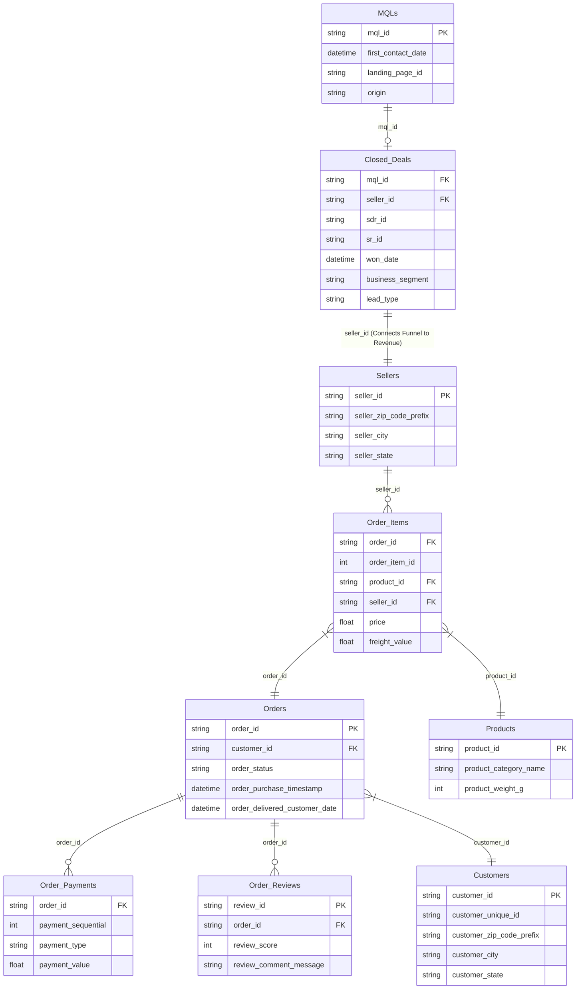
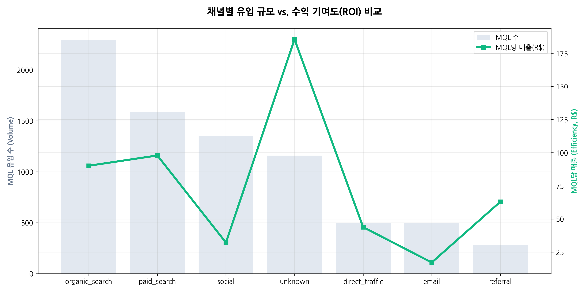

# 🛒 Olist Business Analysis & Marketing Strategy

## 🎯 분석 주제 및 목표
**「89.5% 리드 이탈 최적화 및 채널별 LTV 극대화 전략」**
> "8,000명의 잠재 셀러 중 89.5%가 계약 전 이탈하는 병목을 해결하고, 유입 채널별 셀러 생애 가치(LTV)를 분석하여 마케팅 예산 배분을 최적화한다."

- **핵심 로직**: `MQL.origin(채널)` → `CLOSED_DEALS.seller_id` → `ORDER_ITEMS` → `ORDERS(매출)`
- **상세 전략 및 분석 파이프라인**: [분석 전략 문서 보기](md/analysis_strategy.md)

---

## 👥 팀원 및 협업 안내
- **총 인원**: 6명
- **분석 원칙**: 마스터 테이블(`marketing_sales_base.csv`)을 공통 분모로 사용하며, 아래 **3단계 분석 흐름**에 맞춰 담당 파트를 수행합니다.

### 🛠️ 6인 전문 분석 체계 및 담당 파트
| 분석 단계 | 담당 파트 | 핵심 분석 내용 (비즈니스 임팩트) | 주요 사용 데이터 (컬럼) |
|:---:|---|---|---|
| **[1단계]**<br>유입 및 전환 | **파트 1: 리드 품질 감별사** | 어떤 광고 채널(`origin`)이 고품질 리드를 데려오는지 분석 | `origin`, `is_won`, `business_segment` |
| | **파트 2: 이탈 원인 탐정** | 89.5% 리드 손실이 어디서 발생하는지 영업 단계별 병목 분석 | `won_date`, `first_contact_date`, `lead_type` |
| **[2단계]**<br>활성화 및 수익성 | **파트 3: 온보딩 가이드** | 입점 후 첫 매출 발생까지의 지연 원인과 미판매 셀러 분석 | `has_revenue`, `won_date`, `order_purchase_timestamp` |
| | **파트 4: 스타 셀러 헌터** | 상위 10% 고성과 셀러의 특성 파악 및 생애 가치(LTV) 분석 | `total_revenue`, `seller_id`, `order_count` |
| | **파트 5: 품질 관리자** | 리뷰 점수 기반의 셀러 서비스 품질과 채널별 평판 검증 | `review_score`, `review_comment_message` |
| **[3단계]**<br>전략 통합 | **파트 6: 경제 설계자** | 모든 지표를 대시보드에 통합하고 마케팅 예산 재배분 제언 | (전체 데이터 활용 및 BI 도구 연동) |

---

## 📅 프로젝트 진행 현황 (Timeline)

### ✅ 완료된 작업
- **2026-04-07**
  - [x] **마케팅 채널 성과 분석 완결 (Acquisition)**: 8,000개 리드 전수 분석 및 리포트 작성 ([최종 리포트 보기](md/Acquisition.md))
  - [x] **unknown 채널 정체 규명**: LP 분석을 통해 UTM 유실 검색 트래픽임을 입증 (집중도 **56.7%**)
  - [x] **리드 품질 정량화**: 로지스틱 회귀 분석을 통한 채널별 전환 기여도(Odds Ratio) 산출
  - [x] **데이터 무결성 검증**: 실제 데이터 기반 수치 교정 및 마스터 테이블 정합성 확보
- **2026-04-04**
  - [x] **탐색적 데이터 분석(EDA) 완료**: 기초 통계 분석 리포트 ([리포트 보기](md/eda_report.md))
  - [x] **심층 분석 리포트 추가 (Deep Dive)**: 로지스틱 회귀, 머신러닝 등을 적용한 채널별 ROI 분석 ([심층 리포트 보기](md/Olist_deep_eda_report.md))

---

## 🚀 프로젝트 로드맵 (예시)
보내주신 **5단계 분석 파이프라인**과 **AARRR 프레임워크**를 결합한 상세 실행 계획입니다.

### 📊 분석 흐름 시각화 (Connectivity Map)


```text
[ Step 1. 유입 채널 ]  ──(전환율 분석)──▶  [ Step 2. 입점 셀러 ]
       (Acquisition)                         (Activation)
                                                  │
                                            (RFM/활동성 체크)
                                                  │
                                                  ▼
[ Step 5. 전략/ROI ]   ◀──(LTV/예측)───  [ Step 3 & 4. 매출 기여 ]
        (Strategy)                           (Revenue)
```

🔗 **상세 인터랙티브 맵**: [웹에서 보기(추천)](https://raw.githack.com/yoonjikimkr/olist-business-analysis-marketing/main/html/connectivity_map.html) / [소스 코드](html/connectivity_map.html)

### 🗺️ 통합 데이터 관계도 (ERD)



### 💡 단계별 분석의 이유와 방법 (Why & How)
6명의 팀원이 각자의 분석 결과를 어떻게 합쳐서 하나의 큰 그림을 그릴지 정의합니다.

*   **[1단계] 기반 다지기**: "우리가 돈을 쓰는 광고 채널이 실제 파트너를 제대로 데려오고 있는가?" (전환 효율 중심)
*   **[2단계] 가치 발굴하기**: "들어온 셀러가 플랫폼에서 실제로 돈을 벌고 평판이 좋은가?" (질적 성장 중심)
*   **[3단계] 전략 수립하기**: "분석한 데이터를 바탕으로 다음 달 마케팅 예산은 어디에 써야 하는가?" (의사결정 중심)

---

### 1단계: 데이터 연결 및 마케팅 퍼널 기초 분석 (완료)
- [x] **과제 1. 채널별 전환율 분석**: 유입 경로(`origin`) → 계약(`won`) 전환율 (담당: 파트 1, 2)
  - **결과**: `unknown`(16.7%), `paid_search`(12.3%), `organic_search`(11.8%) 순으로 높은 전환율 확인. `social`은 5.6%로 최하위권.
  - **데이터 포인트**: `origin`, `first_contact_date`, `won_date`
  - **문서**: [Acquisition 성과 분석 리포트](md/Acquisition.md)


- [ ] **과제 2. 셀러 활동성 평가(RFM)**: 입점 셀러의 생존 및 활동 주기 (담당: 파트 2, 3)
  - 최근 판매일(`Recency`)과 빈도(`Frequency`)를 통해 이탈 셀러 식별
  - **데이터 포인트**: `order_purchase_timestamp`, `seller_id`

### 2단계: 수익성(ROI) 심층 분석 및 기여도 평가
- [ ] **과제 3. 매출 기여도 및 평판 분석**: 플랫폼 실매출과 고객 만족도 연결 (담당: 파트 4, 5)
  - 특정 채널 출신 셀러들이 총 거래액(GMV)과 리뷰 점수에서 갖는 특징 분석
  - **데이터 포인트**: `total_revenue`, `review_score`
- [ ] **과제 4. 셀러 생애 가치(LTV) 및 지연 시간 분석**: 장기적 가치 추정 (담당: 파트 4)
  - 첫 주문 수령까지 걸리는 시간이 장기 매출에 미치는 임팩트 파악
  - **데이터 포인트**: `LTV` 추정치, `time_to_first_order`

### 3단계: 전략 제언 및 시뮬레이션
- [ ] **과제 5. 예산 최적화안 도출**: 마케팅 예산 재배분 시나리오 (담당: 파트 6)
  - 채널별 실제 투자 대비 수익(ROI) 기반으로 차기 캠페인 방향 결정
  - **결과물**: 마케팅 예산 재배분 권고안 및 타겟 페르소나 정의
- [ ] **결과 통합 및 시각화**: 
  - [ ] 데이터 대시보드(Looker Studio) 구축 (6인 데이터 통합)
  - [ ] 비즈니스 제언 중심의 최종 발표 자료 제작

---

## 📂 주요 폴더 구조
- `data/`: 데이터셋 보관
    - `raw/`: 원본 CSV ([데이터 수집 가이드](scripts/setup_data.py))
    - `processed/`: 
        - [마스터 테이블(ABT)](data/processed/marketing_sales_base.csv) ([생성 스크립트](scripts/generate_master_table.py))
        - [Looker Studio 마스터](data/processed/looker_studio_master.csv) (시각화 최적화 데이터)
- `scripts/`: 데이터 수집 및 가공 유틸리티
- `images/`: 분석 시각화 이미지 (PNG)
- `md/`: 
    - [마케팅 채널 성과 분석(Final)](md/Acquisition.md) : **(New)** 수치 검증이 완료된 종합 리포트
    - [통합 ERD 설계](md/unified_erd.md)
    - [심층 EDA 리포트](md/Olist_deep_eda_report.md) (핵심 인사이트)
- `html/`: 인터랙티브 [AARRR 프레임워크 웹으로 보기](https://raw.githack.com/yoonjikimkr/olist-business-analysis-marketing/main/html/seller_aarrr_analysis_framework.html) / [소스 코드](html/seller_aarrr_analysis_framework.html)

---

## 🛠️ 분석 시작하기 (Getting Started)
팀원들은 아래 순서로 로컬 환경을 세팅해 주세요.

1. **데이터 수집**: `python3 scripts/setup_data.py` (Kaggle에서 데이터 자동 다운로드 및 배치)
2. **마스터 테이블 생성**: `python3 scripts/generate_master_table.py` (분석용 통합 CSV 생성)
3. **분석 착수**: `data/processed/marketing_sales_base.csv` 파일을 사용해 각 단계 분석 수행

### 🤝 팀 협업 데이터 워크플로우 (Data Workflow)
우리가 사용하는 마스터 테이블(`marketing_sales_base.csv`)은 아래 로직으로 생성됩니다.
- **Join Key**: `seller_id` (마케팅 계약 데이터와 실제 이커머스 판매 데이터의 유일한 연결 고리)
- **Left Join**: '계약은 했으나 매출이 없는' 리드까지 포함하여 **진정한 전환율(Conversion)**을 계산하기 위함
- **Data Granularity**: 1 Row = 1 MQL (각 리드별 마케팅 정보 + 해당 셀러의 성과 요약)