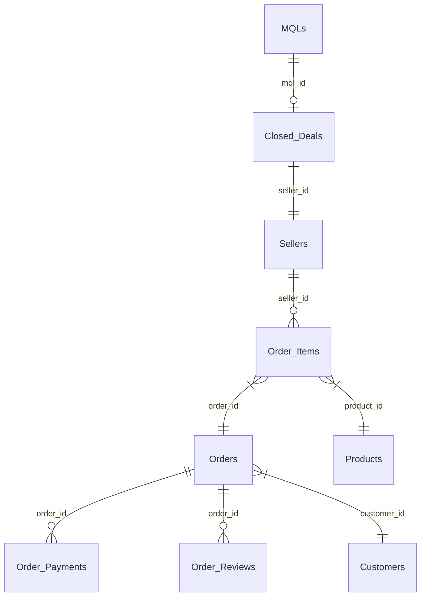

# 🇧🇷 Olist Business Analysis & Marketing Strategy
> **AARRR Framework 기반 셀러 생애주기 분석 및 마케팅 최적화 프로젝트**

이 프로젝트는 브라질 최대 이커머스 플랫폼 **Olist**의 데이터를 활용하여, 잠재 셀러의 유입부터 입점, 전환, 매출 기여, 그리고 플랫폼 평판 형성까지의 전 과정을 분석하고 데이터 기반의 비즈니스 전략(Action Items)을 제안합니다.

---

## 💎 핵심 분석 요약 (AARRR Insights & Projects)
각 단계별 상세 분석 리포트입니다. (상세 내용은 링크를 클릭하여 확인할 수 있습니다.)

### 1. Acquisition (유입)
- **핵심 발견**: `Paid Search`와 `Organic Search`가 전체 리드의 50%를 차지하며 매출 기여도 최상. `unknown` 유입의 56%는 SEO 유실 트래픽.
- **주요 리포트**: 
  - [Acquisition 심층 리포트](md/Acquisition.md) | [Deep Analysis](md/Acquisition_Deep_Analysis.md)
  - [분석 리포트 ALL](md/Olist_AARRR_ALL.md) | [EDA 전략](md/analysis_strategy.md)
  - [마케팅 성능 시각화 (Web)](https://raw.githack.com/yoonjikimkr/olist-business-analysis-marketing/main/html/Acquisition.html)

### 2. Activation & Retention (활성화 및 유지)
- **핵심 발견**: 최초 컨택 후 **15일 이내**에 입점을 완료한 셀러가 일반 셀러 대비 LTV가 2.4배 높음. `Social` 채널 셀러는 매출은 낮으나 고객 만족도(NPS)에 기여.
- **주요 리포트**: 
  - [Part 2: 리드 전환 분석 (MD)](md/Part2_리드전환분석.md) | [Web View](https://raw.githack.com/yoonjikimkr/olist-business-analysis-marketing/main/html/part2_lead_conversion_analysis.html)
  - [Retention 심층 분석](md/Retention.md) | [Retention RV](md/Retention_rv.md)
  - [AARRR 프레임워크 (Web)](https://raw.githack.com/yoonjikimkr/olist-business-analysis-marketing/main/html/seller_aarrr_analysis_framework.html)

### 3. Revenue & Referral (수익 및 추천)
- **핵심 발견**: 8.4%의 스타 셀러가 전체 매출의 40% 점유. 배송 지연 15일 초과 시 리뷰 점수 급락(1.5점).
- **주요 리포트**: 
  - [최종 통합 분석 리포트 (하은)](md/Olist_Final_Integrated_Report_haeun.md) | [Revenue 분석](md/Revenue_analysis_report.md)
  - [Referral 감성 분석](md/Referral_Analysis_Report.md) | [Business Insight](md/Referral_Business_Insight_Report_haeun.md)
  - [최종 수익 분석 (Web)](https://raw.githack.com/yoonjikimkr/olist-business-analysis-marketing/main/html/final_revenue_report.html) | [LTV 전략 (Web)](https://raw.githack.com/yoonjikimkr/olist-business-analysis-marketing/main/html/하은_LTV_전략.html)

---

## 🎯 최종 전략 제언 (Action Items)
1. **[Budget]** Paid Search 예산 70% 집중 배정 (High-LTV 셀러 유입 최적화).
2. **[Process]** 15일 이내 계약 체결을 위한 'VIP 패스트 트랙' 영업 프로세스 도입.
3. **[Incentive]** Watches/Electronics 카테고리 셀러 대상 물류비 보조 및 노출 상단 보장.
4. **[Quality]** 배송 리드타임 10일 이내 유지 셀러에게 인증 뱃지 부여 (NPS 방어).

---

## 📅 날짜별 작업 섹션 (Progress & Task Logs)
프로젝트 진행 상황에 따른 상세 작업 내용과 파일 링크입니다.

### 2026-04-28 (Final Phase)
- [x] **통합 전략 수립**: [AARRR 통합 분석 리포트](md/Olist_Final_Integrated_Report_haeun.md) 완료
- [x] **BI 시스템 설계**: [의사결정 보드 설계안 (Mockup)](Dashboard_Mokup.md) 작성
- [x] **리포트 발행**: 최종 Revenue 및 Referral 분석 완료 ([리포트](md/Referral_Analysis_Report.md))

### 2026-04-21 (Advanced Phase)
- [x] **세그먼테이션**: K-Means 군집 분석을 통한 4개 우량 그룹 식별 ([분석 리포트](md/Olist_deep_eda_report.md#분석-c-매출-셀러-세그먼테이션-k-means))
- [x] **LTV 모델링**: 셀러 생애 가치 예측 및 전략 도출 ([LTV 전략 보기](md/Analysis_Strategy.md))

### 2026-04-14 (Core Phase)
- [x] **전환 병목 분석**: 리드 접촉 후 Won까지의 소요 시간 분석 ([Part 2 리드전환](md/Part2_리드전환분석.md))
- [x] **Retention 분석**: 셀러별 유지율 및 재구매 기여도 분석 ([Retention.md](md/Retention.md))

### 2026-04-07 (Setup Phase)
- [x] **데이터 무결성 확보**: 마케팅 퍼널과 이커머스 매출 데이터 통합 ([마스터 테이블](data/processed/marketing_sales_base.csv))
- [x] **기초 EDA 완료**: 기초 통계 분석 리포트 발행 ([EDA 리포트](md/eda_report.md))

---

## 🚀 상세 분석 로드맵 (Roadmap)

### 📊 분석 흐름 시각화 (Connectivity Map)
```text
[ Step 1. 유입 채널 ]  ──(전환율 분석)──▶  [ Step 2. 입점 셀러 ]
       (Acquisition)                         (Activation)
                                                  │
                                            (RFM/활동성 체크)
                                                  │
                                                  ▼
[ Step 5. 전략/ROI ]   ◀──(LTV/예측)───  [ Step 3 & 4. 매출 기여 ]
        (Strategy)                           (Revenue)
```
🔗 **인터랙티브 맵**: [웹에서 보기(추천)](https://raw.githack.com/yoonjikimkr/olist-business-analysis-marketing/main/html/connectivity_map.html)

### 🗺️ 통합 데이터 관계도 (ERD)

> 상세 데이터 명세는 [통합 ERD 리포트](md/unified_erd.md) 참조.

---

## 📂 프로젝트 폴더 구조 및 워크플로우
- `data/`: 원천 데이터 및 정제 데이터 ([ABT 생성 스크립트](scripts/generate_master_table.py))
- `scripts/`: 데이터 수집(`setup_data.py`) 및 분석 자동화 도구
- `images/`: 분석 시각화 차트 (60여 종)
- `md/`: 단계별 상세 리포트 전문
- `html/`: 웹 기반 인터랙티브 분석 결과물

### 🤝 팀 협업 데이터 워크플로우
1. **Join Key**: `seller_id`를 기준으로 마케팅 데이터와 매출 데이터 통합.
2. **Left Join**: '계약은 했으나 매출이 없는' 리드까지 포함하여 진정한 전환율 계산.
3. **Data Granularity**: 1 Row = 1 MQL 단위의 데이터 분석 수행.

---
**Last Updated: 2026-04-28 | Olist Marketing Analytics Team**
