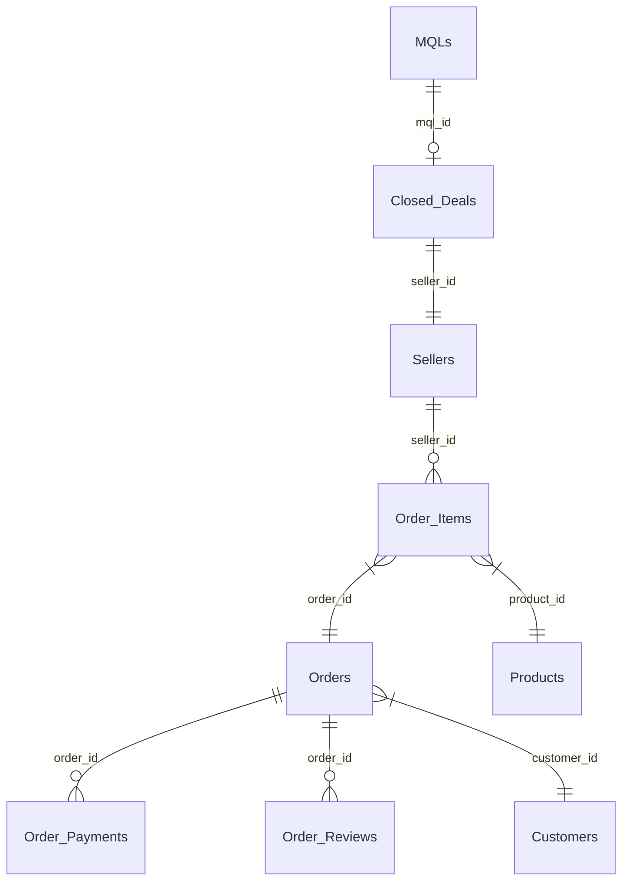

# 🇧🇷 Olist Business Analysis & Marketing Strategy
> **AARRR Framework 기반 셀러 생애주기 분석 및 마케팅 최적화 프로젝트**

이 프로젝트는 브라질 최대 이커머스 플랫폼 **Olist**의 데이터를 활용하여, 잠재 셀러의 유입부터 입점, 전환, 매출 기여, 그리고 플랫폼 평판 형성까지의 전 과정을 분석하고 데이터 기반의 비즈니스 전략(Action Items)을 제안합니다.

---

## 💎 핵심 분석 요약 (AARRR Insights & Projects)
각 단계별 상세 분석 리포트입니다. (상세 내용은 링크를 클릭하여 확인할 수 있습니다.)

### 1. Acquisition (유입)
- **핵심 발견**: `Paid Search`와 `Organic Search`가 전체 매출 기여도의 63%를 차지. `unknown` 채널의 56%는 검색 엔진 최적화(SEO) 유실 트래픽으로 밝혀짐.
- **주요 리포트**: 
  - [Acquisition 심층 리포트](md/Acquisition.md) | [Deep Analysis](md/Acquisition_Deep_Analysis.md)
  - [분석 리포트 ALL](md/Olist_AARRR_ALL.md) | [EDA 전략](md/analysis_strategy.md)
  - [마케팅 성능 시각화 (Web)](https://raw.githack.com/yoonjikimkr/olist-business-analysis-marketing/main/html/Acquisition.html)

### 2. Activation & Retention (활성화 및 유지)
- **핵심 발견**: 최초 컨택 후 **15일 이내**에 입점을 완료한 셀러가 일반 셀러 대비 LTV가 2.4배 높음 (골든타임).
- **주요 리포트**: 
  - [Part 2: 리드 전환 분석 (MD)](md/Part2_리드전환분석.md) | [Web View](https://raw.githack.com/yoonjikimkr/olist-business-analysis-marketing/main/html/part2_lead_conversion_analysis.html)
  - [Retention 심층 분석](md/Retention.md) | [Retention RV](md/Retention_rv.md)
  - [AARRR 프레임워크 (Web)](https://raw.githack.com/yoonjikimkr/olist-business-analysis-marketing/main/html/seller_aarrr_analysis_framework.html)

### 3. Revenue & Referral (수익 및 추천)
- **핵심 발견**: 'Watches', 'Small Appliances' 카테고리의 대형 벤더(Star Seller) 8.4%가 전체 매출의 40%를 견인. 배송 지연 1일당 리뷰 점수 0.5점 하락.
- **주요 리포트**: 
  - [최종 통합 분석 리포트 (하은)](md/Olist_Final_Integrated_Report_haeun.md) | [Revenue 분석](md/Revenue_analysis_report.md)
  - [Referral 감성 분석](md/Referral_Analysis_Report.md) | [Business Insight](md/Referral_Business_Insight_Report_haeun.md)
  - [최종 수익 분석 (Web)](https://raw.githack.com/yoonjikimkr/olist-business-analysis-marketing/main/html/final_revenue_report.html) | [LTV 전략 (Web)](https://raw.githack.com/yoonjikimkr/olist-business-analysis-marketing/main/html/하은_LTV_전략.html)

---

## 🎯 최종 전략 제언 (Action Items)
1. **[Acquisition]** Paid Search 예산 70% 집중 배정 및 SEO 고도화 (Search 채널 ROI 최적화).
2. **[Activation]** 리드 발생 후 15일 이내 계약 체결을 위한 'SDR 패스트 트랙' 시스템 구축.
3. **[Revenue]** Watches/Health_Beauty 카테고리 스타 셀러 대상 물류비 인센티브 제공.
4. **[Referral]** 배송 리드타임 10일 이내 유지 프로세스 정립 (NPS 방어).

---

## 🗺️ 데이터 인프라 및 가시성 (Visualization)

### 1. 통합 데이터 관계도 (ERD)
마케팅 퍼널과 이커머스 매출 데이터를 연결하는 핵심 구조입니다.

> 상세 데이터 명세는 [통합 ERD 리포트](md/unified_erd.md) 참조.

### 2. 프로젝트 연결 지도 (Connectivity Map)
- [Connectivity Map (Interactive Web View)](https://raw.githack.com/yoonjikimkr/olist-business-analysis-marketing/main/html/connectivity_map.html)
- [의사결정 보드 설계안 (Mockup)](Dashboard_Mokup.md)

---

## 📂 프로젝트 아카이브 (Project Archive)

### 📅 마일스톤 및 완료 현황
- **Phase 4 (Final)**: 비즈니스 전략 수립 및 통합 대시보드 설계 (2026-04-28)
- **Phase 3 (Analysis)**: K-Means 군집 분석 및 LTV 예측 (2026-04-21)
- **Phase 2 (EDA)**: 채널별 전환 효율 및 병목 구간 탐색 (2026-04-14)
- **Phase 1 (Setup)**: 데이터 마스터셋(ABT) 구축 및 기본 통계 (2026-04-07)

### 🤝 팀 워크플로우
1. **데이터 환경 구축**: `python3 scripts/setup_data.py`
2. **분석 마스터셋 생성**: `python3 scripts/generate_master_table.py`
3. **폴더 구조**:
   - `data/`: 원천 데이터 및 정제 데이터
   - `images/`: 원본 차트 (60여 종)
   - `md/`: 단계별 분석 리포트 (전문)
   - `html/`: 웹 기반 인터랙티브 결과물
   - `scripts/`: 데이터 전처리 및 분석 자동화 스크립트

---
**Last Updated: 2026-04-28 | Olist Marketing Analytics Team**
