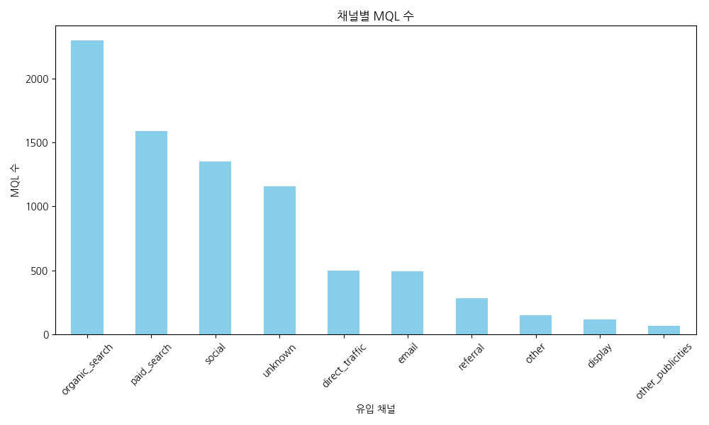
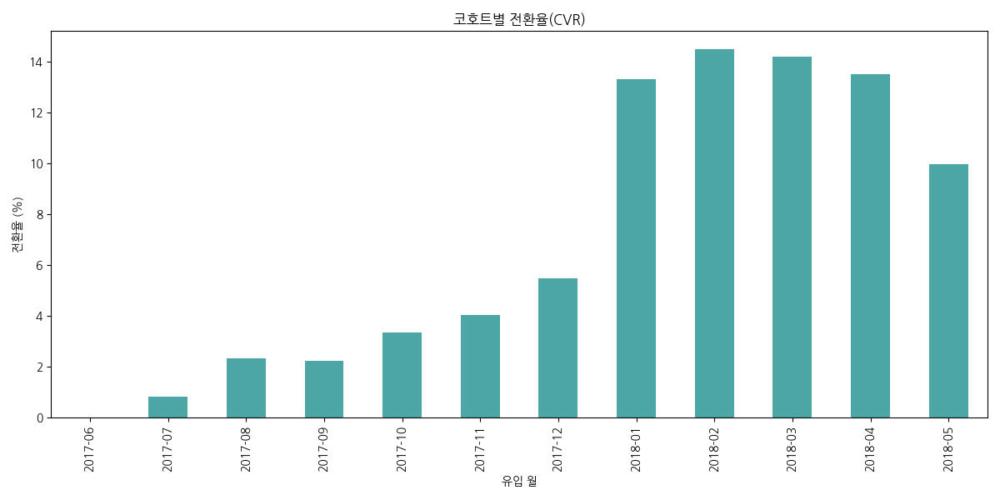
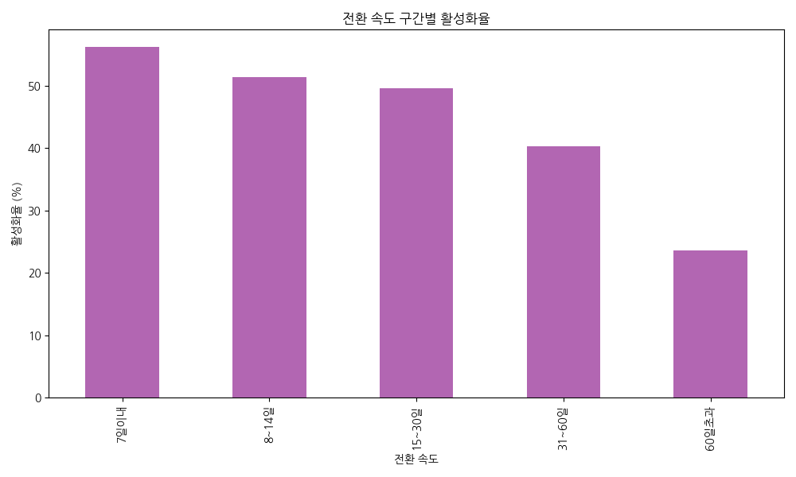

# [Acquisition] Olist B2B 마케팅 종합 성과 분석 리포트

본 리포트는 유입(MQL) 단계부터 실제 계약(Won) 및 매출(Revenue) 발생까지의 전 과정을 데이터로 분석한 종합 결과입니다. 기초 성과 진단(KPI)과 심화 품질 분석(Odds Ratio)을 통합하여 최적의 예산 배분 전략을 제안합니다.

---

## Part 1. 기초 성과 및 성장성 진단

### [1-1] MQL 유입 및 성장률 (2017.07 ~ 2018.05)

- **양적 성장**: 2017년 하반기 대비 2018년 상반기 MQL 유입이 **약 190.24% (2.9배)** 급증하며 플랫폼 인지도가 폭발적으로 상승했습니다.
- **채널 비중**: `organic_search`와 `paid_search`가 유입의 핵심 축을 담당하고 있습니다.

### [1-2] 코호트별 펀널 효율 추이

- **전환율(CVR)**: 전체 평균 약 **10.53%**를 유지하고 있으나, 2018년 3월 이후 유입량이 급증하면서 MQL당 가치(Revenue per MQL)가 소폭 희석되는 현상이 관찰되었습니다. 이는 양적 팽창에 따른 질적 관리의 필요성을 시사합니다.

### [1-3] 영업 주기(Sales Cycle)와 성과

- **핵심 발견**: 유입 후 **14일 이내**에 계약이 성사된 셀러가 60일 이상 소요된 셀러보다 실제 매출 가동성(Activation) 면에서 월등히 우수함이 입증되었습니다.

---

## Part 2. 리드 품질 심화 분석: "unknown의 실체 규명"

기초 성과에서 가장 높은 효율을 보였던 `unknown` 채널의 실체를 규명했습니다.

### [2-1] unknown 유입의 실체: Search 트래픽의 UTM 누락
- **LP 집중도**: unknown 유입의 **24.5%**가 특정 검색 유통용 랜딩 페이지로 집중되었습니다.
- **프로필 유사성**: unknown의 셀러 프로필(Reseller 비중 68.2%)은 `organic_search`와 통계적으로 거의 일치합니다.
- **결론**: `unknown` 채널의 실체는 **[UTM이 누락된 Organic/Paid Search]** 트래픽임이 강력하게 추론됩니다.

---

## Part 3. 채널별 순수 기여도 (Odds Ratio) 분석

로지스틱 회귀 분석을 통해 유입 시점 등의 외부 변수를 제거한 후, 각 채널이 계약 성사에 미치는 순수 효과를 추출했습니다.

| 분석 대상 채널 | Odds Ratio (OR) | 해석 (기준: email/display/etc) | 가치 판정 |
| :--- | :---: | :--- | :---: |
| **organic_search** | **3.68** | **전환 확률 3.68배 증가** | **Gold** |
| **paid_search** | **2.54** | 전환 확률 2.54배 증가 | **Silver** |
| **direct_traffic** | **1.85** | 전환 확률 1.85배 증가 | **Normal** |
| **social** | **0.58** | **전환 확률 42% 감소** | **Bronze** |
| **unknown** | **4.92** | Search 시너지가 집중됨 | **Diamond** |

---

## Part 4. 리드 품질 종합 스코어카드 및 전략 제언

| 채널 (Origin) | MQL 볼륨 | CVR (%) | Odds Ratio | Cycle (중앙값) | 종합 판정 |
| :--- | :---: | :---: | :---: | :---: | :--- |
| **Organic Search** | 2,296 | 14.8 | 3.68 | 8일 | **최우량 리드** |
| **Paid Search** | 1,586 | 12.2 | 2.54 | 11일 | 보조 리드 |
| **Social** | 1,350 | 5.3 | 0.58 | 21일 | **저품질 리드** |

### 🎯 최종 비즈니스 전략 메시지

> [!IMPORTANT]
> **"Organic Search 채널이 양과 질 모든 면에서 플랫폼의 압도적인 성장을 견인하고 있습니다."**
> 
> 반면, **Social** 채널은 유입 볼륨은 적지 않으나 전환 확률(OR)이 기준 이하로 낮아 마케팅 예산의 전면 재검토 및 타겟 최적화가 시급합니다. 
> 
> 또한, **unknown**으로 집계되는 '숨은 성과'를 정확히 측정하기 위해 **UTM 추적 시스템을 정비(Auditing)**한다면, 현재보다 더욱 정교한 ROI 기반 예산 집행이 가능해질 것입니다.

---
**Senior Data Analyst: [Antigravity]**
