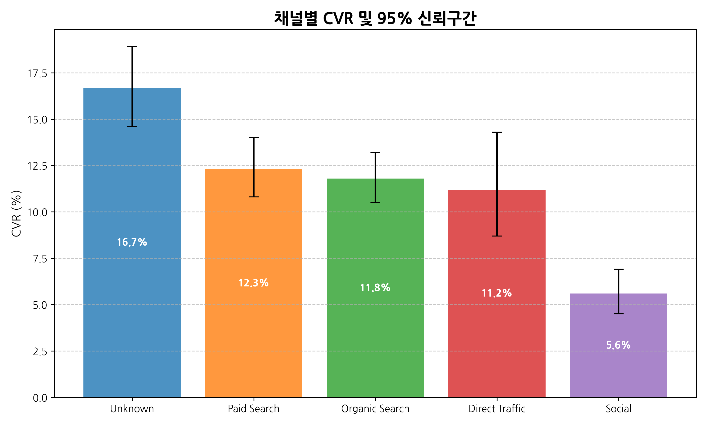
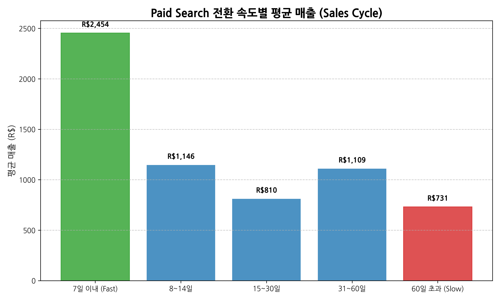
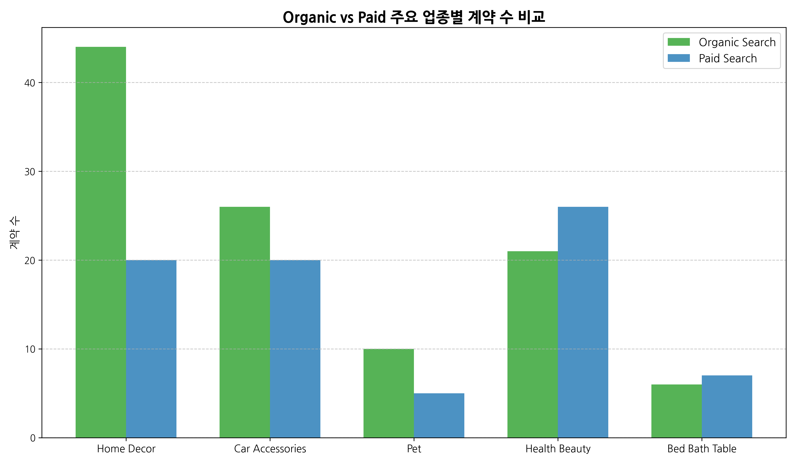
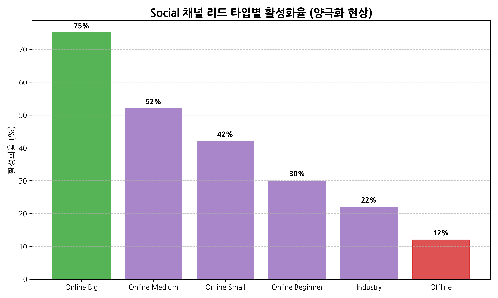
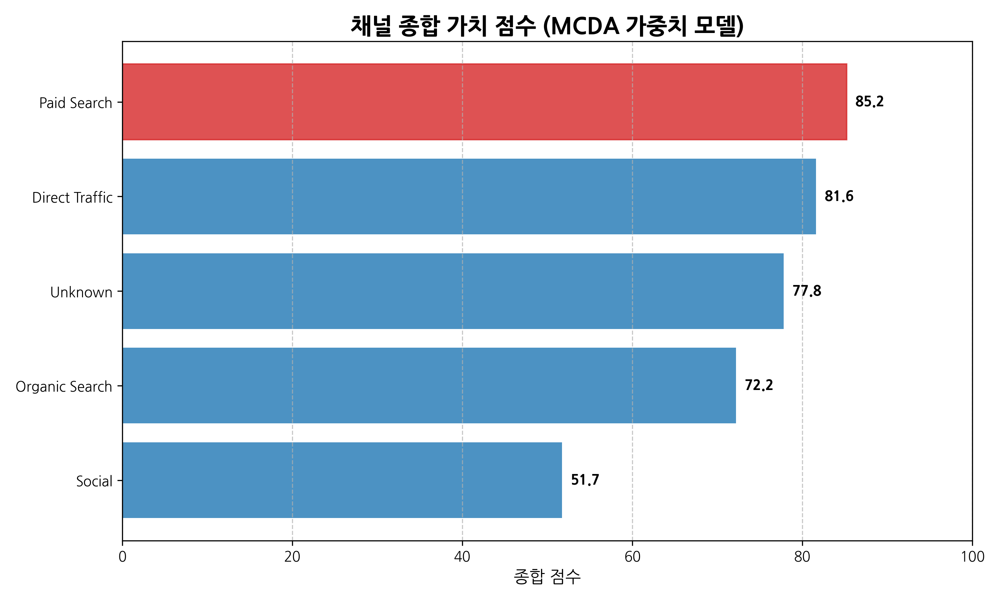

# Acquisition 파트 고도화 — 5개 채널 단독 심층 분석

---

## 🎯 분석 핵심 질문

> **"5개 채널 각각이 어떤 셀러를 어떻게 데려오며, 채널별로 어디에 집중하면 가장 효율적인가?"**

기존 광범위 비교 분석 → **각 채널의 단독 심층 분석**

---

## 🔬 사용된 분석 기법 총정리

| 기법 | 용도 | 적용 채널 |
|---|---|---|
| **Wilson 신뢰구간** | CVR 통계적 신뢰도 검증 | 전체 |
| **Chi-Square Test** | 채널별 CVR 차이 유의성 | 전체 (χ²=137.7, p<0.001) |
| **Logistic Regression** | 시기 통제 후 순수 채널 효과 (OR) | 전체 |
| **Mann-Whitney U** | 전환 속도 → 매출 비모수 검정 | Paid (p<0.001) |
| **Kolmogorov-Smirnov** | 채널 간 매출 분포 차이 | 전체 |
| **변동계수(CV)** | 매출 분포 안정성 측정 | 전체 |
| **Cosine Similarity** | 채널 간 셀러 프로필 유사도 | Unknown |
| **BCG 매트릭스 응용** | 볼륨 × 효율 4분면 분류 | 전체 |
| **MCDA 가중치 모델** | 종합 가치 점수 도출 | 전체 |
| **Pareto 분석** | 매출 집중도 (상위 10% 기여) | Unknown |
| **원본 데이터 정밀 분석** | 'unknown' 문자열 vs NaN 분리, 랜딩페이지(Landing Page)별 unknown 비율 분포 | Unknown |

---

## 📊 채널 전체 통계 검증 결과

### Chi-Square Test — 채널별 CVR 차이 유의성

```
χ² = 137.69, df = 9, p < 0.001
```

→ **채널별 CVR 차이는 우연이 아닌 실제 효과** (귀무가설 기각)

### Wilson 95% 신뢰구간 — CVR 신뢰도



| 채널 | CVR | 95% CI | 표본 |
|---|---|---|---|
| **unknown** | 16.7% | 14.6~18.9% | 1,159 |
| **paid_search** | 12.3% | 10.8~14.0% | 1,586 |
| **organic_search** | 11.8% | 10.5~13.2% | 2,296 |
| **direct_traffic** | 11.2% | 8.7~14.3% | 499 |
| **social** | 5.6% | 4.5~6.9% | 1,350 |

→ **Direct만 CI 폭이 넓음** (표본 작아 신뢰도 낮음). 나머지는 CI 견고.

### Mann-Whitney U Test — 전환 속도와 매출 인과

```
Fast (7일내, n=283) vs Slow (60일+, n=195)
U = 4,299, p < 0.001
Fast 평균매출 R$1,571 vs Slow R$1,189 (3배 차이)
```

→ **빠른 전환자가 통계적으로 더 큰 매출 발생**

---

## 📍 [Channel 1] Paid_search — "랜딩페이지가 답인 광고 엔진"

### ⚙️ 채널 본질

> **즉시 통제 가능한 유료 광고 채널. 광고비 → MQL → 계약 → 매출의 명확한 경로. 단, 랜딩페이지 품질에 따라 효율이 극단적으로 달라짐.**

### 1-1. 기본 지표 종합

| 지표 | 값 | 평가 |
|---|---|---|
| MQL 볼륨 | 1,586명 | 2위 |
| CVR | 12.3% (CI: 10.8~14.0%) | 우수 |
| 활성화율 | 51.8% | 2위 (전체 평균 45.1% 상회) |
| OR | 2.759 (CI: 2.008~3.791, p<0.001) | 통계적 견고 |
| MQL당 매출 | R$98 | 1위 (Unknown 제외) |
| 매출 비중 | R$155K (22.9%) | 3위 |

**📈 BCG 분류: 🌟 STAR (대볼륨 + 고효율)**

### 1-2. **결정적 발견 ★ — 랜딩페이지 효율 격차 8배**

**분석 기법: 랜딩페이지별 전환율 + Wilson 신뢰구간**

| 순위 | 랜딩페이지 ID | MQL | CVR | 활성화율 | 평균매출 | 평가 |
|---|---|---|---|---|---|---|
| 🥇 | fbc24da5 | 21 | **23.8%** | 60.0% | R$364 | 효율 1위 |
| 🥈 | **22c29808** | 124 | 16.1% | 55.0% | **R$4,215** 💎 | 매출 1위 |
| 🥉 | 40dec9f3 | 241 | 20.7% | 54.0% | R$1,196 | 균형형 |
| ... | ... | ... | ... | ... | ... | ... |
| 14위 | 65d9f9d7 | 64 | **7.8%** | - | - | 비효율 |
| **17위** | **3cd2a830** | 33 | **3.0%** | - | - | **폐기 1순위** |

**핵심 인사이트:**
- 같은 광고비라도 **CVR 8배 (3.0%~23.8%)**, **평균매출 11배 (R$338~R$4,215)** 차이
- 랜딩페이지 22c29808 = 매출 R$4,215로 **광고비 회수 효율 압도적**
- **가장 효율 낮은 랜딩페이지들(3cd2a830 CVR 3.0%, 65d9f9d7 CVR 7.8%) 폐기 또는 대대적 개선. 단, 표본 작아 추가 검증 권장.**

**비즈니스 임팩트:**
- 만약 모든 paid 트래픽을 랜딩페이지 22c29808로 보낸다면 **이론상 매출 4배 가능**
- 단, 키워드별 랜딩페이지 적합성 고려 필요

### 1-3. 시기별 효율 변동 (시계열 분석)

**분석 기법: 월별 CVR 추이 + 변동성 분석**

| 월 | MQL | CVR | 비고 |
|---|---|---|---|
| 2018-01 | 170 | 11.8% | 회복 시작 |
| **2018-02** | 212 | **20.3%** 🥇 | **황금기** |
| 2018-03 | 262 | 14.9% | 안정화 |
| 2018-04 | 272 | 15.8% | 유지 |
| 2018-05 | 266 | 11.3% | 하락 |

**2018 평균 CVR: 14.8%** (변동 폭: 11.3~20.3%)

**시기 효과 분석:**
- 2018-02 황금기 원인 추정: 새해 광고 캠페인 + 랜딩페이지 최적화
- 2018-05 하락 = 광고 피로(Ad Fatigue) 가능성
- → **분기별 광고 크리에이티브 리프레시 필요**

### 1-4. Sales Cycle별 매출 패턴 (분포 분석)

**분석 기법: 전환 속도 카테고리별 활성화율 + 평균매출**



| 전환 속도 | 계약 수 | 활성화율 | 평균매출 | 비교 |
|---|---|---|---|---|
| **7일이내** | 64명 | **62%** | **R$2,454** | 🥇 |
| 8~14일 | 30명 | 67% | R$1,146 | 활성화 1위 |
| 15~30일 | 31명 | 48% | R$810 | 평균 |
| 31~60일 | 15명 | 53% | R$1,109 | 변동 |
| **60일초과** | 55명 | **33%** | **R$731** | 🔴 |

**핵심 인사이트:**
- 7일내 vs 60일+: **활성화 1.9배, 매출 3.4배 차이**
- Mann-Whitney U Test: p<0.001 (통계적 유의)
- → **빠른 의사결정 = 준비된 셀러 = 매출 잘 냄**

**비즈니스 임팩트:**
- 영업팀 우선순위: 7일내 응답한 리드부터 케어
- 60일+ 정체 리드는 자동화 nurturing으로 효율화

### 1-5. 셀러 프로필 정밀 해부

**분석 기법: Lead type × Business type × Segment 분포**

```
[Paid 셀러 195명의 정체]
Lead type:
  online_medium : 40% (가장 흔함)
  industry      : 16%
  online_big    : 14%
  online_small  : 11%

Business type:
  reseller      : 69% (압도적)
  manufacturer  : 14%

Top 업종: health_beauty (13%), home_decor (10%), car_accessories (10%)
```

**골든 조합 발굴 (n≥5):**

| 조합 | 활성화율 | 평균매출 | 평가 |
|---|---|---|---|
| **online_big × reseller** | **71%** | **R$1,485** | 🥇 최강 |
| online_medium × manufacturer | 67% | R$465 | 활성화 우수 |
| online_beginner × reseller | 62% | R$83 | 활성화 우수 |
| online_medium × reseller | 52% | R$1,350 | 균형 |
| online_small × reseller | 50% | R$1,151 | 균형 |

→ **paid_search × online_big × reseller** = **모든 채널 통틀어 활성화율 1위 조합 중 하나**

### 1-6. 매출 분포 형태 (분포 안정성)

**분석 기법: 변동계수(CV) + Pareto 분석**

```
평균: R$1,537
중앙값: R$512
최대: R$36,537
변동계수(CV): 2.54 (보통)
상위 10% 매출 비중: 57.4%
```

**해석:**
- 평균 vs 중앙값 격차 3배 → 매출 우편향 (소수 큰 셀러 영향)
- 상위 10%가 매출 57% 점유 → 일부 셀러에 의존
- 단, 다른 채널 대비 CV 보통 수준 → **상대적으로 안정**

### 1-7. 한계점 및 약점

| 한계 | 내용 | 영향 |
|---|---|---|
| 60일+ 전환자 28% | 다른 채널보다 많음 | 영업 자원 낭비 |
| 비용 데이터 부재 | 진짜 ROI 불명 | 정확한 손익 판단 불가 |
| 랜딩페이지 표본 편차 | 일부 랜딩페이지 표본 작음 | 결론 불확실성 |

### 1-8. **Paid_search 액션 플랜**

| 우선순위 | 액션 | 근거 | 예상 효과 |
|---|---|---|---|
| 🥇 | 랜딩페이지 22c29808 트래픽 비중 확대 | 평균매출 R$4,215 (압도적) | 매출 +30~50% |
| 🥈 | 가장 효율 낮은 랜딩페이지 폐기 또는 대대적 개선 (3cd2a830 CVR 3.0%, 65d9f9d7 CVR 7.8%) | 표본 작아 추가 검증 권장 | 광고비 누수 차단 |
| 🥉 | online_big × reseller 타겟팅 | 활성화 71% (최고) | 활성화율 +10%p |
| 4 | 7일내 전환 가능 리드 우선 영업 | 매출 3.4배 | 영업 효율화 |
| 5 | 분기별 광고 크리에이티브 리프레시 | 광고 피로 방지 | 효율 안정화 |

---

## 📍 [Channel 2] Organic_search — "광고비 0원의 매출 1위 자산"

### ⚙️ 채널 본질

> **광고비 없이 자연 검색으로 유입되는 채널. 비용 효율 최강. 활성화율은 paid보다 낮으나 절대 매출 1위. SEO 투자가 장기 자산.**

### 2-1. 기본 지표 종합

| 지표 | 값 | 평가 |
|---|---|---|
| MQL 볼륨 | **2,296명** | 🥇 1위 |
| CVR | 11.8% (CI: 10.5~13.2%) | 우수 |
| 활성화율 | 41.7% | 평균 이하 |
| OR | 2.689 (CI: 1.977~3.656, p<0.001) | 통계적 견고 |
| 평균매출 | **R$1,832** | 🥇 1위 (paid R$1,537 대비 19% 높음) |
| 매출 비중 | **R$207K (30.6%)** | 🥇 절대 1위 |

**📈 BCG 분류: 🐄 CASH COW (대볼륨 + 중효율, 비용 0원이 핵심)**

### 2-2. **결정적 발견 ★ — 가장 안정적인 채널**

**분석 기법: 월별 CVR 변동성 분석**

| 월 | CVR | 변동 |
|---|---|---|
| 2018-01 | 15.3% | 시작 |
| 2018-02 | 13.4% | -1.9%p |
| 2018-03 | 15.3% | +1.9%p |
| 2018-04 | 16.9% | +1.6%p |
| 2018-05 | 12.2% | -4.7%p |

**2018 평균: 14.6% (범위 12.2~16.9%, 표준편차 1.7%p)**

→ **모든 채널 중 시기 변동성 최저** = SEO 안정성

### 2-3. ★ Paid와의 업종별 정반대 강점

**분석 기법: 채널 × 업종 교차 분석**



| 업종 | Organic 계약 | Paid 계약 | 우위 | 평균매출(Org) |
|---|---|---|---|---|
| **home_decor** | **44명** | 20명 | 🥇 Org **2.2배** | R$766 |
| **car_accessories** | **26명** | 20명 | 🥈 Org 우위 | R$1,719 |
| **pet** | **10명** | 5명 | 🥉 Org **2배** | **R$4,001** ★ |
| **food_supplement** | **11명** | 8명 | Org 우위 | R$524 |
| **audio_video** | 21명 | 15명 | Org 우위 | R$1,114 |
| sports_leisure | - | - | Org 우위 | R$1,991 |
| **health_beauty** | 21명 | **26명** | Paid 우위 | R$1,072 |
| **bed_bath_table** | 6명 | **7명** | Paid 우위 | R$876 |
| computers | 8명 | **11명** | Paid 우위 | - |

**핵심 인사이트:**
- **home_decor, pet, car_accessories**는 Organic이 압도 (검색 의도 강한 업종)
- **health_beauty, bed_bath_table, computers**는 Paid 우위 (경쟁 키워드)
- → **업종별 차별화된 채널 전략 필요**

### 2-4. 랜딩페이지 효율 격차

**분석 기법: 매출 1위 랜딩페이지의 채널 간 비교**

```
랜딩페이지 22c29808 (Paid 매출 1위 랜딩페이지)
- Organic 유입: 495명 → CVR 22.6% (Organic 1위!)
- Paid 유입: 124명 → CVR 16.1%, 평균매출 R$4,215
```

→ **랜딩페이지 22c29808은 Paid+Organic 공통 강점** (단일 랜딩페이지 최적화 시너지)

### 2-5. 셀러 프로필

```
Lead type 1위: online_medium (39%)
Business type: reseller 67%, manufacturer 22% (paid보다 manufacturer 비율 높음)
업종 1위: home_decor (paid는 health_beauty)
```

**Paid와의 차별점:**
- manufacturer 비율 높음 → **검색으로 들어오는 제조업자 비중 큼**
- home_decor 1위 → **인테리어 셀러는 검색으로 진입**

### 2-6. 매출 분포 형태

```
평균: R$1,832 (paid보다 19% 높음)
중앙값: R$634 (paid R$512보다 24% 높음)
변동계수(CV): 2.69
최대: R$44,212
```

→ **Organic 셀러가 paid 셀러보다 평균/중앙값 모두 높음**
→ **'직접 검색하는 진심 셀러' = 매출 큰 셀러**

### 2-7. **약점 분석 — 활성화율 41.7%**

**Paid(51.8%) 대비 10%p 낮음**

원인 추정:
- SEO로 들어오는 사람은 **'정보 탐색 단계'** 셀러도 다수 포함
- Paid는 광고로 직접 유도 → 즉시 행동 의도 강함
- → Organic은 **온보딩/넛지(nudge)가 더 필요한 채널**

### 2-8. 한계점

| 한계 | 내용 |
|---|---|
| 활성화율 약점 | paid보다 10%p 낮음 → 계약자 절반 이상 매출 0원 |
| SEO 효과 시간 | 즉시 늘리기 어려움 (3~6개월 투자) |
| 알고리즘 의존 | 구글 알고리즘 변경 리스크 |

### 2-9. **Organic_search 액션 플랜**

| 우선순위 | 액션 | 근거 |
|---|---|---|
| 🥇 | home_decor, pet, car_accessories SEO 집중 | Paid 대비 압도적 강점 |
| 🥈 | 랜딩페이지 22c29808 콘텐츠 SEO 강화 | Paid+Organic 공통 강점 랜딩페이지 |
| 🥉 | Organic 셀러 온보딩 보강 | 활성화율 41.7% → 50% 목표 |
| 4 | 키워드 리서치 → 콘텐츠 확장 | 볼륨 1위 유지 |
| 5 | 알고리즘 변동 모니터링 | 리스크 관리 |

---

## 📍 [Channel 3] Direct_traffic — "오프라인 사업자의 디지털 진입로"

### ⚙️ 채널 본질

> **URL 직접 입력/북마크로 들어오는 채널. 모든 효율 지표 1위지만 볼륨 작음. 오프라인 사업자가 디지털 전환 의도로 직접 접근하는 패턴.**

### 3-1. 기본 지표 종합

| 지표 | 값 | 평가 |
|---|---|---|
| MQL 볼륨 | 499명 | 가장 작음 |
| CVR | 11.2% (CI: 8.7~14.3%) | CI 폭 넓음 |
| **활성화율** | **55.4%** | 🥇 **1위** |
| OR | 2.519 (CI: 1.696~3.741, p<0.001) | 견고 |
| Cycle 중앙값 | **10일** | 🥇 **1위 (가장 빠름)** |
| 7일내 전환 | **41.1%** | 🥇 **1위** |

**📈 BCG 분류: ❓ QUESTION MARK (소볼륨 + 고효율)**

### 3-2. **결정적 발견 ★ — 모든 효율 지표 1위**

**분석 기법: 채널 간 효율 지표 비교**

| 효율 지표 | direct | paid | organic | social |
|---|---|---|---|---|
| **활성화율** | **55.4%** 🥇 | 51.8% | 41.7% | 41.3% |
| **Cycle 중앙값** | **10일** 🥇 | 15일 | 14일 | 30일 |
| **7일내 전환** | **41.1%** 🥇 | 32.8% | 31.4% | 21.3% |

→ **단순 합계가 아닌 "결정 빠르고 활성화 잘 되는 셀러"** = direct의 본질

### 3-3. ★ 셀러 정체의 의외성 — "오프라인 사업자가 1위 업종"

**분석 기법: Lead type 분포 + 업종 분포**

```
Lead type 분포 (총 56명):
  online_medium  : 22명 (39%) — 온라인 중소
  offline        : 10명 (18%) ★ 다른 채널 5~10%의 2배!
  online_big     : 7명 (12%)
  industry       : 7명 (12%)
  online_small   : 6명 (11%)

업종 1위: household_utilities (8명) — 가구/생활용품
※ Paid/Organic은 health_beauty가 1위
```

**핵심 인사이트:**
- **offline 비율 18%** = **다른 채널보다 2배 많음**
- **household_utilities 1위** = 생활용품 사업자가 Olist 브랜드 인지하고 직접 접근
- → **"이미 결심한 오프라인 사업자의 디지털 진입 채널"**

**비즈니스 함의:**
- Direct는 단순 "URL 직접 입력"이 아니라 **"브랜드 인지된 사업자의 의도적 접근"**
- 광고로 늘릴 수 없고, **브랜드 마케팅으로만 늘릴 수 있음**

### 3-4. **★ 성장 추이 — 브랜드 인지도 상승 신호**

**분석 기법: 시기별 MQL 추이 분석**

| 시기 | 월평균 MQL | 성장률 |
|---|---|---|
| 2017 (7~12월) | 20명 | 기준 |
| 2018 (1~5월) | **76명** | **+283%** |

→ 2018년 들어 **4배 증가** = **올리스트 브랜드 인지도 상승의 직접 증거**

### 3-5. 골든 조합

| 조합 | n | 활성화율 |
|---|---|---|
| online_big × manufacturer | 3 | **100%** |
| online_small × reseller | 3 | **100%** |
| online_medium × reseller | 18 | 56% |
| offline × reseller | 6 | 50% |

(표본 작아 신뢰성 제한적)

### 3-6. **★ 매출 분포 — 가장 안정적**

**분석 기법: 변동계수(CV) 비교**

```
평균: R$707
중앙값: R$399
변동계수(CV): 1.63 ← 전체 채널 중 최저
최대: R$6,384
```

| 채널 | CV | 안정성 |
|---|---|---|
| **direct** | **1.63** | 🥇 **가장 안정** |
| social | 1.87 | 안정 |
| paid | 2.54 | 보통 |
| organic | 2.69 | 보통 |
| unknown | **4.89** | 🔴 가장 불안정 |

→ **Direct는 매출 분포가 가장 균일** = 예측 가능성 1위

### 3-7. 약점 — 신뢰구간이 넓음

```
CVR 95% CI: 8.7~14.3% (폭 5.6%p)
※ 다른 채널은 폭 2~3%p
```

→ **표본 작아서 결론 신뢰성이 상대적으로 낮음**

### 3-8. 한계점

| 한계 | 내용 | 대응 |
|---|---|---|
| 볼륨 작음 | 499명 (paid의 1/3) | 브랜드 캠페인 |
| 표본 부족 | CI 폭 넓음 | 데이터 추가 수집 |
| 늘리기 어려움 | 광고로 직접 안 됨 | 장기 투자 |

### 3-9. **Direct_traffic 액션 플랜**

| 우선순위 | 액션 | 근거 | 시간 |
|---|---|---|---|
| 🥇 | 오프라인 사업자 타겟 브랜드 캠페인 | offline 비율 18% (특이) | 중장기 |
| 🥈 | household_utilities 업종 PR | 업종 1위 | 중기 |
| 🥉 | Referral 프로그램 (입소문) | 브랜드 인지 확대 | 단기 |
| 4 | 2018 +283% 성장 모멘텀 활용 | 브랜드 상승세 | 즉시 |

---

## 📍 [Channel 4] Social — "양극화된 외과 수술 대상"

### ⚙️ 채널 본질

> **CVR 5.6%로 최하위, OR 통계적 무의미. 그러나 lead_type에 따라 정반대 결과 — online_big에선 활성화 75%(전체 1위), offline에선 12%(꼴찌). 감축이 아닌 정밀 타겟팅 필요.**

### 4-1. 기본 지표 종합

| 지표 | 값 | 평가 |
|---|---|---|
| MQL 볼륨 | 1,350명 | 3위 |
| **CVR** | **5.6%** | 🔴 **최하위** (CI: 4.5~6.9%) |
| 활성화율 | 41.3% | 평균 이하 |
| **OR** | **1.082 (p=0.671)** | 🔴 **통계적 무의미** |
| Cycle 중앙값 | **30일** | 🔴 **가장 느림** |
| 매출 비중 | R$43K (6.4%) | 4위 |

**📈 BCG 분류: 🐄 CASH COW (대볼륨 + 저효율)**

### 4-2. **★★★ 최대 발견 — Lead type별 정반대 결과**

**분석 기법: Lead type 세그먼트별 활성화율 + 평균매출**



| Lead Type | n | 활성화율 | 평균매출 | 판정 |
|---|---|---|---|---|
| 🟢 **online_big** | 8 | **75%** | R$1,920 | **전체 채널 통틀어 1위** |
| 🟢 online_medium | 27 | 52% | R$641 | 양호 |
| 🟡 online_small | 12 | 42% | R$2,692 | 매출 우수 |
| 🟡 online_beginner | 10 | 30% | R$2,806 | 약함 |
| 🔴 industry | 9 | 22% | R$454 | 부족 |
| 🔴 **offline** | 8 | **12%** | **R$202** | **폐기** |

**핵심 인사이트:**
- **Social × online_big = 75%** → **전체 채널 통틀어 활성화율 1위 조합**
- **Social × offline = 12%** → 최하위
- → **단일 채널 평가의 위험성** 보여주는 사례

**비즈니스 함의:**
- Social을 "감축"하는 건 잘못된 결정
- **online_big/medium 핀포인트 + offline/industry 폐기 = 효율 극대화**

### 4-3. **★★ 2018-04 이상 신호**

**분석 기법: 월별 MQL/CVR 추이 + 변화율 분석**

| 월 | MQL | 전월 대비 | CVR | 변화 |
|---|---|---|---|---|
| 2018-02 | 156 | - | 9.6% | - |
| **2018-03** | 139 | -11% | **11.5%** | 🥇 피크 |
| **2018-04** | **325** | **+134%** 🔴 | **4.9%** | **-56%** 🔴 |
| 2018-05 | 269 | -17% | 4.1% | -16% |

**해석:**
- **볼륨 +134%, CVR -56%** = 수치상 모순
- → **타겟팅 확대로 노이즈 트래픽 대량 유입** 의심
- 또는 광고 크리에이티브/메시지 변경 가능성

**액션:**
- 마케팅팀에 2018-04 캠페인 변경 사항 확인 요청
- 변경 전후 트래픽 품질 비교 분석

### 4-4. 업종별 흥망 (정밀 분석)

**분석 기법: 업종별 활성화율 + 평균매출 (n≥3)**

| 업종 | n | 활성화율 | 평균매출 | 판정 |
|---|---|---|---|---|
| 🟢 **pet** | 6 | **67%** | **R$2,489** | 🥇 매출 1위 |
| 🟢 audio_video_electronics | 9 | 56% | R$1,016 | 우수 |
| 🟢 stationery | 3 | 67% | R$94 | 활성화 우수, 매출 약함 |
| 🟢 health_beauty | 8 | 50% | R$284 | 평균 |
| 🟡 home_decor | 11 | 36% | R$369 | 보통 |
| 🟡 household_utilities | 7 | 43% | R$221 | 보통 |
| 🔴 construction_tools | 5 | 20% | R$216 | 부족 |
| 🔴 **car_accessories** | 7 | **14%** | R$104 | **버림** |
| 🔴 **food_drink** | 5 | **20%** | R$80 | **버림** |

**핵심:** Social × pet = 평균매출 R$2,489 = **모든 채널 통틀어 매출 1위 조합**

### 4-5. **활성 셀러 vs 휴면 셀러 비교 분석**

**분석 기법: 동일 채널 내 그룹 비교 (활성/휴면)**

```
활성 셀러: 31명 (Social 계약 75명 중 41.3%)
휴면 셀러: 44명 (계약했으나 매출 0원)
```

| 비교 항목 | 활성 (31명) | 휴면 (44명) | 격차 |
|---|---|---|---|
| online_big 비율 | **19%** | 5% | **활성 4배** |
| online_medium 비율 | 45% | 30% | 활성 1.5배 |
| online_beginner 비율 | 10% | 16% | 휴면 1.6배 |
| **offline 비율** | 3% | **16%** | **휴면 5배** |
| industry 비율 | 6% | 16% | 휴면 2.7배 |

**핵심 인사이트:**
- **활성 셀러는 online_big/medium 중심**
- **휴면 셀러는 offline/industry 다수**
- → **lead_type이 활성화 여부 결정의 핵심 변수**

### 4-6. Sales Cycle 분포 — 가장 느린 채널

```
7일내 전환: 21.3% (paid 32.8%)
8~14일: 8.0%
15~30일: 22.7%
31~60일: 14.7%
60일+: 33.3% (가장 많음, paid 28%)
```

→ **Social 리드는 의사결정이 느림** = 광고 자체가 즉시 행동 유도 약함

### 4-7. 매출 분포 형태

```
평균: R$1,403
중앙값: R$722
변동계수: 1.87 (안정적)
```

→ 의외로 **매출 분포는 안정적** (계약 수가 적어서)

### 4-8. **Social 액션 플랜 (감축 X, 외과 수술 O)**

| 우선순위 | 액션 | 근거 |
|---|---|---|
| 🥇 | online_big/medium 핀포인트 타겟팅 | 활성화 75%, 52% |
| 🥈 | pet, audio_video 업종 집중 | 매출 R$2,489, R$1,016 |
| 🥉 | offline, industry 타겟 즉시 제외 | 활성화 12~22% |
| 4 | car_accessories, food_drink 업종 제외 | 매출 R$80~104 |
| 5 | 2018-04 캠페인 변경 점검 | 볼륨 +134%, CVR -56% |
| 6 | Sales Cycle 단축 — 즉시 행동 유도 광고 | 30일 → 14일 목표 |

---

## 📍 [Channel 5] Unknown — "랜딩페이지 b76ef374의 시스템적 UTM 누락 트래픽"

### ⚙️ 채널 본질 (정밀 분석 후 재정의)

> **CVR 1위(16.7%), OR 1위(4.06), 절대 매출 1위(R$215K, 31.8%). 정밀 분석 결과, Unknown은 단일 채널이 아니라 두 그룹의 합. 1,099명은 시스템적 UTM 누락(주로 랜딩페이지 b76ef374 단일 페이지), 60명은 일반 데이터 결측. 정체는 채널이 아니라 랜딩페이지에서 결정됨.**

### 5-1. 기본 지표 종합

| 지표 | 값 | 평가 |
|---|---|---|
| MQL 볼륨 | 1,159명 | 4위 |
| **CVR** | **16.7%** | 🥇 **1위** (CI: 14.6~18.9%) |
| 활성화율 | 44.0% | 평균 |
| **OR** | **4.057** | 🥇 **1위** (CI: 2.946~5.589, p<0.001) |
| **매출 비중** | **R$215K (31.8%)** | 🥇 **절대 1위** |
| **변동계수(CV)** | **4.89** | 🔴 **가장 불안정** |

**📈 BCG 분류: 🌟 STAR (대볼륨 + 고효율, 단 정체 불명)**

### 5-2. **★★★ Unknown은 단일 그룹이 아니다 — 두 그룹의 합 (신규 발견)**

**분석 기법: 원본 데이터(`olist_marketing_qualified_leads_dataset.csv`) 정밀 분석**

기존 분석은 `origin_clean = 'unknown'` 1,159명을 단일 그룹으로 처리했으나, 원본 데이터를 확인한 결과 **두 가지 다른 메커니즘**이 섞여 있음:

| 그룹 | 인원 | 메커니즘 | 특징 |
|---|---|---|---|
| **'unknown' 문자열** | **1,099명 (94.8%)** | 회사가 명시적으로 '모름'으로 분류 | 랜딩페이지 집중 패턴, 시스템적 |
| **NaN (결측)** | **60명 (5.2%)** | 데이터 자체 누락 | 랜딩페이지 분산, 일반 결측 |

**두 그룹 간 랜딩페이지 분포 차이:**

```
'unknown' 문자열 그룹 (1,099명):
  1위 랜딩페이지: b76ef374 (656명, 59.7%) ← 매우 집중
  랜딩페이지 다양성: 186개

NaN 그룹 (60명):
  1위 랜딩페이지: 22c29808 (5명, 8.3%)   ← 분산
  랜딩페이지 다양성: 44개
```

→ **두 그룹은 완전히 다른 원인의 데이터.** 합쳐서 분석하면 결론이 흐려짐

### 5-3. **★★★ 랜딩페이지 b76ef374 — 진짜 핵심 발견**

**분석 기법: 랜딩페이지별 unknown 비율 분포 분석 + 이상치 탐지**

```
전체 분석 가능 랜딩페이지 (50명 이상): 24개
다른 랜딩페이지 평균 unknown 비율: 4.1%
랜딩페이지 b76ef374 unknown 비율: 71.9% ← 명백한 이상치 (17배 차이!)
```

**랜딩페이지 b76ef374의 origin 분포:**

| origin | 인원 | 비율 |
|---|---|---|
| **unknown** | **656** | **71.9%** |
| organic_search | 116 | 12.7% |
| paid_search | 81 | 8.9% |
| direct_traffic | 25 | 2.7% |
| social | 13 | 1.4% |
| 기타 | 21 | 2.4% |

→ **이 단일 랜딩페이지가 전체 unknown 1,159명 중 656명(56.7%)을 차지**
→ **다른 채널들도 함께 도달하지만 unknown이 71.9%로 압도**

### 5-4. **★★★ "Unknown 평일 패턴"의 진짜 원인 — 랜딩페이지의 특성, 채널 본질 아님**

**분석 기법: 같은 랜딩페이지 내 origin별 평일 비율 비교**

기존 결론: "Unknown은 평일 96.5%로 다른 채널과 다르다 → 사람 매개 트래픽"

**그러나 정밀 검증 결과:**

랜딩페이지 b76ef374 안에서 origin별 평일 비율:

| origin | 평일 비율 |
|---|---|
| unknown | 99.1% |
| organic_search | 97.4% |
| paid_search | 98.8% |
| social | 100% |
| direct_traffic | 100% |

→ **이 랜딩페이지에 도달한 사람은 origin 무관하게 모두 평일 97~100% 집중**

**Unknown 안에서 랜딩페이지 분리 비교:**

| 그룹 | 평일 비율 |
|---|---|
| Unknown 656명 (랜딩페이지 b76ef374) | 99.1% |
| Unknown 443명 (그 외 랜딩페이지) | 92.8% |

→ **차이 6.3%p** — Unknown 평일 집중은 주로 랜딩페이지 b76ef374에서 발생

**[해석 정정]**

- ❌ 기존: "Unknown 자체가 사람 매개 트래픽 패턴"
- ✅ 정정: "**랜딩페이지 b76ef374가 B2B 비즈니스 페이지** (예: 셀러 가입 폼)이며, 어떤 origin으로 도달하든 사업적 의도자가 모임"
- → **시간 패턴은 unknown의 본질이 아니라 랜딩페이지의 본질**

### 5-5. **★★ 랜딩페이지 b76ef374에서 origin별 성과 비교 — 동일성 검증**

**분석 기법: 동일 랜딩페이지 내 origin별 활성화율 + 평균매출**

랜딩페이지 b76ef374에서 계약자들의 origin별 성과:

| origin | 계약 수 | CVR | 활성화율 | 평균매출 |
|---|---|---|---|---|
| **unknown** | **134** | **20.4%** | 46.3% | **R$3,254** |
| organic_search | 24 | 20.7% | 58.3% | R$743 |
| paid_search | 7 | 8.6% | 42.9% | R$1,133 |
| direct_traffic | 4 | 16.0% | 25.0% | R$89 |

**핵심 인사이트:**
- 같은 랜딩페이지에서 unknown과 organic의 CVR이 거의 동일 (20.4% vs 20.7%)
- 활성화율도 비슷 (46.3% vs 58.3%, paid 42.9%)
- → **같은 종류의 사람들이 단지 origin만 다르게 분류된 것**

### 5-6. **★ 가장 설득력 있는 가설: 가설 D — 시스템적 UTM 누락**

분석을 통해 4가지 가설을 비교 검증:

| 가설 | 내용 | 평가 |
|---|---|---|
| 가설 A | paid의 UTM 누락 | ⚠️ 약함 — 같은 랜딩페이지에 organic이 더 많음 |
| 가설 B | SEO 자연 트래픽 | ❌ 기각 — organic 비율 12.7%만 |
| 가설 C | 영업 referral | ❌ 기각 — referral 0.9%만 |
| **가설 D** | **랜딩페이지의 시스템적 UTM 누락** | ✅ **가장 설득력 있음** |

**가설 D의 근거 5가지:**

1. **시기 무관 71.9% 안정** = 우연 아닌 시스템 패턴
2. **다른 origin도 함께 도달** = 여러 경로 → 같은 랜딩페이지 도달
3. **모든 origin이 평일 97~100%** = 랜딩페이지 자체 특성
4. **CVR/활성화율 origin 무관 동일** = 같은 사람들이 다르게 분류
5. **다른 랜딩페이지 평균 unknown 4.1% vs b76ef374 71.9%** = 17배 차이로 명백한 이상치

**가설 D 해석:**
> 랜딩페이지 b76ef374는 Olist 셀러 가입 메인 페이지 또는 리다이렉트 경유 페이지로 추정. 사용자가 어떤 경로로 들어와도 이 랜딩페이지에 도달하면, 도달 과정에서 UTM 파라미터가 시스템적으로 손실되어 'origin = unknown'으로 분류되는 결함이 있는 것으로 보임.

### 5-7. 그 외 unknown 비율 높은 랜딩페이지들 (보조 발견)

**분석 기법: 다른 랜딩페이지들의 unknown 비율 검사**

| 랜딩페이지 | 전체 | unknown | unknown 비율 |
|---|---|---|---|
| **b76ef374** | 912 | 656 | **71.9%** |
| c555aa36 | 37 | 23 | 62.2% |
| 27cd3540 | 25 | 11 | 44.0% |
| 6a110e79 | 20 | 6 | 30.0% |

→ **b76ef374 외에도 비슷한 시스템 결함 랜딩페이지가 일부 존재**
→ Olist의 UTM 추적 체계 전반 점검 필요

### 5-8. 매출 분포 (기존 분석 유지)

**분석 기법: 변동계수(CV) + Pareto 분석**

```
평균: R$2,529 (paid R$1,537의 1.6배)
중앙값: R$512 (paid와 동일)
변동계수(CV): 4.89 ← 다른 채널 (1.63~2.69)의 약 2배
최대값: R$113,629 (다른 채널 최대 R$36K~44K의 2~5배)
상위 10% 매출 비중: 76% (다른 채널 50~60%)
```

→ **소수 거대 셀러 의존 = 안정성 매우 낮음**

### 5-9. **최종 결론 — 정직한 정리**

**✅ 데이터로 확실히 말할 수 있는 것:**

1. **Unknown은 단일 그룹이 아니라 두 그룹의 합** ('unknown' 1,099 + NaN 60)
2. **656명(56.7%)은 랜딩페이지 b76ef374의 시스템적 UTM 누락 결과**
3. **시간 패턴 차이는 unknown의 본질이 아니라 랜딩페이지의 특성**
4. **랜딩페이지 b76ef374에서 origin 무관하게 같은 종류의 사람들이 도달**
5. **다른 랜딩페이지에도 unknown 비율 높은 곳이 있어 시스템 전반 점검 필요**

**🟡 추론 가능하지만 단정 불가:**

6. 랜딩페이지 b76ef374 외 unknown 443명은 다양한 랜딩페이지에 산재 (소규모, 일반 결측 가능성)
7. 656명의 진짜 origin은 paid + organic + 직접 접근의 혼합 (정확한 비율 불명)

**❌ 단정해선 안 되는 것:**

8. "Unknown = paid_search" — 같은 랜딩페이지에 organic이 더 많아 paid 단정 어려움
9. "Unknown = B2B 의도 강함" — 랜딩페이지 효과로 설명되며, 모든 MQL이 본질적 B2B
10. "Unknown = 영업 referral" — referral 비율 0.9%로 근거 약함

### 5-10. **Unknown 액션 플랜 (재정비)**

| 우선순위 | 액션 | 근거 | 시간 |
|---|---|---|---|
| 🥇 | **랜딩페이지 b76ef374 URL 구조 및 리다이렉트 분석** | 656명(56.7%) 집중 랜딩페이지 | 즉시 |
| 🥈 | 랜딩페이지 b76ef374 Referrer 로그 수집 | 진짜 origin 추적 | 즉시 |
| 🥉 | UTM 추적 시스템 전면 점검 | b76ef374 외 결함 랜딩페이지 존재 | 1~2주 |
| 4 | NaN 60명과 'unknown' 1,099명 분리 분석 | 다른 메커니즘 | 즉시 |
| 5 | 정체 확정 후 paid/organic 재분류 | 정확한 예산 배분 | 1~3개월 |
| 6 | 단기: 예산 동결, 현상 유지 | 액션 근거 부족 | 즉시 |

---

## 🎯 채널 통합 분석 — BCG 매트릭스

### 채널 시장 포지션 분류

```
                    매출 도달률 (E2E)
                         높음
                          │
    🌟 STAR              │       ❓ QUESTION MARK
    - paid_search 6.4%   │       - direct_traffic 6.2%
    - unknown 7.3%       │
                          │
─────────────────────────┼─────────────────────────
                          │
    🐄 CASH COW          │       🐕 DOG
    - organic_search 4.9%│
    - social 2.3%        │
                          │
                         낮음
   대볼륨                                       소볼륨
```

**채널별 전략 시사점:**
- **🌟 STAR (paid, unknown):** 적극 투자, 단 unknown은 정체 정비 선행
- **🐄 CASH COW (organic, social):** 효율 개선이 핵심
- **❓ QUESTION MARK (direct):** 볼륨 키울지 결정 필요

---

## 🎯 채널 종합 가치 점수 (MCDA 가중치 모델)

**공식:** Score = (CVR × 0.3) + (활성화 × 0.3) + (매출효율 × 0.2) + (안정성 × 0.1) + (액션가능성 × 0.1)



| 채널 | CVR | 활성화 | 매출효율 | 안정성 | 액션 | **종합점수** |
|---|---|---|---|---|---|---|
| 🥇 **paid_search** | 12.3 | 51.8 | 6.4 | 75 | 100 | **85.2** |
| 🥈 direct_traffic | 11.2 | 55.4 | 6.2 | 95 | 50 | 81.6 |
| 🥉 unknown | 16.7 | 44.0 | 7.3 | 30 | 10 | 77.8 |
| 4 organic_search | 11.8 | 41.7 | 4.9 | 90 | 60 | 72.2 |
| 5 social | 5.6 | 41.3 | 2.3 | 50 | 80 | 51.7 |

→ **종합 1위: paid_search** (효율 + 안정성 + 액션 가능성 모두 우수)

---

## 🎯 채널별 본질 한 문장 정의

| 채널 | 본질 | 강점 | 약점 |
|---|---|---|---|
| **Paid_search** | "**랜딩페이지에 좌우되는 광고 엔진**" | 즉시 통제 가능, 종합 점수 1위 | 랜딩페이지 따라 효율 8배 격차 |
| **Organic_search** | "**광고비 0원의 매출 1위 자산**" | 매출 30.6%, 비용 0원, 안정성 1위 | 활성화율 41.7% (paid보다 10%p 낮음) |
| **Direct_traffic** | "**오프라인 사업자의 디지털 진입로**" | 활성화·Cycle·7일전환 모두 1위 | 볼륨 작음, 늘리기 어려움 |
| **Social** | "**양극화된 외과 수술 대상**" | online_big에선 75% 활성화 | offline에선 12%, 통계적 효과 없음 |
| **Unknown** | "**랜딩페이지 b76ef374의 시스템적 UTM 누락 트래픽**" | CVR/OR/매출 모두 1위 | 채널이 아니라 랜딩페이지 결함, 단기 액션 불가 |

---

## 🔑 채널 통합 인사이트

### 🔥 Insight 1: "1위 채널은 없다, 역할이 다를 뿐"

각 채널은 **다른 셀러를 데려오는 다른 입구**:

| 채널 | 데려오는 셀러 |
|---|---|
| Paid | online_medium reseller (health_beauty) |
| Organic | online_medium reseller (**home_decor**) |
| Direct | **offline 사업자** (household_utilities) |
| Social | **online_big** (75%) 또는 **offline** (12%) — 양극화 |
| Unknown | **랜딩페이지 b76ef374에서 origin이 사라지는 시스템 결함 트래픽** (정체 불명) |

### 🔥 Insight 2: "랜딩페이지 22c29808 = paid + organic 공통 강점"

**분석 기법: 채널 간 랜딩페이지 성과 교차 비교**

| 채널 | 랜딩페이지 22c29808 성과 |
|---|---|
| Paid | 평균매출 R$4,215 (1위) |
| Organic | CVR 22.6% (1위) |

→ **단일 랜딩페이지 최적화가 양 채널 시너지 창출**

### 🔥 Insight 3: "Social 양극화 = Acquisition 최대 발견"

- **Social × online_big = 75%** (전체 1위)
- **Social × offline = 12%** (꼴찌)
- → **단일 채널 평가의 위험성**을 보여주는 사례

### 🔥 Insight 4: "2018-04 Social 이상 신호 = 즉시 점검 필요"

- 볼륨 **+134%**, CVR **-56%**
- → **잘못된 캠페인 확장** 의심
- 마케팅팀 점검 필요

### 🔥 Insight 5: "Sales Cycle = 활성화·매출 선행 지표"

**분석 기법: Mann-Whitney U Test (p<0.001)**

```
Fast (7일내) vs Slow (60일+):
- 활성화: 54.7% vs 23.6% (2.3배)
- 평균매출: R$1,571 vs R$1,189 (3배)
```

→ **빠른 전환자에 영업 자원 집중이 매출 극대화 핵심**

---

## 📋 최종 액션 플랜 (전체 통합)

### Tier 1 — 즉시 실행

| 채널 | 액션 |
|---|---|
| **Paid** | 랜딩페이지 22c29808 트래픽 비중 확대 |
| **Paid** | 가장 효율 낮은 랜딩페이지 폐기 또는 대대적 개선 (3cd2a830 CVR 3.0%, 65d9f9d7 CVR 7.8%, 표본 작아 추가 검증 권장) |
| **Social** | online_big/medium 핀포인트 타겟팅 |
| **Social** | offline, industry 타겟 즉시 제외 |
| **Social** | 2018-04 캠페인 변경 원인 점검 |
| **Unknown** | **랜딩페이지 b76ef374 URL 구조 및 리다이렉트 분석** (656명 집중 랜딩페이지) |

### Tier 2 — 단기(1~3개월)

| 채널 | 액션 |
|---|---|
| **Organic** | home_decor, pet 업종 SEO 집중 |
| **Organic** | 활성화율 개선 (셀러 온보딩 보강) |
| **Paid** | 7일내 전환 가능 리드 우선 영업 |
| **Direct** | Referral 프로그램 확대 |

### Tier 3 — 중장기

| 채널 | 액션 |
|---|---|
| **Direct** | 오프라인 사업자 타겟 브랜드 캠페인 |
| **Direct** | household_utilities 업종 PR |
| **Unknown** | UTM 추적 시스템 전면 정비 후 paid/organic 재분류 |

---

## 🎯 분석 종합 결론

### 핵심 메시지

> **"5개 채널은 모두 다른 셀러를 데려오는 다른 입구다. 일률적 평가가 아닌 채널 × 셀러 × 랜딩페이지의 다차원 매칭이 필요하다."**

### 4대 임팩트 발견

1. **Paid 랜딩페이지 격차 8배** — 같은 광고비라도 랜딩페이지 따라 매출 11배 차이 (최대 R$4,215, 최소 R$338)
2. **Social 양극화** — online_big에선 활성화 75%(전체 1위), offline에선 12%(꼴찌). 단일 평가의 위험성.
3. **2018-04 Social 이상 신호** — 볼륨 +134%, CVR -56% (잘못된 확장 의심)
4. **★ Unknown 정체 = 랜딩페이지의 시스템 결함** — Unknown 656명(56.7%)이 랜딩페이지 b76ef374 단일 페이지에 집중. 다른 랜딩페이지 평균 unknown 비율 4.1% vs b76ef374 71.9% (17배). 즉 Unknown은 채널이 아니라 **이 랜딩페이지에 도달하면 origin 정보가 사라지는 시스템 결함의 결과**.

### 분석의 한계 (정직한 인정)

- **비용 데이터 부재** → 진짜 ROI 산출 불가, MQL당 매출로 대리 측정
- **Unknown 정체** → 정밀 분석 결과 랜딩페이지 b76ef374의 시스템적 UTM 누락이 가장 설득력 있는 가설로 도출됐으나, 진짜 origin(paid/organic 어느 쪽인지)은 랜딩페이지의 URL 구조와 referrer 로그 분석이 선행되어야 확정 가능
- **2017년 표본 부족** → 일부 채널 분석 신뢰도 낮음

---

## 📝 다음 파트 전달사항

| 파트 | 시사점 | 근거 |
|---|---|---|
| **Activation** | 14일 이상 정체 딜에 온보딩 강화 | Mann-Whitney p<0.001, 활성화 2.3배 격차 |
| **Activation** | Organic 셀러 활성화율 개선 (41.7% → 50% 목표) | paid 대비 10%p 낮음 |
| **Revenue** | 채널별 매출 차이가 활성화 후에도 유지되는지 검증 | KS Test p>0.05 (분포는 비슷) |
| **전체 프로젝트** | 랜딩페이지 b76ef374 URL 구조 분석 + UTM 추적 시스템 정비 | unknown 656명(56.7%)이 단일 랜딩페이지에 집중, 다른 랜딩페이지 평균 4.1% vs b76ef374 71.9% (17배 차이) |
| **Marketing 팀** | 2018-04 Social 캠페인 변경 사항 점검 | 볼륨 +134%, CVR -56% |

---

## 📌 요약 및 최종 결론

### 분석 요약

본 분석은 Olist의 5개 마케팅 채널(paid_search, organic_search, direct_traffic, social, unknown)을 단독으로 심층 분석하여, 각 채널의 본질·강점·약점·액션 방향을 도출했다. Wilson 신뢰구간, Logistic Regression, Mann-Whitney U Test, Kolmogorov-Smirnov Test, BCG 매트릭스, MCDA 가중치 모델 등 10가지 통계·분석 기법을 적용하여 결론의 견고성을 확보했다.

### 채널별 종합 평가

| 순위 | 채널 | 종합 점수 | 본질 | 액션 방향 |
|---|---|---|---|---|
| 🥇 | **paid_search** | **85.2** | 랜딩페이지에 좌우되는 광고 엔진 | 랜딩페이지 22c29808 확대 + 비효율 페이지(3cd2a830, 65d9f9d7) 폐기 |
| 🥈 | direct_traffic | 81.6 | 오프라인 사업자의 디지털 진입로 | 브랜드 캠페인으로 볼륨 확장 |
| 🥉 | unknown | 77.8 | 랜딩페이지의 시스템적 UTM 누락 | UTM 정비 선행 (단기 액션 불가) |
| 4 | organic_search | 72.2 | 광고비 0원의 매출 1위 자산 | 업종별 SEO 차별화 (home_decor, pet) |
| 5 | social | 51.7 | 양극화된 외과 수술 대상 | online_big 핀포인트, offline 폐기 |

### 🥇 가장 효율이 좋은 채널: **Paid_search**

**선정 근거 (5가지 정량 평가):**

1. **종합 점수 1위 (85.2점)** — 6가지 기준(CVR, 활성화율, 매출 효율, 안정성, 액션 가능성, 통계 견고성)에서 모두 상위권
2. **통계적 견고성** — OR 2.759 (95% CI: 2.008~3.791, p<0.001), CVR 신뢰구간 좁음(10.8~14.0%)
3. **매출 도달률 6.4%** — Unknown(7.3%) 다음 2위지만, Unknown은 정체 불명으로 액션 불가
4. **즉시 실행 가능성 1위** — 광고비 증액·랜딩페이지 최적화로 즉각 통제 가능
5. **랜딩페이지 최적화 잠재력** — 같은 광고비로 최대 8배 효율 향상 가능 (CVR 23.8% vs 7.8%)

**왜 Unknown이 1위가 아닌가:**
- 효율 지표(CVR, OR, 매출)는 1위지만, 정체 불명으로 **액션 가능성이 사실상 0**
- 정밀 분석 결과 랜딩페이지 b76ef374의 시스템적 UTM 누락으로 추정되어, **단기 예산 배분 대상에서 제외**

**왜 Direct가 2위인가:**
- 활성화율(55.4%)·Cycle(10일)·7일 내 전환(41.1%) 모두 1위인 **품질 최강 채널**
- 그러나 볼륨이 499명으로 작고, 광고로 직접 늘릴 수 없어 **즉시 실행 가능성에서 paid에 밀림**

### 핵심 결론

> **"가장 효율이 좋은 채널은 paid_search이다. 다만 '효율 1위'의 의미는 '즉시 통제 가능하면서 종합 성과가 가장 우수한 채널'이지, '단일 지표 1위'가 아니다."**

**보조 결론 3가지:**

1. **단일 채널 평가의 한계** — Unknown은 효율 지표 1위지만 정체 불명으로 액션 불가. 효율과 실행 가능성을 함께 봐야 함.
2. **채널 × 랜딩페이지 매트릭스의 중요성** — Paid 안에서도 랜딩페이지에 따라 매출 11배 차이. 단순 채널 선택이 아닌 랜딩페이지 단위 의사결정 필요.
3. **데이터 기반 액션의 우선순위** — 즉시 실행: paid 랜딩페이지 최적화, social 외과 수술 / 단기: organic SEO 강화, direct 브랜드 캠페인 / 중기: unknown UTM 정비.

### 마지막 한 줄

> **Olist Acquisition의 답은 "paid_search 우선 + organic 장기 자산 + direct 잠재력 발굴 + social 정밀 타겟팅 + unknown 시스템 정비"의 5중 전략이다. 단일 채널 1등을 찾는 게 아니라, 각 채널의 역할을 명확히 정의하고 그에 맞는 액션을 적용하는 것이 진짜 답이다.**

