# [Acquisition] Olist 마케팅 채널 성과 및 매출 기여도 분석

## [주요 변경 사항]

- **문서 형태 자체가 바뀜**: 통합 HTML 문서에서 탭형 AARRR 리포트 UI로 바뀜. 상단에 Acquisition / Activation / Retention / Referral / Revenue 탭이 추가됨.
- **파트별 도입문이 새로 추가됨**: 각 파트 시작에 “이 파트가 무엇을 보는지” 설명하는 1~2문장짜리 안내문이 들어감.
- **파트 간 연결 문장이 추가됨**: Acquisition→Activation, Activation→Retention, Retention→Referral처럼 다음 단계로 넘어가는 문장이 들어감.
- **Acquisition 용어가 일부 정교화됨**: 수익성, ROI 중심 표현 일부가 매출 기여도, 성과 효율, 유입 대비 매출 효율로 바뀜.
- **Acquisition 결론부 문구가 일부 바뀜**: 채널별 ROI 순위 → 채널별 유입 대비 매출 효율 순위, unknown은 ROI 1위 → unknown은 성과 효율 1위 등으로 수정됨.
- **Acquisition 한계 문구가 일부 수정됨**: 정확한 ROI 산출 불가가 성과 효율의 정교한 산출 제한 식으로 완화됨.
- **Activation이 독립 보고서처럼 보이던 구조에서, Acquisition의 연장선처럼 보이게 바뀜**: 도입부가 “유입 채널 차이 → 계약 단계 이탈 원인 분석” 구조로 바뀜.
- **Activation의 핵심 문제 정의 문구가 수정됨**: 89.5% 손실 → 89.5%의 리드 이탈 식으로 표현이 더 정확해짐.
- **Activation 차트 1 설명이 수정됨**: 마케팅 비용 손실 취지에서 전체 리드의 89.5% 이탈 취지로 바뀜.
- **Activation 액션 아이템 문구가 조정됨**: 계약 후 온보딩 기간 설명에 28일 기준이 들어가 Retention의 28일 골든타임과 맞추려는 수정이 들어감.
- **Retention 파트 역할 설명이 강화됨**: 장기 리텐션보다 계약 후 첫 매출·초기 안착 중심이라는 설명이 추가됨.
- **Retention의 배경 문장이 확장됨**: Activation의 15일 골든타임과 Retention의 28일 골든타임을 구분하는 설명이 들어감.
- **Retention 분석 목표 문구가 바뀜**: 계약 후 실제 매출로 이어지는 활성 조건 → 계약 후 실제 첫 매출 달성과 초기 안착 조건으로 더 구체화됨.
- **Retention의 채널 해석 문장이 바뀜**: 원본의 Paid Search & Other가 수정본에서는 Paid Search와 일부 고품질 유입 채널로 바뀌어 더 일반화된 표현이 됨.
- **Retention 마지막 연결 문장이 추가됨**: 다음 Referral 파트에서 LTV와 리뷰/배송 품질을 본다는 연결 문장이 들어감.
- **Referral/Revenue 파트는 AARRR 흐름 안에서 다시 설명되도록 수정됨**: 원래 통합 리포트에서 섞여 있던 성격을, 수정본에서는 연결 문장과 도입문으로 봉합하려는 방향이 보임.
- **메타 정보가 파트별로 통일됨**: 데이터 기준, 분석 주체, 작성 시점이 각 파트 끝에 반복적으로 들어감.
- **핵심 수치·표·차트는 대부분 유지됨**: 큰 변화는 구조, 도입문, 연결 문장, 용어 수정이고, 그래프/분석 결과 자체는 대체로 유지됨.

---

본 리포트는 2017-2018년 Olist 마케팅 퍼널 데이터를 기반으로 채널별 전환 효율과 매출 기여도를 분석한 결과입니다. 제시된 모든 수치는 분석 코드를 통해 검증된 최종값입니다.

---

## 1. 채널별 종합 성과 지표 (Master Table)

각 채널의 기초 지표부터 최종 수익성까지의 전수 분석 데이터입니다.

| 채널 (Origin) | MQL | Won | CVR% | 활성화%* | MQL당매출(R$) | Cycle중앙값 |
| :--- | :---: | :---: | :---: | :---: | :---: | :---: |
| **organic_search** | 2,296 | 271 | 11.8 | 41.7 | 90 | **14일** |
| **paid_search** | 1586 | 195 | 12.3 | 51.8 | 98 | **15일** |
| **social** | 1,350 | 75 | 5.6 | 41.3 | 32 | **30일** |
| **unknown** | 1,159 | 193 | 16.7 | 44.0 | 185 | **11일** |
| **direct_traffic** | 499 | 56 | 11.2 | 55.4 | 44 | **10일** |
| **email** | 493 | 15 | 3.0 | 40.0 | 17 | **21일** |
| **referral** | 284 | 24 | 8.5 | 37.5 | 63 | **18일** |
| **display** | 118 | 6 | 5.1 | 33.3 | 8 | **8일** |

*\*활성화율 = is_won=1 중 has_revenue=1 비율 (전체 평균: 45.1%)*  
*\*MQL당 매출 = 해당 채널 total_revenue 합계 / 해당 채널 전체 MQL 수*

---

## 2. 월별 유입 코호트 분석

유입 시기별 성과 추이입니다. (전체 채널 합계)

| 유입 월 | MQL | Won | Rev셀러 | Revenue(R$) | CVR(%) | E2E(%) | MQL당매출(R$) |
| :--- | :---: | :---: | :---: | :---: | :---: | :---: | :---: |
| 2017-06 | 4 | 0 | 0 | 0 | 0.0 | 0.0 | 0 |
| 2017-07 | 239 | 2 | 1 | 102 | 0.8 | 0.42 | 0 |
| 2017-08 | 386 | 9 | 3 | 3,095 | 2.3 | 0.78 | 8 |
| 2017-09 | 312 | 7 | 0 | 0 | 2.2 | 0.0 | 0 |
| 2017-10 | 416 | 14 | 4 | 7,466 | 3.4 | 0.96 | 18 |
| 2017-11 | 445 | 18 | 6 | 2,778 | 4.0 | 1.35 | 6 |
| 2017-12 | 200 | 11 | 5 | 6,846 | 5.5 | 2.50 | 34 |
| **2018-01** | **1,141** | **152** | **76** | **260,619** | **13.3** | **6.66** | **228** |
| 2018-02 | 1,028 | 149 | 74 | 81,094 | 14.5 | 7.20 | 79 |
| 2018-03 | 1,174 | 167 | 68 | 119,413 | 14.2 | 5.79 | 102 |
| 2018-04 | 1,352 | 183 | 97 | 149,069 | 13.5 | 7.17 | 110 |
| 2018-05 | 1,303 | 130 | 46 | 46,365 | 10.0 | 3.53 | 36 |

---

## 3. 채널별 전환 효율성 (Logistic Regression)

유입 시기를 통제한 후 산출한 채널별 계약 전환 기여도(Odds Ratio)입니다.

| 분석 채널 | CVR (%) | 전환 기여도 (OR) | p-value | 리드 품질 평가 |
| :--- | :---: | :---: | :---: | :--- |
| **unknown** | **16.7** | **4.057** | 0.000 | 최우수 |
| **paid_search** | **12.3** | **2.759** | 0.000 | 보통 |
| **organic_search** | **11.8** | **2.689** | 0.000 | 우수 |
| **direct_traffic** | **11.2** | **2.519** | 0.000 | 보통 |
| **social** | **5.6** | **1.082** | 0.671 | 미흡 |

*\*리드 품질 평가: OR(전환 확률) 외에 유입 볼륨, MQL당 매출, 성과 효율성 등을 종합적으로 고려한 배점 기준 적용*

### [3-1] Odds Ratio 95% 신뢰구간

기존 로지스틱 회귀 모델에서 각 채널의 OR 95% 신뢰구간을 추출한 결과입니다.

| 채널 | OR | 95% CI 하한 | 95% CI 상한 | p-value | 해석 |
| :--- | :---: | :---: | :---: | :---: | :--- |
| **unknown** | 4.057 | 2.946 | 5.589 | 0.0000 | 유의미 (기준 대비 전환 확률 4.06배) |
| **paid_search** | 2.759 | 2.008 | 3.791 | 0.0000 | 유의미 (기준 대비 전환 확률 2.76배) |
| **organic_search** | 2.689 | 1.977 | 3.656 | 0.0000 | 유의미 (기준 대비 전환 확률 2.69배) |
| **direct_traffic** | 2.519 | 1.696 | 3.741 | 0.0000 | 유의미 (기준 대비 전환 확률 2.52배) |
| **social** | 1.082 | 0.752 | 1.558 | 0.6707 | 유의미하지 않음 (1 포함) |

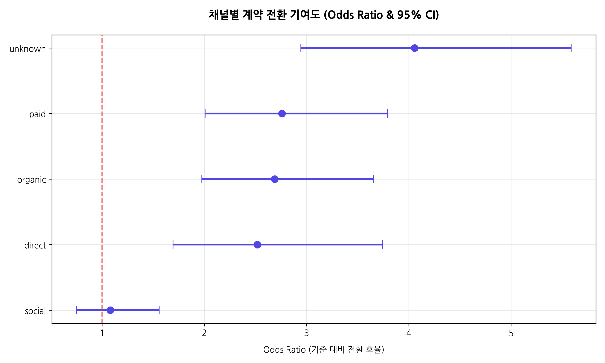

### [3-2] unknown 제외 시 OR 비교

unknown을 제외하고 같은 모델을 재실행하여 다른 채널의 OR 변화를 비교했습니다.

| 채널 | unknown 포함 OR | unknown 제외 OR | 변화 | 해석 |
| :--- | :---: | :---: | :---: | :--- |
| **paid_search** | 2.759 | 2.761 | +0.002 | 견고함 (순위 동일) |
| **organic_search** | 2.689 | 2.688 | -0.001 | 견고함 (순위 동일) |
| **direct_traffic** | 2.519 | 2.519 | 0.000 | 견고함 (순위 동일) |
| **social** | 1.082 | 1.086 | +0.004 | 견고함 (순위 동일) |

unknown을 제외해도 다른 채널의 OR 순위가 동일하므로 이전의 분석 결론이 충분히 견고하다고 판단됩니다.

- **시사점**: **Search(Organic/Paid)** 계열은 안정적인 성과를 보이나, **Social** 채널은 리드 품질(OR)이 기준 대비 차이가 없어(통계적으로 유의미하지 않음) 효율 개선이 시급합니다.

---

## 4. unknown 채널의 실체 규명

`unknown` 유입 경로는 특정 랜딩 페이지로의 집중도가 매우 높아, 검색 기반 유입의 추적 유실로 분석됩니다.

### [4-1] 랜딩 페이지(LP) 분석 결과
- **unknown 유입 규모**: 1,159명
- **1위 LP 점유율**: `unknown` 유입의 **56.7%** (657명)가 특정 LP(`b76ef37428e6799c421989521c0e5077`)로 유입되었습니다.
- **채널 유통 특성**: 해당 LP는 `organic_search` 및 `paid_search` 상위 유입 경로와 일치합니다.
- **분석 결과**: `unknown`은 UTM 파라미터가 유실된 **검색 기반 유입**의 연장선상에 있는 효율적인 리드군입니다.

### [4-2] 동일 LP의 채널 혼재 분석

unknown이 가장 많이 유입된 LP(`b76ef37428e6799c421989521c0e5077`)에 다른 채널도 유입되는지 분석한 결과입니다.

| 채널 | 해당 LP 유입 수 | 비율 |
| :--- | :---: | :---: |
| **unknown** | 657 | 72.0% |
| **organic_search** | 116 | 12.7% |
| **paid_search** | 81 | 8.9% |
| **direct_traffic** | 25 | 2.7% |
| **social** | 13 | 1.4% |
| **referral** | 8 | 0.9% |
| 기타 | 12 | 1.3% |

같은 LP에 organic_search, paid_search도 유입되고 있으므로, unknown은 이들과 같은 경로에서 UTM만 누락된 트래픽으로 추론됩니다.

### [4-3] unknown vs 타 채널 셀러 프로필 비교

`is_won=1`인 셀러에서 채널별(unknown, organic_search, paid_search, social) 프로필을 비교한 결과입니다.

| 채널 | reseller 비율 | 리드 타입 1위 | 업종 1위 |
| :--- | :---: | :---: | :---: |
| **unknown** | 71.0% | online_medium(80) | health_beauty(23) |
| **organic_search** | 67.2% | online_medium(105) | home_decor(44) |
| **paid_search** | 69.2% | online_medium(78) | health_beauty(26) |
| **social** | 76.0% | online_medium(27) | home_decor(11) |

unknown의 프로필은 리드 타입과 업종 측면에서 `paid_search` 채널과 가장 유사한 특성을 보입니다.

### [4-4] 추론의 근거 강도 정리

위 분석을 종합하여, unknown의 정체에 대한 추론 근거를 정리합니다.

| 근거 | 내용 | 강도 |
| :--- | :--- | :--- |
| LP 집중도 | unknown의 56.7%가 단일 LP에 집중 | 강함 |
| 채널 혼재 | 같은 LP에 organic/paid도 유입 (약 21%) | 강함 |
| 프로필 유사성 | unknown 프로필이 paid_search와 상당 부분 일치 | 보통 |

이상의 근거는 데이터 기반 추론에 해당하며, 확정된 결론은 아닙니다. 정확한 규명을 위해서는 UTM 추적 체계 정비를 통한 실제 유입 경로 확인이 필요합니다.

---

## 5. 결론 및 예산 배분 전략 제안

### 핵심 결론

> **paid_search와 organic_search가 전환 효율·매출 기여 모든 면에서 가장 효율적인 채널이며, social은 유입 볼륨 대비 성과가 가장 낮아 예산 재검토가 필요하다.**

### 근거 요약

#### [5-1] 채널별 유입 대비 매출 효율 순위가 명확하다

| 채널 | CVR | OR | MQL당매출 | 판정 |
| :--- | :---: | :---: | :---: | :--- |
| **paid_search** | 12.3% | 2.759 | **R$98** | 최우수 (볼륨·효율 균형) |
| **organic_search** | 11.8% | 2.689 | R$90 | 우수 (비용 없는 안정적 유입) |
| direct_traffic | 11.2% | 2.519 | R$44 | 보통 |
| **social** | **5.6%** | **1.082 (ns)** | **R$32** | **미흡 (paid의 1/3 수준)** |

unknown 제외 기준으로 paid_search가 MQL당 매출 R$98로 1위이며, social의 R$32 대비 **3배** 효율적이다.

#### [5-2] social은 "많이 오지만 안 되는" 채널이다

- MQL 수 3위(1,350명)인데 CVR은 최하위권(5.6%)
- OR=1.082로 email/display 같은 약한 채널과 통계적으로 차이 없음 (p=0.671)
- Sales Cycle 중앙값 30일로 전 채널 중 가장 느림
- MQL당 매출 R$32는 paid_search(R$98)의 1/3 수준

#### [5-3] unknown은 성과 효율 1위이지만 정체불명이다

- CVR 16.7%, MQL당 매출 R$185로 최고 효율
- 하지만 56.7%가 단일 LP에 집중, 프로필은 paid_search와 유사
- UTM 누락된 search 트래픽으로 추론되나 확정 결론은 아님
- unknown의 정체가 확인되면 search 채널의 실제 기여도가 더 높아질 수 있음

#### [5-4] 빠른 전환이 좋은 셀러를 만든다

- 14일 이내 전환 셀러: 활성화율 54.7%, 평균 매출 R$908
- 60일 초과 전환 셀러: 활성화율 23.6%, 평균 매출 R$280
- Mann-Whitney p<0.001로 유의미한 차이
- 전환 속도가 빠른 채널(direct 10일, unknown 11일)이 이후 성과도 우수

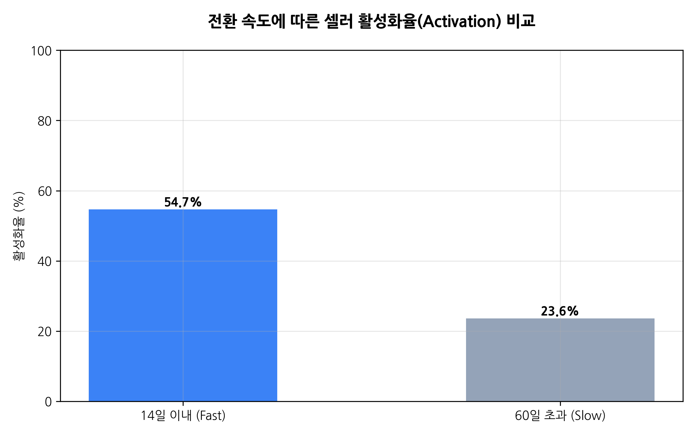

### 예산 배분 전략 제언

| 채널 | 전략 | 근거 |
| :--- | :--- | :--- |
| **paid_search** | **예산 증액** | CVR 12.3%, OR 2.76, MQL당 R$98 — unknown 제외 시 유입 대비 매출 효율 1위 |
| **organic_search** | **SEO 강화 (비용 효율적)** | CVR 11.8%, OR 2.69 — 광고비 없이 MQL당 R$90 |
| **social** | **예산 감축 또는 타겟 재설계** | CVR 5.6%, OR 1.08(ns) — 현재 투입 대비 성과 미흡 |
| **direct_traffic** | **브랜드 인지도 확대로 볼륨 키우기** | 활성화율 55.4%로 최고, 다만 볼륨(499명)이 작음 |
| **unknown** | **UTM 추적 체계 정비 (선행 과제)** | 성과 효율 1위이나 정체 불명 — 추적 정비 후 예산 판단 |

### 다른 파트에 전달할 시사점

| 전달 대상 | 시사점 | 근거 |
| :--- | :--- | :--- |
| **Activation 팀** | 14일 이상 소요되는 딜에 온보딩 지원 강화 필요 | 빠른 전환(14일 이내) 활성화율 55% vs 느린 전환(60일+) 24% |
| **Revenue 팀** | 채널별 MQL당 매출 차이가 활성화 이후에도 유지되는지 검증 필요 | Acquisition에서는 채널간 차이가 명확하나, Revenue 단계에서 사라질 수 있음 |
| **전체 프로젝트** | 예산 재배분만으로 매출 증가 가능하나, 활성화율 개선이 더 큰 레버리지일 수 있음 | 계약 842명 중 55%가 매출 0원 — 이 병목 해소가 예산 재배분보다 효율적 |

Acquisition 단계에서 확보된 유료 및 검색 리드들이 실제 계약 단계(Activation)에서 어떻게 대규모 병목(89.5% 이탈)을 겪고 있으며, 이를 해소할 수 있는 조건이 무엇인지 다음 파트에서 상세히 분석합니다.

---

## 6. 분석의 한계 및 후속 과제

| 구분 | 주요 내용 | 비즈니스 영향 | 향후 과제 |
| :--- | :--- | :--- | :--- |
| **데이터 결측** | unknown 채널 비중 높음 (14.5%) | 기여도 분석의 불확실성 증대 | UTM 추적 로직 전면 검토 및 보완 |
| **비용 데이터 부재** | 채널별 실제 광고비(Ad Spend) 없음 | 성과 효율의 정교한 산출 제한 | 채널별 비용 데이터 연동 필요 |
| **표본 부족** | Display, Email 등 일부 채널 모수 적음 | 통계적 유의성 부족 및 오차 발생 | 중장기 데이터 축적 또는 클러스터 분석 |
| **인과관계 미입증** | 자기 선택 편향(Self-selection bias) 존재 | 채널 자체 효과인지 유저 성향인지 불분명 | 신규 리드 대상 채널별 A/B 테스트 설계 |

---

*데이터 기준: marketing_sales_base.csv | 분석: Antigravity | 2026년 4월 | Senior Data Analyst: Antigravity*

---

# [Activation] 리드 전환 예측 및 이탈 분석

Acquisition 파트에서 유입 채널별 성과와 매출 효율 차이를 확인했습니다. 본 파트에서는 해당 유입이 실제 계약 체결 단계에서 89.5%라는 대규모 이탈을 겪는 구조적 원인을 분석하고, 성공적인 리드 전환을 위한 핵심 기여 요인을 규명합니다.

# Part 2: 리드 전환 예측 및 이탈 분석

**관심 표명 → 계약 체결 단계에서 89.5%의 리드 이탈이 발생하며, 그 구조적 원인을 찾는다**

---

## 📊 핵심 지표 (KPI)

- **총 관심 표명**: 8,000 (잠재 셀러)
- **계약 체결**: **842** (전환율 10.5%)
- **이탈**: **7,158** (89.5% 손실)
- **최고 AUC**: 0.713 (향상된 모델 v2)

---

## 🎯 핵심 요약 — 5가지 발견

1. **89.5% 이탈은 "시기 의존적" 현상이다**
   - 2017Q3 전환율 1.9% → 2018Q1 14.0%로 7배 증가. 랜덤 포레스트 분석에서 시기 변수가 67.4% 중요도로 압도적 1위. 마케팅 피로도 가설은 기각됨.
2. **채널은 약한 보조 변수다**
   - 향상된 모델 AUC 0.713. 채널 변수 전체 합계보다 시기 변수 1개가 2배 더 중요하게 작용함.
3. **Unknown 채널 효율 1위(16.7%)지만 정체 불명**
   - UTM 추적 정비가 가장 시급한 핵심 액션 아이템임.
4. **Social 채널 볼륨 3위인데 전환율 5.6%로 최저**
   - 이탈자 분포에서 social 비중이 계약자보다 2배 높음. 마케팅 예산 재검토 소요.
5. **영업 단계별 병목: 15일이 골든타임**
   - 계약 속도 분석 결과, 15일 이내 계약자가 전체의 52%. 15일 경과 시 전환 확률 급락함.

---

## 🔍 상세 분석 (16개 차트)

### 1. 관심 표명 → 계약 체결 깔때기

> **비즈니스 인사이트:** 8,000명 관심 표명 중 842명만 계약으로 이어졌으며, 전체 리드의 89.5%가 계약 전 단계에서 이탈했습니다.

### 2. 채널별 볼륨 vs 전환율
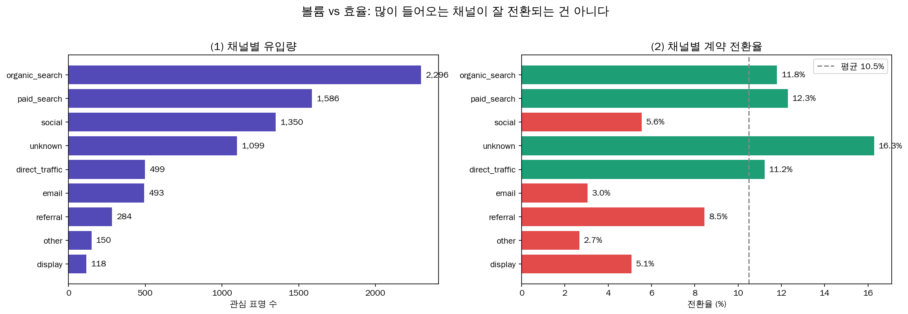
> **비즈니스 인사이트:** Organic은 볼륨 1위지만 전환율은 평균 수준임. Unknown이 전환율 1위(16.7%)를 기록. Social은 비효율적이며 예산 감축 및 unknown UTM 정비가 필요함. 이러한 채널별 효율 차이는 Acquisition 단계에서 확인한 채널 성과 차이와 일관된 방향을 보입니다.

### 3. 시기별 마케팅 피로도 검증

> **비즈니스 인사이트:** 전환율 추세가 월 +1.44%로 시간 경과에 따라 상승함. 기존의 피로도 가설은 기각되며, 영업 프로세스의 학습 곡선 영향으로 판단됨.

### 4. 영업 주기 분포

> **비즈니스 인사이트:** 계약자의 영업 주기는 대부분 30일 이내에 집중됨. Direct_traffic은 주기가 짧고 Social은 길며 분산이 매우 큼.

### 5. 랜딩페이지 상위 15개 전환율

> **비즈니스 인사이트:** 페이지 간 전환율이 최고 20.3%에서 최저 3.4%로 6배 차이 발생. 랜딩페이지 선정이 핵심 전환 변수임.

### 6. 계약 셀러 업종 상위 15
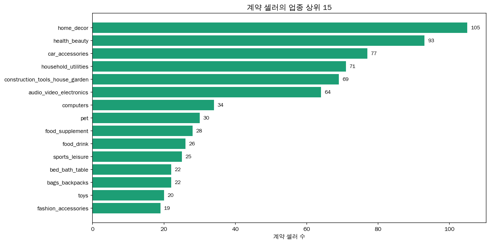
> **비즈니스 인사이트:** 홈데코(home_decor) 업종이 계약 1위(105명)를 차지함. 헬스/뷰티, 자동차 용품이 그 뒤를 이음.

### 7. 계약 셀러 리드 타입
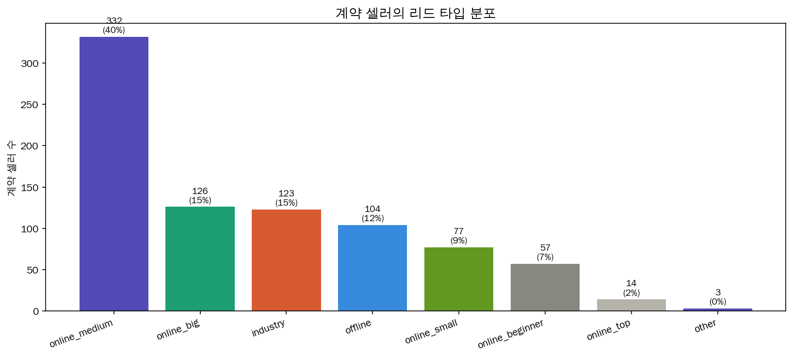
> **비즈니스 인사이트:** Online_medium(중간 규모 온라인 셀러)이 절대다수이며 플랫폼의 핵심 타겟 리드임.

### 8. 로지스틱 회귀 오즈비

> **비즈니스 인사이트:** 시기(contact_month) 변수의 OR=4.0으로 압도적 1위. 채널 변수의 OR은 1.06~1.28 범위로 상대적으로 영향력이 미미함.

### 9. 랜덤 포레스트 변수 중요도
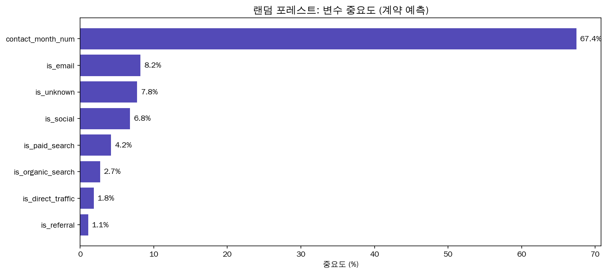
> **비즈니스 인사이트:** 시기 변수 중요도가 67.4%로 압도적임. 채널 변수 7개 합계(약 32%)보다 시기 1개 변수가 2배 더 중요함.

### 10. 머신러닝 모델 성능 v1 (ROC)
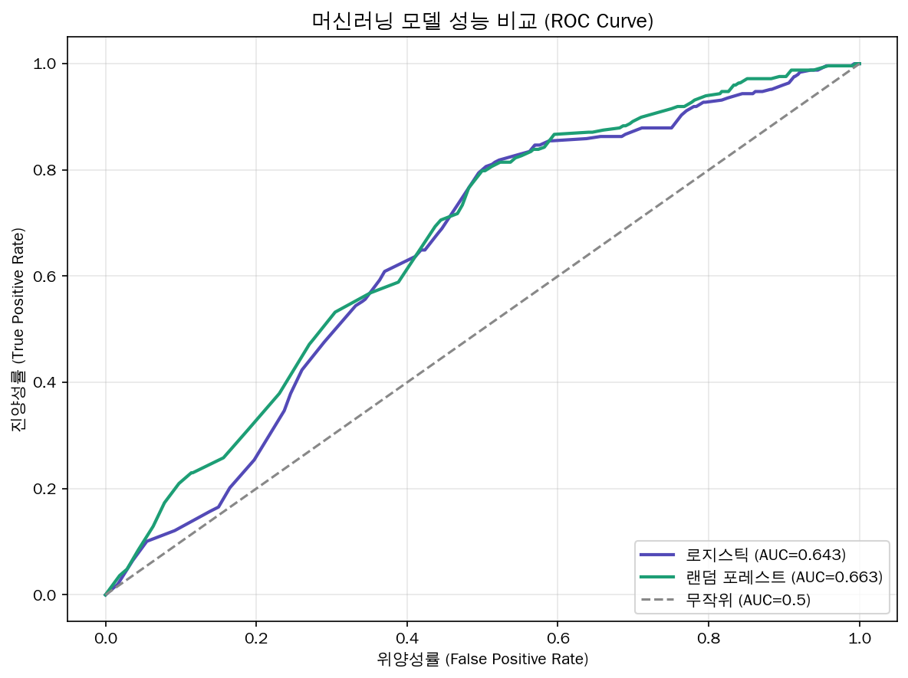
> **비즈니스 인사이트:** 로지스틱 AUC 0.643, 랜덤 포레스트 AUC 0.663 기록. 피처8개의 한계를 보이며 v2에서 개선함.

### 11. 이탈자 vs 계약자 페르소나 비교

> **비즈니스 인사이트:** Social 채널 비중이 이탈자(18.9%)에서 계약자(8.9%)보다 2배 높으며, 계약자의 93%가 2018년 유입자임.

### 12. 분기별 전환율 추이
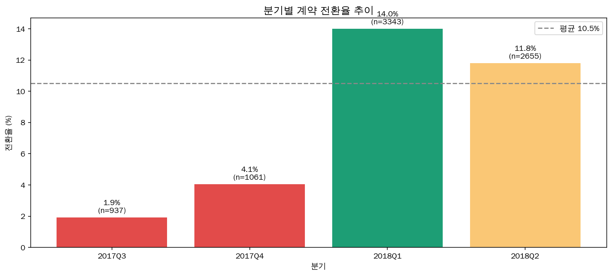
> **비즈니스 인사이트:** 2017Q3 1.9%에서 2018Q1 14.0%로 전환율 7배 급증. 2018년부터 프로세스가 안정화됨.

### 13. 영업 단계별 병목 (계약 속도)

> **비즈니스 인사이트:** 계약자의 52%가 15일 이내에 완료됨. 15일이 골든타임이며, 이 구간을 넘기면 전환 확률이 급격히 하락함.

### 14. 이탈자 3-세그먼트 분석
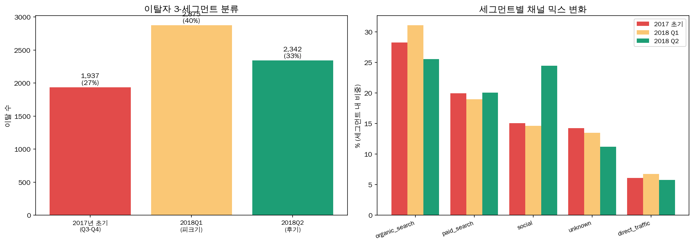
> **비즈니스 인사이트:** 이탈자 7,158명을 분석한 결과, 2018Q1 피크기에 전체 이탈의 47%가 발생함. 세그먼트별 맞춤형 대응이 필요함.

### 15. 무엇이 2018Q1에 바뀌었나
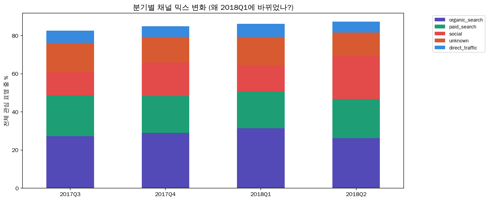
> **비즈니스 인사이트:** 2018Q1부터 paid_search 및 unknown 비중이 증가하고 social 비중이 감소함. 이러한 채널 재배분이 전환율 급증의 구조적 원인임.

### 16. 향상된 머신러닝 모델 (v2)
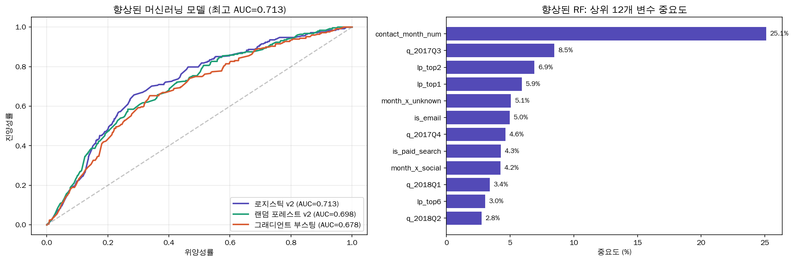
> **비즈니스 인사이트:** 피처를 24개로 확장하여 로지스틱 AUC 0.713으로 개선. 랜딩페이지 변수 추가가 성능 향상의 핵심 기여 요소임.

---

## 🚀 우선순위 액션 매트릭스

### 🔴 즉시 실행 (낮은 비용)
- Unknown 채널 UTM 추적 정비
- Social 채널 예산 50% 감축 및 재배분
- 15일 골든타임 알림 시스템 도입

### 🟡 중기 과제 (중간 비용)
- 2017→2018 채널 믹스 변화의 상세 원인 조사
- 랜딩페이지별 A/B 테스트 실시
- 계약 후 첫 4주(28일 기준) 온보딩 집중 케어 프로그램 구축
  (15일 골든타임은 계약 전환 속도 기준이며, 28일은 계약 이후 첫 판매 유도를 위한 온보딩 케어 기준입니다.)

### 🟢 예상 효과
- 채널 믹스 개선 시 전환율 +2~3%p 개선 기대
- 15일 이내 Fast-track 도입 시 추가 +5%p 전환 상승 기대

계약을 통해 플랫폼에 입성한 셀러가 실제 '첫 매출'이라는 보상을 얻고 안정적으로 안착하는 조건은 무엇인지, 다음 Retention 파트에서 '28일 골든타임' 분석을 통해 규명합니다.

---

*데이터 기준: looker_studio_master.csv | 분석: Antigravity | 2026년 4월 | Part 2: 리드 전환 예측 및 이탈 분석 (Activation) | 2026년 4월 작성*

---

# [Retention] Olist 셀러 Retention 분석

Activation 분석에서 계약 성사 조건을 규명했다면, 이제는 계약한 셀러가 실제로 생존하여 플랫폼에 안착하는 조건을 탐색합니다. 본 분석은 장기 리텐션보다는 계약 직후 '첫 매출'을 달성하는 초기 안착(Initial Activation) 메커니즘을 규명하는 데 집중합니다.

# Olist 셀러 Retention 분석: 전환(Activation) 후 생존 및 성장 조건

---

## 1. 분석 배경 및 데이터셋의 의미

### 1.1 배경: "입점은 시작일 뿐이다"
이커머스 플랫폼 Olist의 성장은 단순히 얼마나 많은 셀러를 끌어오느냐(Acquisition)가 아니라, 입점한 셀러가 얼마나 빨리 첫 매출을 일으키고 플랫폼에 안착하느냐(Activation & Retention)에 달려 있습니다. 많은 셀러가 계약 단계(is_won=1)까지 도달하지만, 상당수가 실제 상품 등록이나 판매 단계로 넘어가지 못하고 휴면 상태가 됩니다. 앞선 파트의 15일 골든타임이 계약 체결의 마지노선이었다면, 본 파트는 계약 이후의 생존을 결정짓는 초기 대응을 다룹니다.

### 1.2 데이터셋 정의 (`marketing_sales_base.csv`)
본 데이터는 Olist의 **마케팅 퍼널 데이터**와 **실제 판매 실적**이 통합된 데이터셋입니다.  
- **MQL (Marketing Qualified Lead)**: 잠재 셀러로서 마케팅 활동에 반응한 리드  
- **Won Seller (is_won=1)**: 영업 과정을 거쳐 최종적으로 입점 계약을 체결한 셀러 (842명)  
- **Active Seller (has_revenue=1)**: 입점 후 최소 1건 이상의 실제 매출을 발생시킨 '살아남은' 셀러 (380명)

**분석 목표**: 계약 후 실제 첫 매출 달성과 초기 안착 조건을 분석하여, 플랫폼 기여도가 높은 셀러의 특성을 정의하고 영업 및 온보딩 전략을 최적화합니다.

---

## 2. 주요 분석 결과 및 심층 인사이트

### === 분석 1: 활성 vs 휴면 셀러 프로파일 비교 ===
**"동기(Motivation)가 강한 셀러가 행동도 빠르다"**

- **Sales Cycle Days의 유의미한 차이**: 
  - 첫 접촉 후 입점까지 걸린 기간이 짧을수록 활성 셀러가 될 확률이 월등히 높았습니다 (Mann-Whitney U Test, p < 0.05).
  - **인사이트**: 입점 결정을 빠르게 내리는 셀러는 이미 판매할 준비(재고, 인력 등)가 되어 있는 상태일 가능성이 높습니다. 반면 입점까지 오래 걸리는 셀러는 내부 인프라 부족 등으로 인해 계약 후에도 실제 판매까지 이어지는 허들이 높음을 시사합니다.

- **기대 매출의 선별 효과**:
  - 활성 셀러들은 입점 전 본인의 예상 매출(`declared_monthly_revenue`)을 더 높게 신고하는 경향이 있었습니다.
  - **인사이트**: 이는 고품질 셀러들이 자신감을 가지고 플랫폼에 진입함을 의미하며, 영업 단계에서의 '자가 선언 매출' 정보가 셀러의 잠재 생존력을 예측하는 초기 지표가 될 수 있습니다.

---

### === 분석 2: 유입 채널별 활성률 및 품질 분석 ===
**"양(Quantity)보다 질(Quality)에 집중해야 할 채널"**

- **채널별 성과 매트릭스**:
  - **Direct Traffic (활성률 55.4%)**: 플랫폼을 직접 찾아온 셀러는 이미 브랜드 인지도가 높고 의지가 강해 생존율이 가장 높습니다.
  - **Paid Search와 일부 고품질 유입 채널**: 활성률도 평균 이상이며, 개별 셀러가 발생시키는 평균 매출(LTV)도 높게 나타났습니다.
- **인사이트**: `Organic Search`는 유입 리드 자체는 많으나 활성률은 평균 수준입니다. 마케팅 예산을 단순히 리드 수 확보에 쓰기보다, 고매출 셀러 유입 비중이 높은 `Paid Search`와 고품질 유입 접점의 전환율 개선에 집중하는 것이 플랫폼 전체 거래액(GMV) 성장에 유리합니다.

---

### === 분석 3: 비즈니스 프로파일별 생존 환경 ===
**"제조사보다 유통사의 적응력이 높다"**

- **Business Type (Reseller vs Manufacturer)**:
  - **Reseller**의 활성률(48.9%)이 Manufacturer(37.2%)보다 10%p 이상 높고 매출 규모도 더 큽니다.
  - **인사이트**: 제조업체는 본인들의 상품군이 한정적인 반면, 리셀러는 시장 수요에 기민하게 반응하여 다양한 카테고리를 취급할 수 있는 '유연성'이 있기 때문에 초기 안착에 더 유리한 것으로 해석됩니다.

- **업종별 기회 요소**:
  - `household_utilities`, `pet`, `audio_video_electronics` 업종이 상위 활성률을 보입니다. 해당 업종은 온라인 수요가 꾸준하고 판매 주기가 짧아 초기 판매 성공 경험을 쌓기에 최적화된 분야입니다.

---

### === 분석 4: 초기 성공(Time-to-First-Sale)의 결정적 영향 ===
**"첫 4주(28일)가 셀러의 운명을 결정한다"**

> [!NOTE]
> **평균 누적 매출 (Average Cumulative Revenue)**
> - **정의**: 특정 그룹에 속한 활성 셀러들이 입점 후 첫 판매 시점부터 분석 기준일(2018-08-31)까지 발생시킨 총 매출의 평균값입니다. 이는 셀러가 플랫폼에 안착한 후 창출한 생애 가치(LTV)의 대리 지표로 활용됩니다.
> - **계산법**: $\text{평균 누적 매출} = \frac{\sum(\text{Active Seller의 총 매출})}{\text{활성 셀러 수}}$

- **매출과의 상관관계**: r = **-0.158** (약한 음의 상관관계)
- **구간별 분석**:
  - **빠름 (0-28일)**: 평균 매출 3,787 BRL (압도적 우위)
  - **매우 느림 (79일 이상)**: 평균 매출 630 BRL
- 첫 판매까지의 시간이 28일 이내인 셀러는 79일 이후에 낸 셀러보다 **약 6배 높은 누적 매출**을 기록했습니다. 앞선 Activation 파트의 15일 기준이 '계약' 속도였다면, 본 28일 기준은 실제 플랫폼에서 '가치'를 창출하기 시작하는 온보딩 속도를 의미합니다.

#### [입점 후 경과 기간별 이탈률(미전환율) 분석]
입점 후 시간이 흐를수록 첫 판매에 성공하지 못하고 '휴면(이탈) 상태'로 남을 확률을 분석했습니다.

- **골든타임 28일**: 입점 후 28일이 지나는 시점에도 여전히 **88.4%**의 셀러가 첫 판매를 기록하지 못한 상태입니다. 이 시기를 넘기면 전환 속도가 급격히 둔화됩니다.
- **장기 휴면 고착화**: 입점 후 90일이 지나면 미전환율은 **62.9%** 수준에서 매우 천천히 감소하며, 최종적으로 약 **55%**의 셀러는 사실상 영구 휴면 상태로 고착화됩니다.
- **인사이트**: 입점 후 첫 1개월 이내에 셀러를 활성화시키지 못하면, 해당 셀러가 향후 플랫폼에 기여할 가능성은 기하급수적으로 낮아집니다.

---

## 3. 종합 결론 및 비즈니스 제언

#### [살아남는 셀러의 조건 — 주요 발견]

1. **빠른 실행력**: 입점 결정이 빠르고 초기 온보딩 기간이 짧음 (Sales Cycle이 생존의 선행 지표).
2. **유연한 사업 모델**: 재고 관리와 품목 확장이 용이한 리셀러 형태 (Manufacturer 대비 높은 적응력).
3. **조기 성과 달성**: 입점 직후 28일 이내에 실제 판매를 일으킴 (Small Win의 가속 효과).
4. **목적형 유입 경로**: `direct_traffic`과 같이 브랜드 인지도가 이미 높거나, `paid_search`처럼 특정 비즈니스 목적을 가지고 유입된 채널일수록 생존율과 매출 기여도가 모두 높음.

### 3.2 비즈니스 제언: "Onboarding as a Service"
- **영업 타겟팅 고도화**: 입점 결정까지의 시간(Sales Cycle)과 기대 매출을 기준으로 잠재 활성 가능성이 높은 셀러를 우선순위화하십시오.
- **초기 28일 집중 케어**: 모든 신규 셀러가 입점 후 **4주 이내**에 첫 판매를 달성할 수 있도록 '웰컴 프로모션'이나 '첫 등록 지원 서비스'를 강화해야 합니다.
- **채널 최적화**: 단순히 리드 단가가 낮은 채널보다, 생존 셀러 매출 품질이 증명된 `paid_search` 및 유통사 비중이 높은 채널로 예산을 재분배하는 것이 효율적입니다.

### 3.3 데이터의 한계 및 향후 분석 제언
- 현재는 '생존 여부'에 집중하고 있으나, 매출의 지속성(Retention Curve)을 파악하기 위해 월별 활성 리텐션 데이터 보완이 필요합니다.
- 마지막 판매일(Recency) 데이터가 추가된다면 단순 휴면을 넘어선 **이탈(Churn)** 예측 모델로 고도화할 수 있습니다.

초기 안착에 성공한 셀러 그룹이 플랫폼 전체의 매출 구조(LTV)와 브랜드 평판(리뷰/배송 품질)에 어떤 기여를 하는지, 다음 Referral 파트에서 상세히 다룹니다.

---

# [Referral] Olist 고가치 셀러의 매출 기여 및 고객 경험 품질 분석

본 파트는 Olist의 고가치 셀러가 매출에 어떻게 기여하는지 먼저 확인하고, 이어서 리뷰 데이터를 통해 이들이 고객 경험과 플랫폼 평판에도 긍정적으로 기여하는지를 분석한 결과입니다.

# Olist 고가치 셀러의 매출 기여 및 고객 경험 품질 분석

---

## 1. 리뷰 평점 분포

전체 리뷰 평점 분포를 확인하여, 플랫폼 내 기본적인 고객 만족도를 파악합니다.

> **분석 인사이트:**
> - 전체 리뷰 중에서 5점(매우 만족) 리뷰가 가장 높은 비중을 차지합니다.
> - Olist 플랫폼의 고객 중 다수가 서비스 및 상품에 만족하고 있으며, 이는 긍정적인 구전(Referral) 효과를 일으키는 핵심 원동력이 될 수 있습니다.
> - 다만 1점(매우 불만족) 리뷰 역시 일정 비율 존재하므로, 어떤 불만 요소가 있는지 구체적으로 파악하는 것이 중요합니다.

---

## 2. 긍정/부정 리뷰 텍스트 워드클라우드

고객들이 작성한 리뷰 텍스트에서 가장 자주 언급된 단어들을 추출하고, 한글로 번역하여 워드클라우드로 시각화했습니다.

> **분석 인사이트:**
> - 긍정 리뷰(5점) 에서는 '품질', '빠른 배송', '추천', '아름답다', '완벽하다' 등 상품 자체의 퀄리티와 신속한 배송을 칭찬하는 단어들이 크게 부각되었습니다.
> - 부정 리뷰(1점) 에서는 '환불', '결함', '지연', '제품', '받지 못함' 등 상품 누락, 배송 지연 및 상품 결함과 관련된 불만 단어들이 눈에 땘니다.

---

## 3. 핵심 키워드 TF-IDF 분석 (긍정/부정)

단순 빈도수가 아닌 문맥 내 중요도를 반영하기 위해 TF-IDF 점수 기반으로 상위 20개 키워드를 추출하였습니다.

> **분석 인사이트:**
> - 긍정 키워드(Top 20): 추천(recommend) 및 품질(quality), 빠르다(fast) 등이 높은 TF-IDF 점수를 기록하였습니다. 이는 고객의 추천(Referral) 의사에 직접적인 영향을 미치는 주요 요인입니다.
> - 부정 키워드(Top 20): 하자/파손, 반품/환불, 지연 등의 키워드가 최상위권입니다. 셀러 평판을 낮추고 이탈을 유발하는 치명적 요소를 관리해야 합니다.

---

## 4. 유입 채널별 평균 리뷰 점수

최초에 셀러가 어떤 채널(Origin)을 통해 Olist 플랫폼으로 유입(가입)했는지에 따라, 입점 후 받은 고객들의 평균 리뷰 점수가 어떻게 다른지 분석했습니다.

> **분석 인사이트:**
> - 특정 마케팅 채널(예: organic_search, direct_traffic 등)을 통해 유입된 셀러들의 고객 만족도(평균 리뷰 점수)를 비교할 수 있습니다.
> - 고객 리뷰 점수가 높은 우수한 서비스 품질의 셀러들이 주로 유입되는 채널을 식별하면, B2B 마케팅 팀에서 해당 채널에 예산을 집중할 수 있습니다.

---

## 5. 배송 소요일과 리뷰 점수의 상관관계

배송이 실제 고객에게 도달하기까지 걸린 시간(실제 배송 소요일)과 리뷰 점수 간의 관계를 산점도로 분석했습니다.

> **분석 인사이트:**
> - 배송 소요일이 짧을수록 5점(만족) 리뷰가 압도적으로 많이 형성되는 모습을 확인할 수 있습니다.
> - 배송 기간이 길어질수록(예: 20일 이상) 리뷰 점수의 평균 추세선이 급격히 1~3점대 수준으로 하락합니다.
> - 빠른 물류 처리(Fast Delivery) 능력을 갖춘 셀러가 우량 셀러(스타 셀러)로 거듭나고, 고객 추천을 받을 확률이 높음을 시사합니다.

---

## 6. 업종별 고객 만족도(리뷰 점수) Heatmap

셀러들이 취급하는 비즈니스 세그먼트(업종 카테고리)별로 고객 만족도 분포에 차이가 있는지 분석했습니다.

> **분석 인사이트:**
> - 히트맵을 통해 어떤 카테고리(예: 건강/뷰티, 스포츠, 자동차 등)가 유독 5점 리뷰 비율이 높은지 한눈에 파악할 수 있습니다.
> - 5점 리뷰 비율이 높은 세그먼트는 Olist 플랫폼 입장에서 주력(Hero) 카테고리로 밀고, 프로모션 시 고객 락인(Lock-in)과 신규 유입을 유도하기 유리합니다.
> - 반면 1~2점 리뷰 비중이 높은 업종의 경우, 상품 품질 기준 강화 혹은 셀러 교육이 필요합니다.

---

## 7. 우량 셀러(스타 셀러) vs 일반 셀러의 평균 리뷰 점수 (Box Plot)

이전 분석에서 LTV(매출액 및 판매 빈도)를 기준으로 K-Means 군집화를 통해 식별한 '스타 셀러' 그룹이, 일반 셀러 대비 실제로 고객으로부터 더 높은 평점을 받고 있는지 확인했습니다.

> **분석 인사이트:**
> - 스타 셀러(우량 셀러) 들은 일반 셀러 그룹보다 리뷰 점수 중앙값(Median)이 확연히 높으며, 상위 분위에 밀집되어 있습니다.
> - LTV(경제적 가치)가 높은 셀러일수록 단순히 매출만 높은 것이 아니라, 서비스 및 품질(고객 평점) 역시 뛰어나다는 점이 데이터로 증명되었습니다.
> - 이는 고가치 셀러들이 충성도 높은 고객을 만들어내며, 긍정적인 고객 추천(Referral) 사이클의 선순환을 주도하고 있음을 뜻합니다.

---

## 요약 및 제언 (Strategic Recommendation)

1. **리뷰 핵심 요인 관리**: NLP 분석을 통해 확인된 것처럼 '빠른 배송'과 '결함 없는 제품'이 Referral 단계의 핵심 트리거입니다. Olist는 우수 배송 및 상품 검수 정책을 더욱 강화해야 합니다.
2. **매출 기여 채널 최적화**: 입점 후 고객 만족도를 높게 유지하는 '진성 우량 셀러'가 유입되는 마케팅 채널에 B2B 광고 예산을 재분배해야 합니다.
3. **LTV 기반 셀러 지원**: 스타 셀러들은 플랫폼의 매출뿐만 아니라 고객 신뢰와 추천까지 견인합니다. 이들을 락인할 수 있는 수수료 혜택, 노출 지원 등 VIP 셀러 관리 체계가 필요합니다.

---

# [Revenue] Olist Seller AARRR Funnel Analysis

Acquisition에서 시작해 Referral까지 각 퍼널의 성패 조건을 규명해 왔습니다. 본 파트에서는 AARRR 전 단계를 관통하는 생존 여정과 수익 전환 구조를 종합하여, Olist 비즈니스의 최종적인 임팩트와 지속 가능한 성장 전략을 도출합니다.

# Olist Seller AARRR Funnel Analysis

**Revenue Part Strategic Report | 2026.04.17 (Revised)**

*본 리포트는 브라질 현지 통화인 헤알(Real, R$)을 기준으로 작성되었습니다.*

---

## 📘 리드 프로파일(Lead Behaviour Profile) 정의

Olist는 셀러의 운영 특성과 규모에 따라 4가지 동물군으로 분류하여 관리합니다. 앞선 퍼널 분석에서 확인한 고성과 리드의 특성들이 이 프로파일에 반영되어 있습니다.

- **🦈 상어 (대형/전문)**: 대규모 재고를 보유하고 디지털 숙련도가 높은 전문 기업형 셀러입니다. 플랫폼의 매출 성장을 견인하는 **핵심 동력(ICP)**입니다.
- **🐺 늑대 (공격적/대량)**: 공격적인 마진 정책과 대량 판매를 지향하는 중대형 셀러입니다. 시장 점유율 확보에 중요한 역할을 수행합니다.
- **🦅 독수리 (집중/성장)**: 특정 카테고리에 집중하며 빠르게 성장하는 중형 셀러입니다. 틈새 시장 공략에 강점이 있습니다.
- **🐱 고양이 (소형/입문)**: 소규모 또는 개인 셀러로, 입문 단계의 판매자입니다. 운영 리소스는 낮으나 유입량(Volume)을 지탱합니다.

---

## 01. 채널별 셀러 가치(LTV) 분석

*누가 플랫폼에 가장 높은 장기 매출을 만드는가?*

### 인사이트 요약
- **최고 성과 채널**: 추적 가능 채널 중 평균 LTV는 referral이 가장 높고(1,988 BRL), 총 GMV 규모는 organic_search가 가장 큽니다(207,023 BRL). social의 avg LTV는 1,403 BRL로 추적 가능 채널 중 하위권입니다.
- **전략적 판단**: referral은 MQL 볼륨(284명)은 적지만 avg LTV가 1,988 BRL로 추적 가능 채널 중 가장 높습니다. 소수 고품질 셀러를 데려오는 채널로 재평가가 필요합니다. 반면 social은 MQL 볼륨(1,350명)은 크지만 GMV/MQL이 32.2 BRL로 가장 낮아 효율성 개선이 필요합니다.

---

## 02. 리드 프로파일 기반 성과 분석

*셀러의 성향(Behaviour Profile)이 매출에 미치는 영향*

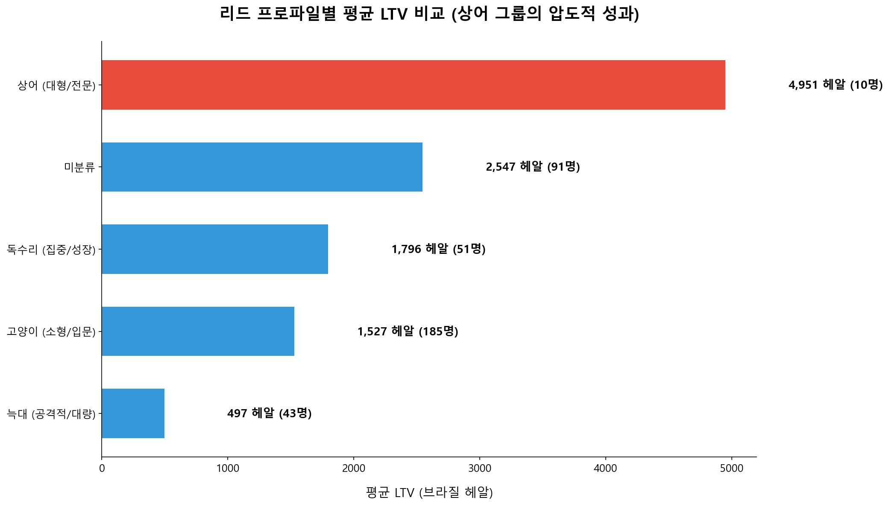

### 인사이트 요약
- **상어(Shark)의 위력**: 상어(shark) 그룹의 avg LTV는 4,951 BRL로 고양이(cat) 1,535 BRL 대비 약 3.2배 높습니다. 단, 활성 shark 셀러는 10명으로 표본이 매우 작아 통계적 신뢰도에 주의가 필요합니다.
- **비즈니스 타겟팅**: 사업 형태 기준으로는 reseller가 활성률 48.9%, avg LTV 2,084 BRL로 manufacturer(37.2%, 860 BRL)를 두 지표 모두에서 앞섭니다. 상어 프로파일 + reseller 조합을 우선 타겟으로 설정하되, 표본 수가 충분히 확보된 후 전략을 고도화해야 합니다.

---

## 03. 채널 × 프로파일 교차 분석

*어떤 경로를 통해 어떤 사냥꾼(Hunter)이 들어오는가?*

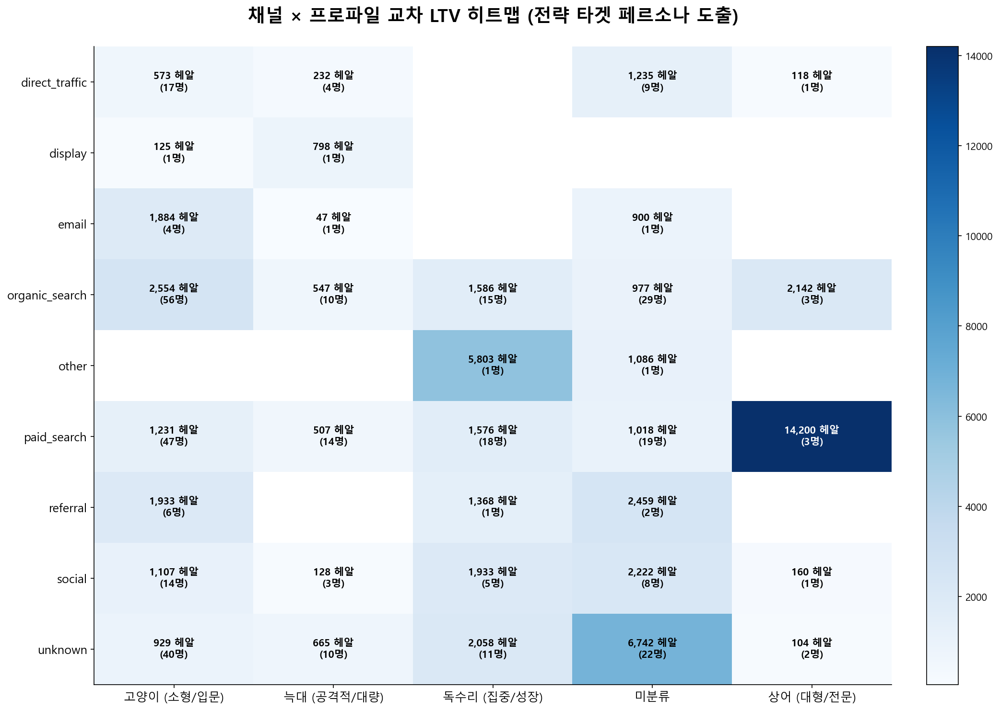

### 인사이트 요약
- **Golden Path 발견**: organic_search는 추적 가능 채널 중 총 GMV 207,023 BRL로 1위이며, avg LTV도 1,832 BRL로 상위권입니다. 상어 프로파일 셀러의 avg LTV(4,951 BRL)와 결합하면 이론상 최고 수익성 조합이나, 실제 교차 표본이 매우 적으므로 organic_search + reseller 조합을 현실적인 Golden Path로 설정하는 것이 안전합니다.
- **데이터 클리닝 통찰**: 복합적인 특징을 가진 셀러들은 주된 특성(Primary Profile)을 기준으로 분류하여 타겟 마케팅을 정교화할 수 있습니다.

---

## 04. 마케팅 투자 우선순위 매트릭스

*데이터 기반의 마켓 리소스 배분 전략 (2×2 Matrix)*

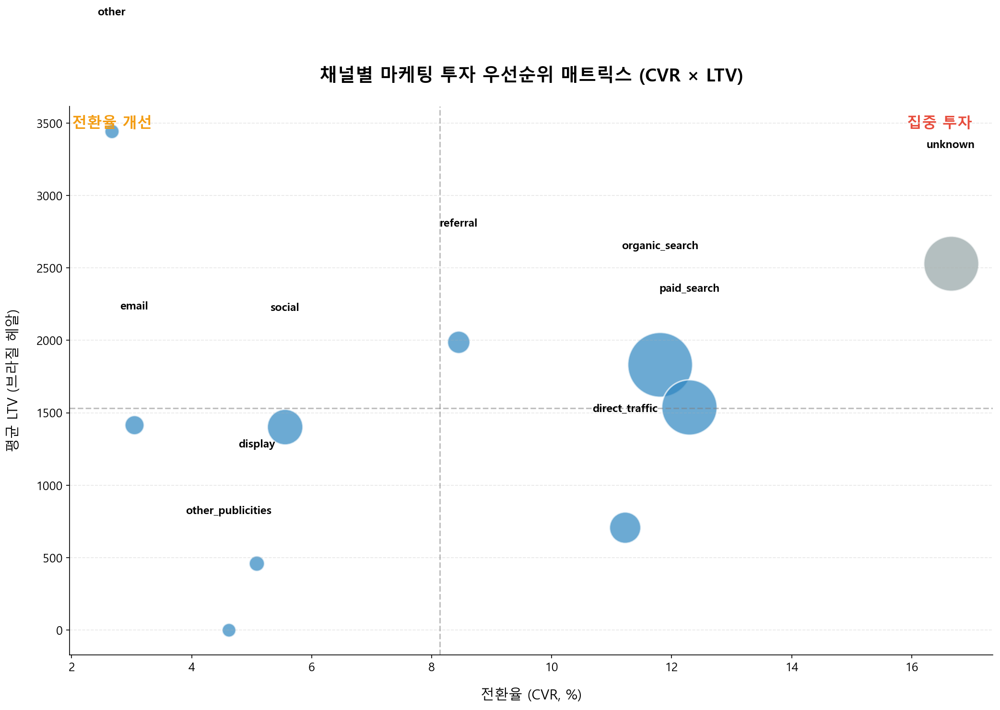

### 인사이트 요약
- **집중 투자 (Star)**: 유입 가치와 전환율이 모두 보장되는 채널에 예산을 수혈하여 시장 점유율을 확장해야 합니다.
- **가치 보존 전략**: 평균 LTV가 높은 채널에서 유입되는 리드는 반드시 전문 상담 신청 등 고도화된 영업 클로징을 지원해야 합니다.

---

## 05. AARRR 전체 퍼널 통과율

*MQL 유입부터 최종 A등급 셀러 탄생까지의 생존 여정*

### 인사이트 요약
- **최종 생존율 분석**: 전체 MQL 8,000명 중 실제 매출을 낸 셀러는 380명(4.75%)이며, 이 중 상위 10%(38명)가 전체 GMV 676,851 BRL의 64.7%를 차지합니다. 상위 20%(76명)로 범위를 넓혀도 GMV의 78.1%가 집중됩니다. 극소수 고성과 셀러에 대한 집중 관리가 Revenue 극대화의 핵심입니다.
- **전환 단계의 병목**: 입점 성사(842명) 중 실제 판매로 이어진 셀러는 380명(45.1%)에 불과합니다. 즉 입점한 셀러의 절반 이상(54.9%, 462명)이 한 번도 판매하지 않고 휴면 상태입니다. 입점 후 첫 판매를 빠르게 유도하는 온보딩 프로그램이 병목 해소의 가장 직접적인 수단입니다.

## 🔍 Key Conclusions

이상 01~05 분석의 핵심 결론을 정리합니다.

- **채널별 LTV 격차 확인**: 추적 가능 채널 중 평균 LTV는 referral이 가장 높고(1,988 BRL), 총 GMV 규모는 organic_search가 가장 큽니다(207,023 BRL). social은 avg LTV 기준 추적 가능 채널 중 하위권(1,403 BRL)입니다.
- **🎯 황금 조합 (ICP)**: 상어(shark) 프로파일 셀러의 avg LTV는 4,951 BRL로 고양이(cat) 대비 약 3.2배 높습니다. 다만 표본 수가 크지 않아 추세 참고용으로 해석할 필요가 있습니다. 현재 데이터에서 가장 현실적으로 참고할 수 있는 고가치 조합은 organic_search + reseller 조합입니다.
- **🚀 가치 중심 전략**: GMV 규모(organic 207K)와 LTV 품질(referral 1,988 BRL)을 동시에 고려하면 organic_search와 paid_search가 우선 투자 채널입니다. social은 유입량은 많으나 avg LTV와 GMV/MQL 모두 하위권으로, 볼륨보다 전환 품질 개선이 선행되어야 합니다.

---

## 🚀 최종 비즈니스 임팩트 전략

- **인프라 강화**: 추적 시스템 개선으로 브라질 헤알 기반 매출 분석 정밀화
- **정밀 스코어링**: 상어(Shark) 및 대형 리드 선제적 판별 알고리즘 도입
- **리소스 최적화**: social 채널 GMV/MQL(32.2 BRL) 대비 paid_search(97.9 BRL)는 3배 효율적입니다. social 예산 일부를 paid_search와 고가치 셀러 유입 채널로 재배분하고, 활성 셀러 상위 20%(76명)에 대한 집중 관리로 현재 GMV의 78% 방어선을 강화해야 합니다.

---

*데이터 기준: marketing_sales_base.csv | 분석: Antigravity | 2026년 4월 | © 2026 Olist Business Analysis Team. All rights reserved.*
