# Olist 셀러 생애주기 관리 전략
MQL 유입부터 고성과 셀러 육성까지 — Olist 셀러 생애주기 전략 분석

---

## 1. 분석 개요
| 항목 | 내용 |
| :--- | :--- |
| **분석 주제** | Olist 플랫폼에서 셀러는 어떻게 유입되고, 살아남고, 돈을 버는가 |
| **데이터** | marketing_sales_base.csv (8,000행 × 22컬럼) — mql_leads + closed_deals 병합본 olist_orders_dataset.csv (99,441건) olist_order_reviews_dataset.csv (99,224건) |
| **분석 기간** | 2017년 6월 ~ 2018년 5월 (12개월) |
| **통화** | 브라질 헤알 (R$) |
| **핵심 수치** | 전체 MQL 8,000명 → 입점 성사 842명(10.5%) → 매출 발생 380명(4.75%) → 총 GMV R$676,851 |

---

## 2. 핵심 컬럼 정의
| 컬럼 | 정의 | 비고 |
| :--- | :--- | :--- |
| `is_won` | 입점 계약 성사 여부 | 1=성사(842명), 0=미성사(7,158명) |
| `has_revenue` | 실제 매출 발생 여부 | 1=발생(380명), 0=미발생(462명) |
| `sales_cycle_days` | won_date − first_contact_date (일수) | 입점 계약까지 소요된 기간 |
| `time_to_first_sale` | first_sale_date − won_date (일수) | 계약 후 첫 판매까지 소요된 기간 |
| `total_revenue` | 누적 실매출 (R$) | 활성 셀러 avg R$1,781 / 중앙값 R$547 |
| `origin` | 마케팅 유입 채널 | organic / paid_search / social / direct / referral 등 |
| `business_type` | 사업 형태 | reseller(587명) / manufacturer(242명) |

<small>* `declared_monthly_revenue`는 결측·0값 편중으로 인해 본 분석의 핵심 판단 지표에서 제외했다.</small>

---

## 3. AARRR 프레임워크 — 단계별 역할 정의
| 단계              | 핵심 질문                                 | 분석 대상                                            | 핵심 지표                                                           |
| :-------------- | :------------------------------------ | :----------------------------------------------- | :-------------------------------------------------------------- |
| **Acquisition** | 어떤 채널이 가장 효율적인 리드를 유입시키는가?            | 채널별 MQL 유입, 계약 전환, 매출 기여도                        | MQL 수, Won 수, CVR, MQL당 매출, 계약 후 매출 발생률                         |
| **Activation**  | 유입된 리드는 어떤 조건에서 계약으로 전환되는가?           | MQL → Won 전환 과정, 계약 소요 시간, 랜딩페이지, 유입 시기          | CVR, 이탈률, Sales Cycle, 15일 이내 계약 비중, LP별 전환율                    |
| **Retention**   | 계약한 셀러는 어떤 조건에서 실제 매출을 발생시키는가?        | Won Seller → Active Seller 전환, 채널·사업형태·업종별 초기 안착 | 계약 후 매출 발생률, Sales Cycle 중앙값, Business Type별 매출 발생률, 업종별 매출 발생률 |
| **Referral**    | 실제 거래 경험은 플랫폼 신뢰와 추천 가능성에 어떤 영향을 주는가? | 리뷰 점수, 배송 소요일, 업종별 고객 만족도, 셀러 품질                 | 평균 리뷰 점수, 긍정/부정 리뷰 비율, NPS Proxy, 배송 지연 여부, 30일 초과 배송 비중        |
| **Revenue**     | 첫 판매 이후 어떤 셀러가 더 많이, 오래 매출을 만드는가?     | Active Seller의 GMV, LTV, 첫 판매 소요 시간, 고성과 셀러      | 총 GMV, 평균 LTV, MQL당 매출, Time-to-First-Sale, 상위 셀러 GMV 기여도       |

---

# [Acquisition] 어느 채널이 가장 효율적인 리드를 보냈는가

셀러 생애주기의 첫 단계. 어떤 채널이 얼마나 많은 리드를 보냈고, 그 리드가 얼마나 효율적으로 수익으로 연결됐는지를 분석합니다. MQL 수, 전환율(CVR), MQL당 매출을 기준으로 채널별 유입 효율을 종합 평가하고 예산 배분 방향을 도출합니다. 제시된 모든 수치는 분석 코드를 통해 검증된 최종값입니다.

---

## 1. 채널별 종합 성과 지표 (Master Table)
각 채널의 기초 지표부터 최종 수익성까지의 전수 분석 데이터입니다.

| 채널 (Origin) | MQL | Won | CVR% | 계약 후 매출 발생률%* | MQL당매출(R$) | Cycle중앙값 |
| :--- | :--- | :--- | :--- | :--- | :--- | :--- |
| **organic_search** | 2,296 | 271 | 11.8 | 41.7 | 90 | **14일** |
| **paid_search** | 1,586 | 195 | 12.3 | 51.8 | 98 | **15일** |
| **social** | 1,350 | 75 | 5.6 | 41.3 | 32 | **30일** |
| **unknown** | 1,159 | 193 | 16.7 | 44.0 | 185 | **11일** |
| **direct_traffic** | 499 | 56 | 11.2 | 55.4 | 44 | **10일** |
| **email** | 493 | 15 | 3.0 | 40.0 | 17 | **21일** |
| **referral** | 284 | 24 | 8.5 | 37.5 | 63 | **18일** |
| **display** | 118 | 6 | 5.1 | 33.3 | 8 | **8일** |

> **Acquisition 인사이트:**
> 식별 가능 채널 중 paid_search와 organic_search는 CVR과 MQL당 매출 모두에서 상위권을 기록해, 유입 규모와 매출 효율의 균형이 가장 좋은 채널로 확인된다. 계약 후 매출 발생률 기준으로는 direct_traffic(55.4%)과 paid_search(51.8%)가 전체 평균(45.1%)을 상회한다. referral은 볼륨은 작지만 살아남은 셀러의 avg LTV가 높아 별도 육성 가치가 있다. unknown은 수치상 성과가 높지만 UTM 추적 부재로 예산 판단에는 보류가 필요하다.

<small>*\*계약 후 매출 발생률 = 입점 계약 셀러(is_won=1) 중 실제 매출 발생 셀러(has_revenue=1) 비율 (전체 평균: 45.1%) *\*MQL당 매출 = 해당 채널 total_revenue 합계 / 해당 채널 전체 MQL 수</small>

---

## 2. 월별 유입 코호트 분석
유입 시기별 성과 추이입니다. (전체 채널 합계)

| 유입 월 | MQL | Won | CVR(%) |
| :--- | :--- | :--- | :--- |
| 2017-06 | 4 | 0 | 0.0 |
| 2017-07 | 239 | 2 | 0.8 |
| 2017-08 | 386 | 9 | 2.3 |
| 2017-09 | 312 | 7 | 2.2 |
| 2017-10 | 416 | 14 | 3.4 |
| 2017-11 | 445 | 18 | 4.0 |
| 2017-12 | 200 | 11 | 5.5 |
| **2018-01** | **1,141** | **152** | **13.3** |
| 2018-02 | 1,028 | 149 | 14.5 |
| 2018-03 | 1,174 | 167 | 14.2 |
| 2018-04 | 1,352 | 183 | 13.5 |
| 2018-05 | 1,303 | 130 | 10.0 |

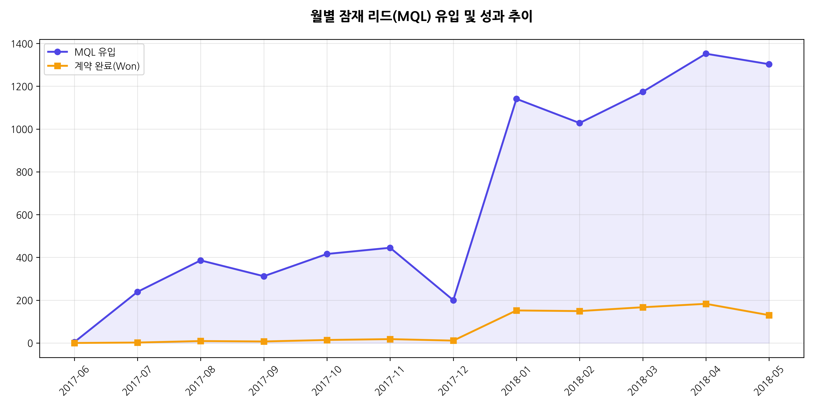

> **Acquisition 인사이트:**
> 월별 MQL 유입 및 계약 완료 추이를 보면, 2018년 1월을 기점으로 유입 규모와 계약 완료 수가 동시에 크게 증가했다. 이는 Olist의 셀러 확보 퍼널이 2017년 하반기 대비 2018년부터 구조적으로 확대되었음을 보여준다. 다만 MQL 유입량 증가폭에 비해 계약 완료 수의 증가폭은 제한적이므로, 단순 리드 확보뿐 아니라 유입 이후 계약 전환율을 함께 관리하는 것이 중요하다.

---

## 3. unknown 채널의 실체 규명
unknown 채널은 CVR과 MQL당 매출이 높지만, 유입 경로가 식별되지 않아 직접적인 예산 판단에는 활용하기 어렵다. 다만 unknown 유입의 56.7%가 특정 LP에 집중되어 있고, 해당 LP에 organic_search와 paid_search 유입도 함께 존재한다는 점에서 검색 기반 유입의 추적 유실 가능성이 있다. 따라서 unknown의 성과를 특정 채널 성과로 단정하기보다, UTM 추적 체계 정비를 선행해야 한다.

---

## 4. 결론 및 예산 배분 전략 제안

### 핵심 결론
> **핵심 결론:**
> 식별 가능 채널 중 paid_search(CVR 12.3%, MQL당 R$97.9)와 organic_search(CVR 11.8%, MQL당 R$90.2)가 전환 효율과 매출 기여 모든 면에서 가장 효율적이다. 반면 social은 MQL 1,350명으로 볼륨 3위지만 CVR 5.6%로 최하위, MQL당 매출 R$32.2로 paid의 1/3 수준에 불과하다. unknown은 CVR 16.7%로 수치상 1위지만 UTM 추적 부재로 실체를 확정할 수 없어 예산 판단을 보류해야 한다.

### 근거 요약
#### [5-1] 채널별 유입 대비 매출 효율 순위가 명확하다
| 채널 | CVR | OR | MQL당매출 | 판정 |
| :--- | :--- | :--- | :--- | :--- |
| **paid_search** | 12.3% | 2.759 | **R$98** | 최우수 (볼륨·효율 균형) |
| **organic_search** | 11.8% | 2.689 | R$90 | 우수 (비용 없는 안정적 유입) |
| direct_traffic | 11.2% | 2.519 | R$44 | 보통 |
| **social** | **5.6%** | **1.082 (ns)** | **R$32** | **미흡 (paid의 1/3 수준)** |

unknown 제외 기준으로 paid_search가 MQL당 매출 R$98로 1위이며, social의 R$32 대비 **3배** 효율적이다.

#### [5-2] social은 "많이 오지만 안 되는" 채널이다
* MQL 수 3위(1,350명)인데 CVR은 최하위권(5.6%)
* OR=1.082로 email/display 같은 약한 채널과 통계적으로 차이 없음 (p=0.671)
* Sales Cycle 중앙값 30일로 전 채널 중 가장 느림
* MQL당 매출 R$32는 paid_search(R$98)의 1/3 수준

#### [5-3] unknown은 수치상 성과가 높지만 추적 불확실성이 크다
* CVR 16.7%, MQL당 매출 R$185로 수치상 가장 높지만, 유입 경로가 불명확해 직접적인 채널 성과로 단정하기 어렵다.
* 하지만 56.7%가 단일 LP에 집중, 프로필은 paid_search와 유사
* UTM 누락된 search 트래픽으로 추론되나 확정 결론은 아님
* unknown의 정체가 확인되면 search 채널의 실제 기여도가 더 높아질 수 있음

### 예산 배분 전략 제언
| 채널 | 전략 | 근거 |
| :--- | :--- | :--- |
| **paid_search** | **예산 증액** | CVR 12.3%, OR 2.76, MQL당 R$98 — unknown 제외 시 유입 대비 매출 효율 1위 |
| **organic_search** | **SEO 강화 (비용 효율적)** | CVR 11.8%, OR 2.69 — 광고비 없이 MQL당 R$90 |
| **social** | **예산 감축 또는 타겟 재설계** | CVR 5.6%, OR 1.08(ns) — 현재 투입 대비 성과 미흡 |
| **direct_traffic** | **브랜드 인지도 확대로 볼륨 키우기** | 계약 후 매출 발생률 55.4%로 최고, 다만 볼륨(499명)이 작음 |
| **unknown** | **UTM 추적 체계 정비 (선행 과제)** | 성과 효율 1위이나 정체 불명 — 추적 정비 후 예산 판단 |

유입된 리드가 실제 계약으로 이어지는 과정에서 89.5%가 이탈하는 구조적 원인은 다음 Activation 파트에서 분석한다.

---

## 5. 분석의 한계 및 후속 과제
| 구분 | 주요 내용 | 비즈니스 영향 | 향후 과제 |
| :--- | :--- | :--- | :--- |
| **데이터 결측** | unknown 채널 비중 높음 (14.5%) | 기여도 분석의 불확실성 증대 | UTM 추적 로직 전면 검토 및 보완 |
| **비용 데이터 부재** | 채널별 실제 광고비(Ad Spend) 없음 | 성과 효율의 정교한 산출 제한 | 채널별 비용 데이터 연동 필요 |
| **표본 부족** | Display, Email 등 일부 채널 모수 적음 | 통계적 유의성 부족 및 오차 발생 | 중장기 데이터 축적 또는 클러스터 분석 |
| **인과관계 미입증** | 자기 선택 편향(Self-selection bias) 존재 | 채널자체 효과인지 유저 성향인지 불분명 | 신규 리드 대상 채널별 A/B 테스트 설계 |

---

# [Activation] 리드 전환 예측 및 이탈 분석

---

Acquisition 파트에서 유입 채널별 성과와 매출 효율 차이를 확인했습니다. 본 파트에서는 해당 유입이 실제 계약 체결 단계에서 89.5%라는 대규모 이탈을 겪는 구조적 원인을 분석하고, 성공적인 리드 전환을 위한 핵심 기여 요인을 규명합니다.

## Part 2: 리드 전환 예측 및 이탈 분석
**관심 표명 → 계약 체결 단계에서 89.5%의 리드 이탈이 발생하며, 그 구조적 원인을 찾는다**

---

## 📊 핵심 지표 (KPI)
* **총 관심 표명**: 8,000 (잠재 셀러)
* **계약 체결**: **842** (전환율 10.5%)
* **이탈**: **7,158** (89.5% 손실)
* **최고 AUC**: 0.713 (향상된 모델 v2)

---

## 🔍 상세 분석 (10개 차트)

### 1. 관심 표명 → 계약 체결 깔때기
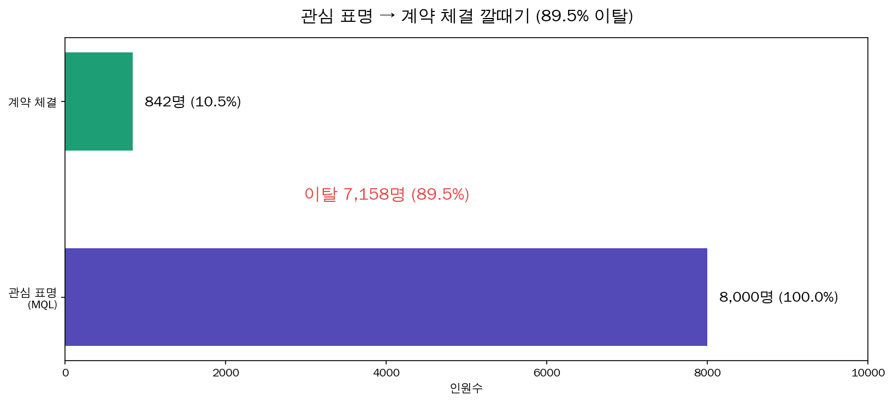
> **Activation 인사이트:**
> 전체 MQL 8,000명 중 계약까지 도달한 건 842명(CVR 10.5%)이고 7,158명(89.5%)이 계약 전 단계에서 이탈했다. 이 89.5% 이탈 구간이 Olist 셀러 퍼널에서 가장 큰 병목이다.

### 2. 시기별 마케팅 피로도 검증
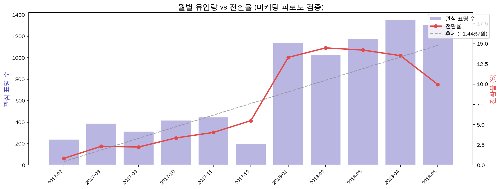
> **Activation 인사이트:**
> "리드가 많이 쌓이면 전환율이 떨어진다"는 마케팅 피로도 가설은 본 데이터에서는 확인되지 않았다. 2018년 이후에는 유입량 증가와 전환율 개선이 동시에 나타났으며, 이는 영업 프로세스 개선 또는 유입 품질 변화가 함께 작용했을 가능성을 시사한다.

### 3. 영업 주기 분포
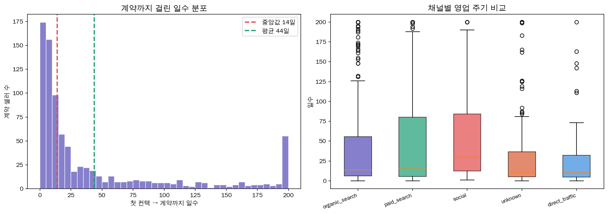
> **Activation 인사이트:**
> 계약까지 걸린 시간 분포를 보면 중앙값은 14일, 평균은 44일로 나타났다. 이는 계약자의 절반이 2주 이내에 전환되는 반면, 일부 장기 지연 리드가 평균을 크게 끌어올리고 있음을 의미한다. 따라서 모든 리드를 동일하게 관리하기보다, 14~15일 이내 전환 가능성이 높은 리드는 Fast-track으로 집중 관리하고, 장기 검토 리드는 별도 nurturing 프로세스로 분리할 필요가 있다.
채널별로는 direct_traffic과 unknown의 계약 속도가 상대적으로 빠른 반면, social은 계약까지 걸리는 시간이 길고 변동 폭도 크다. 이는 social 리드가 즉시 구매 의도가 낮거나 검토 단계가 긴 리드를 많이 포함할 가능성을 시사한다.

### 4. 랜딩페이지 상위 15개 전환율
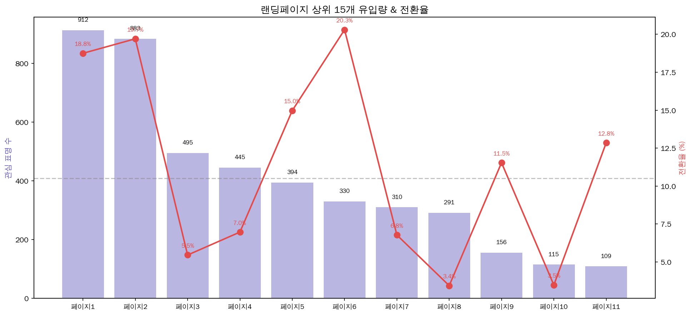
> **Activation 인사이트:**
> 랜딩페이지별 유입량과 전환율을 비교한 결과, 상위 LP 간에도 전환율 차이가 크게 나타났다. 페이지1과 페이지2는 유입량과 전환율이 모두 높아 핵심 전환 LP로 볼 수 있으며, 페이지6은 유입량은 중간 수준이지만 전환율이 20.3%로 가장 높아 고효율 LP로 해석된다. 반면 페이지3, 페이지8, 페이지10은 유입량 대비 전환율이 낮아 메시지, CTA, 폼 구조 등 LP 개선이 필요한 구간으로 보인다.
따라서 계약 전환율 개선을 위해서는 채널 예산 조정뿐 아니라, 고성과 LP의 구조를 저성과 LP에 확산하고 저성과 LP의 전환 병목을 개선하는 랜딩페이지 최적화가 병행되어야 한다.다.

### 5. 로지스틱 회귀 오즈비
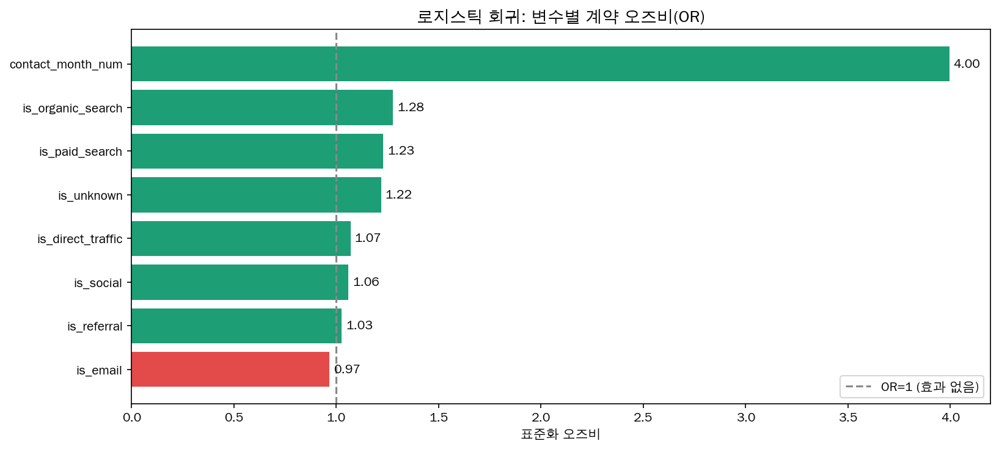
> **Activation 인사이트:**
> contact_month_num의 오즈비가 4.00으로 가장 높다. 이는 시간이 지날수록, 특히 2018년 이후로 갈수록 계약 전환 가능성이 크게 높아졌다는 의미다. 따라서 계약 전환율 상승은 단순히 특정 채널 하나의 효과라기보다, 유입 시기, 캠페인 운영 변화, 영업 프로세스 개선 등이 함께 작용한 결과로 보는 것이 적절하다.
채널 변수 중에서는 organic_search(OR 1.28), paid_search(OR 1.23), unknown(OR 1.22)이 상대적으로 높다. 검색 기반 유입이 계약 전환에 긍정적인 영향을 주는 경향이 있다는 의미다. 반면 direct_traffic(1.07), social(1.06), referral(1.03)은 OR=1에 가까워 전환 효과가 크지 않다. email(0.97)은 1보다 낮아 기준 대비 전환 기여가 낮은 편으로 해석된다.

### 6. 이탈자 vs 계약자 페르소나 비교
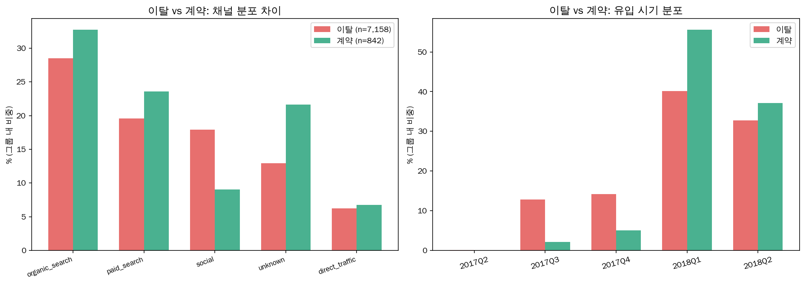
> **Activation 인사이트:**
> 왼쪽 그래프를 보면 계약자는 이탈자보다 organic_search, paid_search, unknown 비중이 높다. 특히 unknown은 이탈자 비중보다 계약자 비중이 크게 높아, 실제로는 고의도 유입이 추적되지 않은 채널일 가능성이 있다. 반면 social은 이탈자 비중이 계약자보다 훨씬 높다. 즉, social 유입은 볼륨은 크지만 계약까지 이어지지 않는 리드가 상대적으로 많이 포함되어 있다고 볼 수 있다.
오른쪽 그래프에서는 계약자와 이탈자의 유입 시기 차이가 보인다. 계약자는 2018Q1 비중이 가장 높고, 이탈자보다 2018년 유입 비중이 더 크다. 반대로 2017Q3~Q4에서는 이탈자 비중이 계약자보다 높다. 이는 2018년 이후 유입 품질, 영업 프로세스, 캠페인 운영 방식이 개선되면서 계약 전환 가능성이 높아졌을 가능성을 보여준다.

### 7. 영업 단계별 병목 (15일 골든타임)
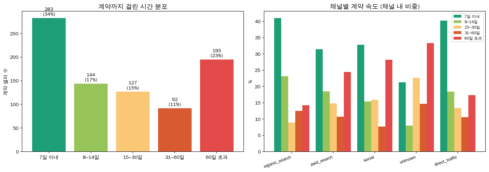
> **Activation 인사이트:**
> 계약까지 걸린 시간 분포를 보면 전체 계약 셀러의 34%가 7일 이내, 51%가 14일 이내 계약을 완료했다. 이는 첫 접촉 이후 2주 이내가 계약 전환의 핵심 구간임을 보여준다. 다만 60일 초과 계약도 23%로 적지 않아, 빠른 전환형 리드와 장기 검토형 리드를 구분한 영업 운영이 필요하다.
채널별로는 organic_search와 direct_traffic의 7일 이내 계약 비중이 높아 고의도 유입 채널의 특성을 보인다. 반면 unknown과 social은 60일 초과 계약 비중이 상대적으로 높아, 즉시 전환보다 장기 검토형 리드가 많이 포함된 채널로 해석된다.

---

## 🎯 핵심 요약
1. **계약 전환은 초기 2주에 집중된다** : 계약자의 절반 이상이 14~15일 이내 계약을 완료한다. 따라서 첫 접촉 이후 2주가 계약 전환의 핵심 구간이며, 이 시점 안에 빠르게 응대하고 설득하는 Fast-track 영업 프로세스가 필요하다.
2. **평균 계약 소요 기간은 장기 지연 리드 때문에 왜곡된다** : 계약까지 걸린 시간의 중앙값은 14일인 반면 평균은 44일로 크게 높다. 이는 다수의 리드는 빠르게 계약되지만, 일부 장기 지연 리드가 평균을 끌어올린다는 의미다. 따라서 평균보다 중앙값과 구간별 분포를 기준으로 영업 속도를 관리하는 것이 적절하다.
3. **채널별로 빠른 전환형과 장기 검토형 리드가 다르게 섞여 있다** : organic_search와 direct_traffic은 7일 이내 계약 비중이 높아 고의도 리드 특성을 보인다. 반면 social과 unknown은 60일 초과 계약 비중이 상대적으로 높아, 즉시 전환보다 장기 검토형 리드가 많이 포함된 채널로 해석된다.
4. **계약 전환은 채널만의 문제가 아니라 시기·LP·영업 속도의 조합이다** : 월별 유입량과 전환율, 랜딩페이지별 전환율, 로지스틱 회귀 결과를 함께 보면 계약 전환은 특정 채널 하나로 설명되기 어렵다. 유입 시기, 랜딩페이지 품질, 영업 대응 속도가 함께 작용한 결과로 보는 것이 적절하다.
5. **랜딩페이지 최적화는 계약 전환율 개선의 직접적인 레버다** : 상위 랜딩페이지 간에도 전환율 차이가 크게 나타난다. 페이지1·페이지2는 유입량과 전환율이 모두 높고, 페이지6은 유입량은 중간 수준이지만 전환율이 가장 높다. 반면 유입량 대비 전환율이 낮은 페이지는 메시지, CTA, 폼 구조 개선이 필요하다.
6. **2018년 이후 유입 확대와 전환율 상승이 동시에 나타났다** : 2018년 1월 이후 MQL 유입량이 급증했지만 전환율은 하락하지 않고 오히려 상승했다. 이는 단순한 마케팅 피로도보다는 유입 품질 개선, 영업 프로세스 개선, 캠페인 운영 변화가 함께 작용했을 가능성을 시사한다.

---

# [Retention] Olist 셀러 Retention 분석

---

Activation 분석에서 계약 성사 조건을 규명했다면, 이제는 계약한 셀러가 실제로 생존하여 플랫폼에 안착하는 조건을 탐색합니다. 본 분석은 장기 리텐션보다는 계약 직후 '첫 매출'을 달성하는 초기 안착(Initial Activation) 메커니즘을 규명하는 데 집중합니다.

## Olist 셀러 Retention 분석: 전환(Activation) 후 생존 및 성장 조건

---

## 1. 분석 배경 및 데이터셋의 의미
### 1.1 배경: "입점은 시작일 뿐이다"
이커머스 플랫폼 Olist의 성장은 단순히 얼마나 많은 셀러를 끌어오느냐(Acquisition)가 아니라, 입점한 셀러가 얼마나 빨리 첫 판매를 달성하고 플랫폼에 안착하느냐에 달려 있습니다. 많은 셀러가 계약 단계(is_won=1)까지 도달하지만, 상당수가 실제 상품 등록이나 판매 단계로 넘어가지 못하고 휴면 상태가 됩니다. 앞선 파트의 15일 골든타임이 계약 체결의 마지노선이었다면, 본 파트는 계약 이후의 생존을 결정짓는 초기 대응을 다룹니다.

### 1.2 데이터셋 정의 (marketing_sales_base.csv)
* **MQL (Marketing Qualified Lead)**: 잠재 셀러로서 마케팅 활동에 반응한 리드
* **Won Seller (is_won=1)**: 영업 과정을 거쳐 최종적으로 입점 계약을 체결한 셀러 (842명)
* **Active Seller (has_revenue=1)**: 입점 후 최소 1건 이상의 실제 매출을 발생시킨 '살아남은' 셀러 (380명)

**분석 목표**: 계약 후 실제 첫 매출 달성과 초기 안착 조건을 분석하여, 플랫폼 기여도가 높은 셀러의 특성을 정의하고 영업 및 온보딩 전략을 최적화합니다.

---

## 2. 주요 분석 결과 및 심층 인사이트

### === 분석 1: 활성 vs 휴면 셀러 프로파일 비교 ===
**"동기(Motivation)가 강한 셀러가 행동도 빠르다"**
* **Sales Cycle Days의 유의미한 차이**: 활성 셀러의 Sales Cycle 중앙값은 10일, 휴면 셀러는 21일로 통계적으로 유의미한 차이가 있습니다 (Mann-Whitney U Test, p < 0.0001).

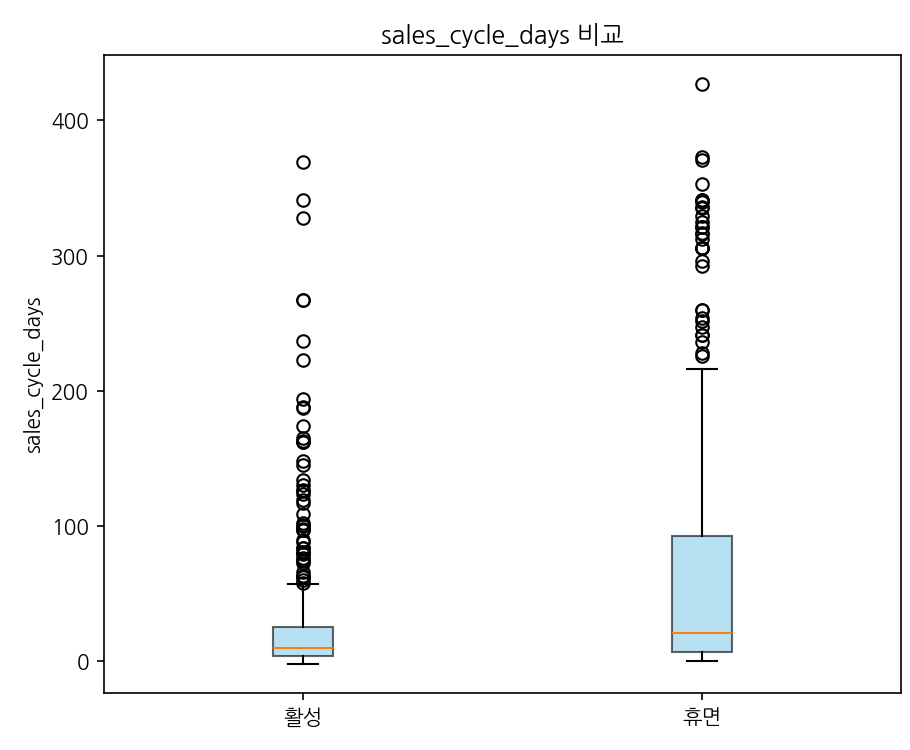

> **Retention 인사이트:**
> 활성 셀러와 휴면 셀러의 Sales Cycle 중앙값은 각각 10일과 21일로 통계적으로 유의미한 차이가 있다 (Mann-Whitney U, p<0.0001). 입점 결정이 빠른 셀러가 계약 이후에도 빠르게 행동한다는 패턴이 데이터로 확인된다.

### === 분석 2: 유입 채널별 계약 후 매출 발생률 비교 ===
**"어느 채널 출신 셀러가 실제 매출까지 더 많이 이어졌는가"**
* **채널별 계약 후 매출 발생률**: direct_traffic 55.4%, paid_search 51.8%로 평균(45.1%) 상회. organic 41.7%, social 41.3%는 평균 수준. referral은 37.5%로 가장 낮다.

> **Retention 인사이트:**
> 채널별 계약 후 매출 발생률 차이에는 마케팅적 이유가 있다. 검색 기반 채널(paid_search 51.8%, organic 41.7%)은 "Olist에 입점하겠다"는 명확한 의도를 가진 리드가 유입된다. 검색어 자체가 입점 의향을 선별하는 필터 역할을 하기 때문에 계약 이후에도 빠르게 행동으로 이어질 가능성이 높다. 반면 social(41.3%)은 피드에 노출된 광고를 보고 수동적으로 유입되는 경우가 많아 입점 의향이 명확하지 않은 리드가 섞인다. direct_traffic(55.4%)이 가장 높은 이유도 같은 맥락이다. 이미 Olist를 알고 직접 찾아온 셀러는 준비도가 가장 높다. referral(37.5%)은 계약 후 매출 발생률이 낮지만 살아남은 셀러의 avg LTV가 R$1,988로 추적 가능 채널 최고다. 소개로 유입되는 구조 특성상 준비 없이 들어오는 경우가 섞이지만 일단 활성되면 가장 많이 판다. 따라서 마케팅 예산 배분 시 채널별 계약 후 매출 발생률과 LTV를 분리해서 목표에 맞게 최적화해야 한다.

### === 분석 3: 비즈니스 프로파일별 생존 환경 ===
**"제조사보다 유통사의 적응력이 높다"**
* **Business Type (Reseller vs Manufacturer)**: Reseller의 계약 후 매출 발생률(48.9%)이 Manufacturer(37.2%)보다 높습니다.

> **Retention 인사이트:**
> Reseller의 계약 후 매출 발생률(48.9%)이 Manufacturer(37.2%)보다 11.7%p 높다. 이유는 사업 구조의 차이다. Reseller는 완성 상품을 이미 보유하고 있어 입점 직후 바로 등록·판매가 가능하다. 반면 Manufacturer는 제조 공정, 최소 주문 수량, 품질 인증 등 판매 전 준비 단계가 길어 28일 골든타임 내 첫 판매 허들이 높다. Manufacturer 타겟 영업 시 28일이 아닌 45일 이상의 확장 온보딩 설계가 필요하다.

> **Retention 인사이트:**
> 업종(business_segment)별로 계약 후 매출 발생률에 차이가 있다. 계약 후 매출 발생률이 높은 상위 업종은 재고 회전이 빠르고 표준화된 상품을 다루는 업종이 많다. 반면 커스터마이징이 많거나 리드타임이 긴 업종은 계약 후 매출 발생률이 낮은 경향을 보인다. 영업 타겟을 계약 후 매출 발생률 상위 업종으로 좁히면 동일 유입 비용으로 더 많은 활성 셀러를 확보할 수 있다.

첫 판매를 달성한 셀러가 이후 얼마나 많이, 오래 파는지는 다음 Revenue 파트에서 수익화 관점으로 분석합니다.

---

## 3. 종합 결론 및 비즈니스 제언

#### [살아남는 셀러의 조건 — 주요 발견]
1. **빠른 실행력**: 입점 결정이 빠르고 초기 온보딩 기간이 짧음 (Sales Cycle이 생존의 선행 지표).
2. **유연한 사업 모델**: 재고 관리와 품목 확장이 용이한 리셀러 형태 (Manufacturer 대비 높은 적응력).
3. **빠른 계약 전환**: 활성 셀러의 Sales Cycle 중앙값(10일)이 휴면 셀러(21일)보다 짧다. 이는 계약 결정 속도가 이후 매출 발생 가능성을 설명하는 선행 지표임을 보여준다.
4. **목적형 유입 경로**: direct_traffic(55.4%)과 paid_search(51.8%) 출신 셀러의 계약 후 매출 발생률이 가장 높다.

#### [비즈니스 제언: "Onboarding as a Service"]
1. **Sales Cycle 기반의 매출 발생 가능성이 높은 셀러 우선 관리**: 활성 셀러의 Sales Cycle 중앙값이 10일로 나타난 만큼, 입점 결정이 빠른 셀러는 계약 이후에도 실제 판매로 이어질 가능성이 높다. 따라서 영업 단계에서 Sales Cycle이 짧은 셀러를 매출 발생 가능성이 높은 셀러군으로 분류하고, 계약 직후 상품 등록과 첫 판매까지 빠르게 연결하는 집중 온보딩이 필요하다.
2. **Direct / Paid Search 중심의 고의도 채널 투자 확대**: direct_traffic과 paid_search는 평균보다 높은 계약 후 매출 발생률을 보였다. 이는 이미 Olist를 알고 있거나 입점 의도가 명확한 셀러가 유입되었기 때문으로 해석된다. 따라서 마케팅 예산은 단순 리드 수가 아니라 계약 후 매출 발생률과 실제 매출 전환 가능성을 함께 고려해 배분해야 한다.
3. **Reseller 및 계약 후 매출 발생률 상위 업종 중심의 타겟팅 강화**: Reseller는 Manufacturer보다 계약 후 매출 발생률이 높게 나타났다. 이미 판매 가능한 상품과 재고를 보유하고 있어 입점 직후 상품 등록과 판매 전환이 빠르기 때문이다. 초기 매출 발생 셀러 확보를 위해서는 Reseller와 재고 회전이 빠른 업종, 표준화 상품군을 우선 타겟으로 설정하는 전략이 효과적이다.
4. **Manufacturer 대상 확장형 온보딩 프로그램 설계**: Manufacturer는 판매 준비 과정이 길어 일반 셀러와 동일한 28일 기준으로 관리할 경우 실제 판매 전환 가능성을 과소평가할 수 있다. 따라서 Manufacturer에 대해서는 45일 이상의 확장 온보딩을 설계하고, 첫 판매 이전 단계인 상품 등록, 대표 SKU 확보, 판매 가능 상태 전환 등을 중간 KPI로 관리할 필요가 있다.

> **Retention 인사이트:**
> 의사결정나무 모델에서 계약 후 매출 발생 여부를 가장 잘 설명하는 변수는 sales_cycle_days(입점 속도)로 나타났다. 그 다음으로 origin(유입 채널), business_type(사업형태) 순이며, lead_behaviour_profile(행동 프로파일)의 기여도는 상대적으로 낮다. 즉 셀러의 행동 프로파일보다 Sales Cycle, 유입 채널, 사업 형태가 계약 후 매출 발생 가능성을 더 잘 설명한다.

초기 안착에 성공한 셀러들이 실제 거래에서 어떤 품질의 경험을 만드는지, 다음 Referral 파트에서 리뷰와 배송 데이터를 통해 확인합니다.

---

# [Referral] 셀러 품질 — 리뷰·배송이 플랫폼 신뢰를 만드는가

---

입점 후 안착한 셀러들이 실제 거래에서 어떤 품질의 경험을 만드는지 분석합니다. 리뷰 점수와 배송 품질이 플랫폼 신뢰도를 높이는 핵심 요소임을 검증합니다.

## 셀러 거래 품질 분석 — 리뷰·배송·스타 셀러 비교

---

## 1. 리뷰 평점 분포
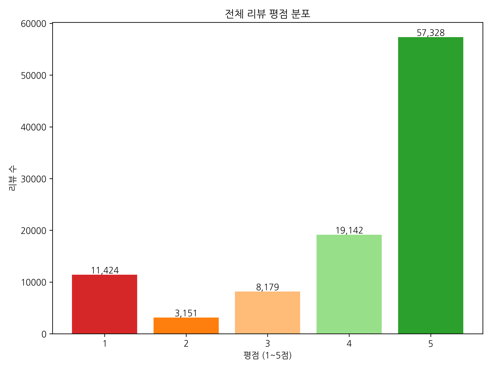
> **Referral 인사이트:**
> 전체 99,224건의 리뷰에서 평균 점수는 4.09점이다. 점수 분포를 보면 5점이 57.8%(57,328건)로 절반 이상을 차지하고 4점이 19.3%로 그 뒤를 잇는다. 긍정(4~5점) 비율은 77.1%, 부정(1~2점)은 14.7%로 NPS Proxy(긍정-부정)는 +62.4%p다. 단, 1점이 11.5%로 두 번째로 많은 점은 특정 셀러 또는 카테고리에서 반복적인 불만족이 발생하고 있음을 시사한다.

---

## 2. 긍정/부정 리뷰 텍스트 워드클라우드

> **Referral 인사이트:**
> 긍정 리뷰의 핵심 키워드는 빠른 배송, 제품 상태 양호, 예상보다 빠른 도착 등이다. 부정 리뷰의 핵심 키워드는 배송 지연, 제품 불일치, 연락 두절 등이다. 이 패턴은 플랫폼 신뢰도를 높이는 핵심 관리 포인트가 배송 속도와 상품 설명 정확성임을 텍스트 데이터가 직접 보여준다.

---

## 3. 핵심 키워드 TF-IDF 분석 (긍정/부정)
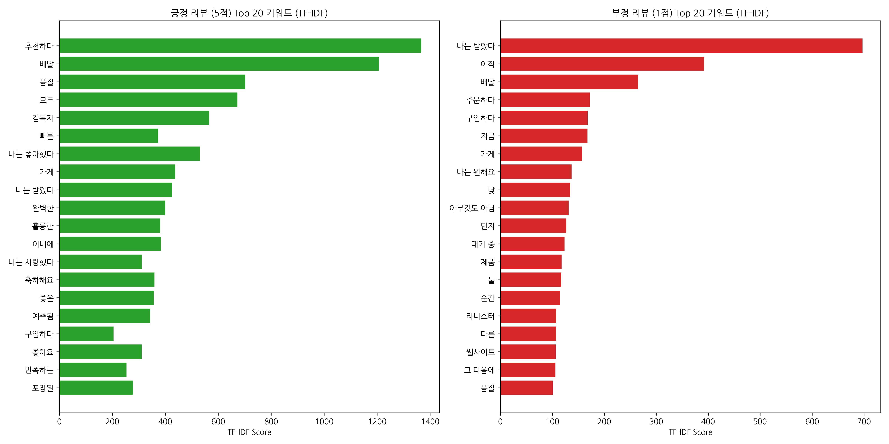
> **Referral 인사이트:**
> TF-IDF 분석 결과, 긍정 리뷰에서는 ‘추천’, ‘배송’, ‘품질’, ‘빠른’과 같은 키워드가 높게 나타나 고객 만족이 빠른 배송과 안정적인 상품 품질 경험에서 형성됨을 확인할 수 있다. 반면 부정 리뷰에서는 ‘아직’, ‘대기 중’, ‘받았다’, ‘주문하다’ 등 배송 지연 및 미수령과 관련된 표현이 두드러져, 낮은 평점의 핵심 원인이 배송 과정의 불확실성과 기대 불일치에 있음을 시사한다.  따라서 리뷰 평점 개선을 위해서는 상품 품질 관리뿐 아니라 배송 지연 모니터링, 예상 배송일 안내, 지연 발생 시 사전 커뮤니케이션 등 배송 경험 전반의 관리가 중요하다.

---

## 4. 유입 채널별 평균 리뷰 점수
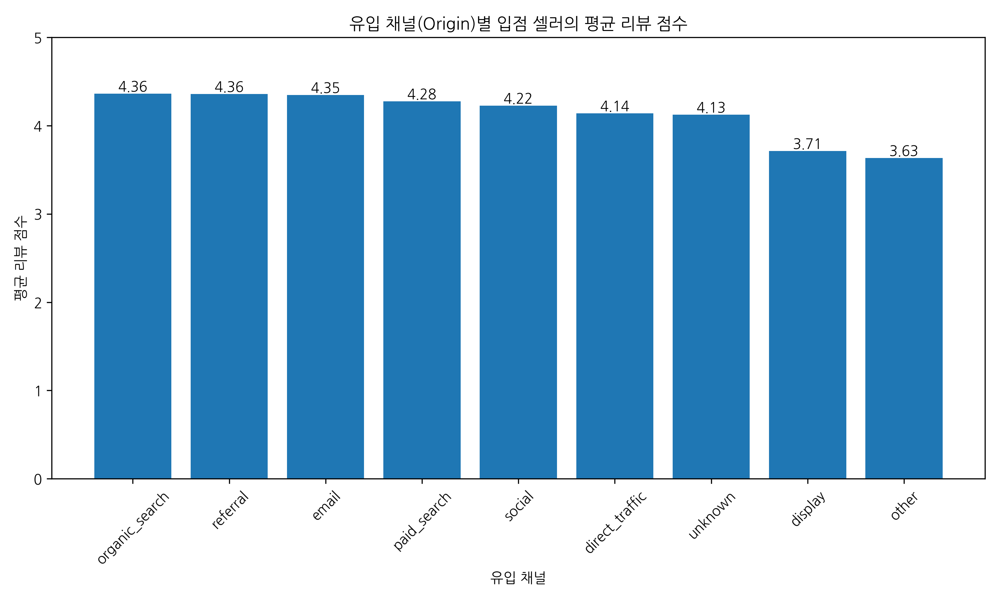
> **Referral 인사이트:**
> 이 분석은 채널별 거래 품질을 보기 위한 참고 지표이며, 정확한 채널별 리뷰 성과는 order_items 기반의 추가 연결 분석이 필요하다. 다만 GMV가 높은 채널이 반드시 리뷰 점수도 높지 않을 수 있으므로, 채널 평가 시 매출 기여도와 셀러 거래 품질 지표를 함께 고려할 필요가 있다.

---

## 5. 배송 소요일과 리뷰 점수의 상관관계
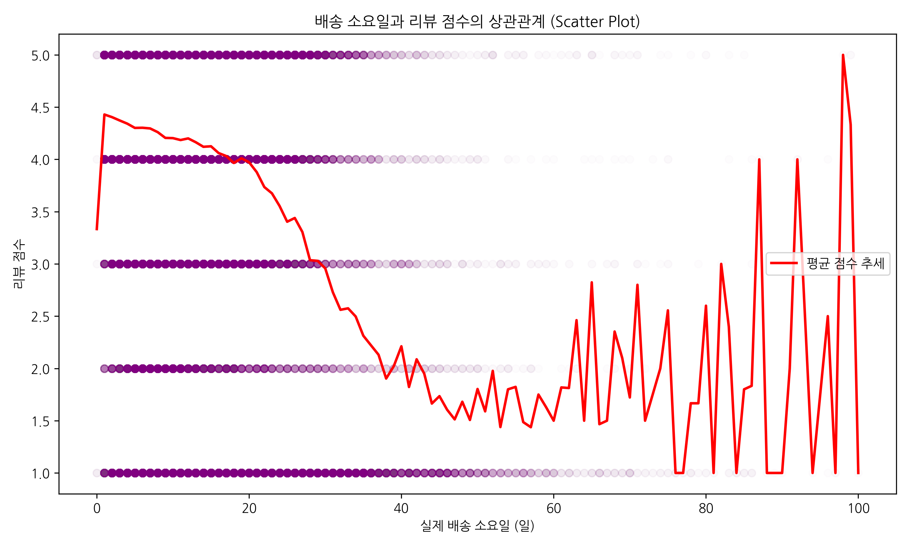
> **Referral 인사이트:**
> 배송 소요일과 리뷰 점수 간 피어슨 상관계수는 r=-0.267(p<0.0001)로 통계적으로 유의미한 음의 상관관계가 확인된다. 배송일수 구간별로 보면 차이가 더 극명하다.
> * 7일 이하: 평균 4.41점 (5점 비율 67.9%)
> * 8~14일: 평균 4.29점 (5점 비율 62.1%)
> * 15~21일: 평균 4.10점 (5점 비율 54.3%)
> * 22~30일: 평균 3.49점 (5점 비율 38.2%)
> * 30일 초과: 평균 2.18점 (5점 비율 15.3%, 1점 비율 56.8%)
> 30일을 넘기면 1점 비율이 56.8%로 폭증한다. 배송 지연 방지가 플랫폼 신뢰 관리의 가장 직접적인 수단이다. 전체 배송 완료 주문(96,478건) 중 정시 배송률은 93.2%이며 평균 배송 소요일은 12.1일(중앙값 10일)이다. 정시 배송 주문의 평균 리뷰는 4.29점인 반면 지연 배송 주문의 평균 리뷰는 2.27점으로 2.02점 차이가 난다.

---

## 6. 업종별 고객 만족도(리뷰 점수) Heatmap
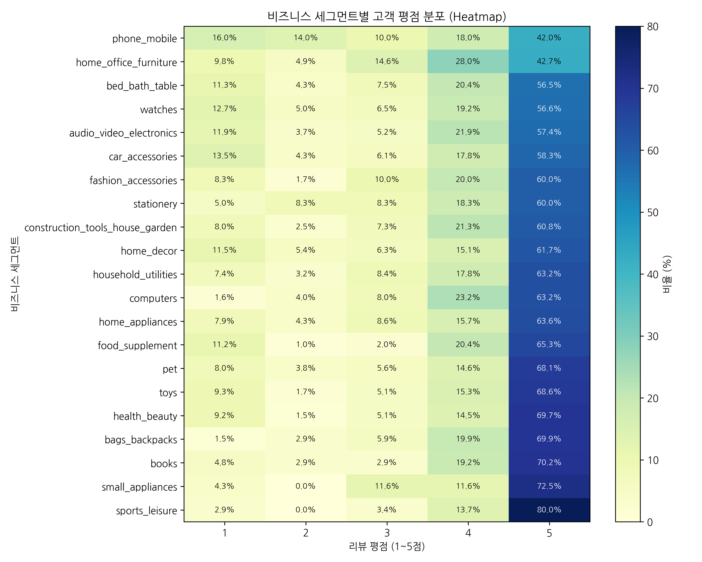
> **Referral 인사이트:**
> 업종별 고객 평점 분포를 분석한 결과, 대부분의 업종에서 5점 리뷰 비중이 가장 높게 나타났으나 업종 간 만족도 차이는 뚜렷했다. sports_leisure, small_appliances, books, health_beauty 등은 5점 리뷰 비중이 높고 저평점 비중이 낮아 상대적으로 안정적인 고객 만족 구조를 보였다.  반면 phone_mobile, home_office_furniture, bed_bath_table은 5점 리뷰 비중이 낮고 1점 리뷰 비중이 상대적으로 높아 고객 경험의 편차가 큰 업종으로 확인된다. 특히 배송 중 파손, 제품 기대치 불일치, 설치·사용 편의성 등이 영향을 줄 수 있는 가구·침구·전자기기 계열 업종은 품질 관리와 배송 경험 개선이 중요하다는 해석이다. 관리 포인트로 해석된다.

---

## 7. 우량 셀러(스타 셀러) vs 일반 셀러의 평균 리뷰 점수 (Box Plot)
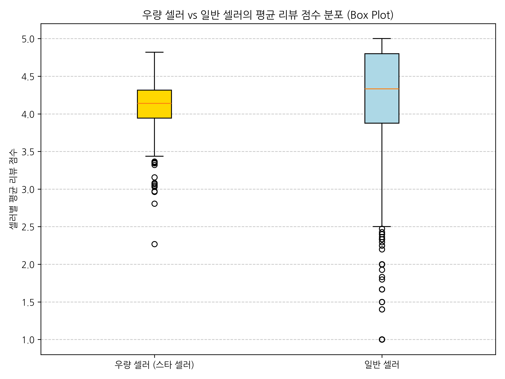
> **Referral 인사이트:**
> 매출이 높은 셀러(스타 셀러)일수록 리뷰 품질도 높은 경향이 있어 "잘 파는 셀러가 플랫폼 평판도 높인다"는 패턴을 보인다. 일반 셀러의 리뷰 점수 분산이 더 크다는 점은 품질 편차 관리를 위한 셀러 등급별 지원 체계의 필요성을 시사한다.

---

## 요약 및 제언
> **Referral 핵심 결론:**
> 전체 99,224건 리뷰의 평균 점수는 4.09점이며 NPS Proxy는 +62.4%p로 전반적인 고객 만족도는 양호하다. 그러나 1점 비율이 11.5%로 적지 않고, 배송이 30일을 초과하면 1점 비율이 56.8%로 폭증한다. 정시 배송(93.2%)이 유지되는 한 평균 리뷰 4.29점이 보장되지만 지연 배송은 평균 2.27점으로 2.02점 차이가 난다. 배송 속도 관리는 플랫폼 신뢰도와 리뷰 점수에 큰 영향을 미치는 핵심 요인으로 확인된다.

### 데이터 기반 제언
| 제언 | 근거 | 기대 효과 |
| :--- | :--- | :--- |
| **배송 30일 초과 셀러 조기 경고 시스템** | 30일 초과 시 1점 비율 56.8%로 폭증 | 1점 리뷰 집중 구간 사전 차단 → 플랫폼 평균 리뷰 상승 |
| **채널별 리뷰 점수를 채널 평가 KPI에 추가** | GMV가 높은 채널이 반드시 리뷰도 높지 않음 | 매출 효율(GMV/MQL)과 품질(리뷰)을 동시에 고려한 예산 배분 |
| **스타 셀러 전용 VIP 관리 체계 구축** | 스타 셀러가 리뷰 품질도 높은 경향 확인 | 상위 20%(76명) 락인 → GMV 78.1% 방어 + 플랫폼 평판 유지 |
| **저만족 업종 셀러 집중 온보딩** | 업종별 리뷰 점수 편차 존재 | 반복 저평점 업종 개선 → 전체 리뷰 분포 균형화 |

품질이 검증된 셀러들이 첫 판매 이후 얼마나 많이, 오래 팔았는지 다음 Revenue 파트에서 수익화 성과를 분석합니다.

---

# [Revenue] 첫 판매 이후 — 얼마나 많이, 오래 팔았는가

---

Retention 단계에서 첫 판매를 달성한 셀러 380명이 이후 얼마나 많이, 얼마나 오래 팔았는지를 분석합니다. 첫 판매 속도가 장기 매출에 미치는 영향, 채널별 수익화 성과 차이, 매출 집중도를 통해 플랫폼 GMV를 극대화하기 위한 자원 배분 방향을 도출합니다.

---

## 00. Time-to-First-Sale과 매출의 관계
입점 후 첫 판매까지 걸린 시간이 셀러의 장기 매출을 얼마나 결정하는가

> **평균 누적 매출 (Average Cumulative Revenue)**
> 특정 그룹에 속한 활성 셀러들이 입점 후 첫 판매 시점부터 분석 기준일(2018-08-31)까지 발생시킨 총 매출의 평균값이다.

> [!NOTE]
> ### 🔍 장기 이탈률 분석 관련 안내
> 장기 이탈률 분석은 월별 표본 수의 영향을 크게 받을 수 있으므로, 본 리포트에서는 초기 매출 발생 여부를 중심으로 Retention을 해석하고, Churn Rate는 후속 분석 과제로 분리한다.

> **Revenue 인사이트:**
> 첫 판매까지 소요 시간(time_to_first_sale)과 누적 매출(total_revenue) 간 피어슨 상관계수는 r=-0.158이다. 약한 음의 상관관계로, 빨리 첫 판매를 낼수록 더 많이 파는 경향이 있다. 단 이 관계 하나만으로 매출을 예측하기엔 강도가 부족하며 채널·업종·사업형태 조건과 함께 볼 때 의미가 커진다.

> **Revenue 인사이트:**
> 첫 판매 소요 시간을 4구간으로 나누면 매출 차이가 명확하다.
> * 0~28일(빠름): 평균 R$3,787
> * 29~50일(보통): 평균 R$1,599
> * 51~78일(느림): 평균 R$1,023
> * 79일+(매우 느림): 평균 R$630
> 가장 빠른 그룹이 가장 느린 그룹보다 6배 더 많이 판다. 채널별 GMV 차이 중 상당 부분은 첫 판매 속도 차이에서 비롯된다. 28일 이내 첫 판매 유도가 채널 예산 조정만큼 GMV에 직접적인 영향을 준다.

---

## 01. 채널별 GMV 기여도 및 MQL당 매출 비교
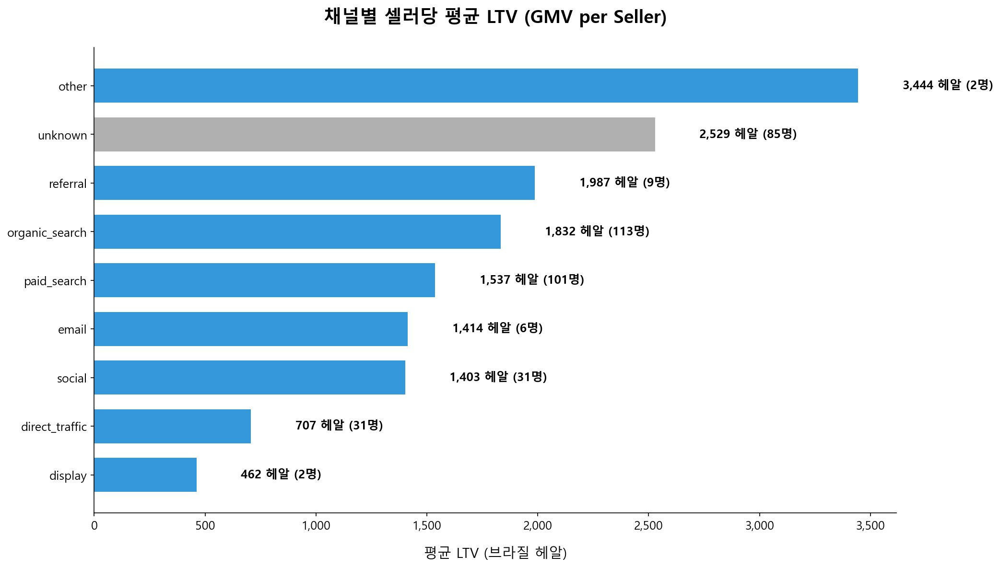

> **Revenue 인사이트:**
> 활성 셀러 380명이 창출한 총 GMV는 R$676,851이다. 추적 가능 채널 중 총 GMV는 organic_search(R$207,023)가 1위이고 MQL당 매출(ROI proxy)은 paid_search(R$97.9)가 1위다. social은 MQL 1,350명으로 볼륨 3위지만 MQL당 매출 R$32.2로 paid의 1/3 수준이다. referral은 MQL 284명으로 볼륨이 작지만 살아남은 셀러의 avg LTV가 R$1,988로 추적 가능 채널 최고다. unknown(MQL당 R$194.5)은 수치상 1위지만 미식별 채널로 해석에 주의가 필요하다.

---

# [결론] 종합 인사이트 & 액션 플랜

---

AARRR 전 단계 분석을 종합해 셀러 생애주기 관리 전략을 도출한다.

---

## 1. 전체 퍼널 현황
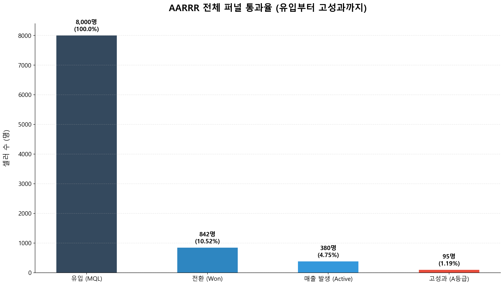

> **퍼널 종합: :**
> 전체 MQL 8,000명이 유입됐지만 최종 매출까지 도달한 셀러는 380명(4.75%)이다. 각 단계별 이탈률은 Acquisition→Activation 89.5%, Activation→Retention 54.9%로 두 구간이 핵심 병목이다. 살아남은 380명 중 상위 10%(38명)가 전체 GMV R$676,851의 64.7%를, 상위 20%(76명)가 78.1%를 담당한다. 각 단계의 전환율을 1%p씩만 개선해도 최종 GMV에 미치는 복리 효과가 크다.

---

## 2. 단계별 핵심 인사이트 요약
| 단계              | 핵심 인사이트                                                           | 검증 수치                                                                                 |
| :-------------- | :---------------------------------------------------------------- | :------------------------------------------------------------------------------------ |
| **Acquisition** | 채널 평가는 단순 MQL 수가 아니라 **전환율, MQL당 매출, 계약 후 매출 발생률을 함께 기준으로 봐야 한다** | paid_search MQL당 R$97.9 vs social R$32.2 — 약 3배 차이 / direct_traffic 계약 후 매출 발생률 55.4% |
| **Activation**  | 계약 전환의 병목은 단순 채널 문제가 아니라 **유입 시기, 랜딩페이지, 영업 속도가 함께 작용한 결과**다      | 전체 MQL 8,000명 중 계약 842명(CVR 10.5%) / 계약자 51%가 14일 이내 완료                               |
| **Retention**   | 계약 후 실제 매출 발생 여부는 **Sales Cycle, 유입 채널, 사업 형태**에 따라 달라진다          | 활성 셀러 Sales Cycle 중앙값 10일 vs 휴면 셀러 21일 / Reseller 48.9% vs Manufacturer 37.2%         |
| **Referral**    | 고객 만족도는 상품 품질뿐 아니라 **배송 속도와 배송 지연 관리**에 크게 좌우된다                   | 정시배송 avg 4.29점 vs 지연배송 2.27점 / 30일 초과 시 1점 비율 56.8%                                   |
| **Revenue**     | GMV는 소수 고성과 셀러에 집중되어 있어 **고성과 셀러 식별·육성·락인 전략**이 중요하다              | 활성 셀러 380명 중 상위 20%(76명)가 GMV 78.1% 담당                                                |

---

## 3. 종합 액션 플랜

### 🔴 단기 - 고효율 채널과 고의도 리드를 중심으로 유입·계약 전환 효율을 빠르게 개선한다.
| 퍼널              | 액션 플랜                        | 실행 내용                                                                                             | 목표 지표                              |
| :-------------- | :--------------------------- | :------------------------------------------------------------------------------------------------ | :--------------------------------- |
| **Acquisition** | 고효율 채널 중심 예산 재배분             | paid_search와 organic_search 중심으로 유입을 강화하고, social은 타겟·메시지·LP를 재점검한다. unknown 채널은 UTM 추적 체계를 정비한다. | MQL당 매출, CVR, 채널별 계약 후 매출 발생률      |
| **Activation**  | 14~15일 Fast-track 영업 프로세스 운영 | 첫 접촉 후 2주 이내 계약 가능성이 높은 리드를 우선 응대하고, 빠른 상담·견적·계약 전환 플로우를 만든다.                                     | 15일 이내 계약 비중, Sales Cycle 중앙값, CVR |
| **Activation**  | 저성과 랜딩페이지 개선                 | 유입량은 많지만 전환율이 낮은 LP의 메시지, CTA, 폼 구조를 개선하고 고성과 LP의 구조를 확산한다.                                       | LP별 CVR, 이탈률, 계약 전환율               |

### 🟡 중기 - 계약 완료 셀러가 28일 이내 첫 판매까지 이어지도록 온보딩과 배송 품질 관리를 체계화한다.
| 퍼널            | 액션 플랜             | 실행 내용                                                                    | 목표 지표                                     |
| :------------ | :---------------- | :----------------------------------------------------------------------- | :---------------------------------------- |
| **Retention** | 계약 직후 28일 온보딩 강화  | 계약 완료 셀러가 28일 이내 첫 판매를 달성하도록 상품 등록, 대표 SKU 확보, 가격 설정, 물류 준비를 단계별로 지원한다.  | 28일 이내 첫 판매율, 계약 후 매출 발생률                 |
| **Retention** | 셀러 유형별 온보딩 분리     | Reseller는 빠른 판매 전환 중심으로 관리하고, Manufacturer는 45일 이상 확장 온보딩과 중간 KPI를 적용한다. | Business Type별 매출 발생률, Time-to-First-Sale |
| **Referral**  | 배송 지연 조기 경고 체계 구축 | 배송 30일 초과 가능성이 있는 주문·셀러를 조기 탐지하고, 지연 안내 및 CS 대응을 강화한다.                   | 30일 초과 배송 비중, 평균 리뷰 점수, 1점 리뷰 비율          |

### 🟢 장기 - 고성과 셀러를 식별·육성·락인해 GMV와 플랫폼 신뢰도를 지속적으로 확대한다.
| 퍼널                        | 액션 플랜             | 실행 내용                                                              | 목표 지표                               |
| :------------------------ | :---------------- | :----------------------------------------------------------------- | :---------------------------------- |
| **Revenue**               | 고성과 셀러 락인 프로그램 구축 | 상위 20% 셀러를 별도 관리하고, 노출 우대, 운영 지원, 수수료 혜택, 전담 매니저 등 VIP 프로그램을 운영한다. | 상위 셀러 GMV 기여도, 평균 LTV, 활동 지속률       |
| **Referral / Revenue**    | 셀러 품질 등급제 운영      | 리뷰 점수, 배송 품질, GMV, 주문 수를 기준으로 셀러 등급을 나누고 등급별 지원·제재 정책을 운영한다.       | 평균 리뷰 점수, 정시 배송률, GMV, 반복 저평점 셀러 비중 |
| **Acquisition / Revenue** | 고성과 셀러 유사군 타겟팅    | 상위 셀러의 채널, 업종, 사업 형태를 기반으로 유사한 신규 셀러를 타겟팅한다.                       | 고성과 셀러 유입 수, MQL당 매출, 신규 셀러 LTV     |

## 4. 핵심 한 문장
> **고의도 리드를 15일 안에 계약으로 전환하고 → 입점 직후 첫 판매까지 연결하며 → 검증된 고성과 셀러를 장기 락인하라.**

---

데이터 기준: marketing_sales_base.csv | 분석: Antigravity | 2026년 4월 
© 2026 Olist Business Analysis Team. All rights reserved.

