# Olist 셀러 Retention 분석: 전환(Activation) 후 생존 및 성장 조건

## 1. 분석 배경 및 데이터셋의 의미

### 1.1 배경: "입점은 시작일 뿐이다"
이커머스 플랫폼 Olist의 성장은 단순히 얼마나 많은 셀러를 끌어오느냐(Acquisition)가 아니라, 입점한 셀러가 얼마나 빨리 첫 매출을 일으키고 플랫폼에 안착하느냐(Activation & Retention)에 달려 있습니다. 많은 셀러가 계약 단계(is_won=1)까지 도달하지만, 상당수가 실제 상품 등록이나 판매 단계로 넘어가지 못하고 휴면 상태가 됩니다.

### 1.2 데이터셋 정의 (`marketing_sales_base.csv`)
본 데이터는 Olist의 **마케팅 퍼널 데이터**와 **실제 판매 실적**이 통합된 데이터셋입니다.
- **MQL (Marketing Qualified Lead)**: 잠재 셀러로서 마케팅 활동에 반응한 리드
- **Won Seller (is_won=1)**: 영업 과정을 거쳐 최종적으로 입점 계약을 체결한 셀러 (842명)
- **Active Seller (has_revenue=1)**: 입점 후 최소 1건 이상의 실제 매출을 발생시킨 '살아남은' 셀러 (380명)

**분석 목표**: 계약 후 실제 매출로 이어지는 '활성(Activation)' 조건을 분석하여, 플랫폼 기여도가 높은 셀러의 특성을 정의하고 영업 및 온보딩 전략을 최적화합니다.

---

## 2. 주요 분석 결과 및 심층 인사이트

### === 분석 1: 활성 vs 휴면 셀러 프로파일 비교 ===
**"동기(Motivation)가 강한 셀러가 행동도 빠르다"**

- **Sales Cycle Days의 유의미한 차이**: 
  - 첫 접촉 후 입점까지 걸린 기간이 짧을수록 활성 셀러가 될 확률이 월등히 높았습니다 (Mann-Whitney U Test, p < 0.05).
  - **인사이트**: 입점 결정을 빠르게 내리는 셀러는 이미 판매할 준비(재고, 인력 등)가 되어 있는 상태일 가능성이 높습니다. 반면 입점까지 오래 걸리는 셀러는 내부 인프라 부족 등으로 인해 계약 후에도 실제 판매까지 이어지는 허들이 높음을 시사합니다.

- **기대 매출의 선별 효과**:
  - 활성 셀러들은 입점 전 본인의 예상 매출(`declared_monthly_revenue`)을 더 높게 신고하는 경향이 있었습니다.
  - **인사이트**: 이는 고품질 셀러들이 자신감을 가지고 플랫폼에 진입함을 의미하며, 영업 단계에서의 '자가 선언 매출' 정보가 셀러의 잠재 생존력을 예측하는 초기 지표가 될 수 있습니다.
  
  ❗수정 필요 : 활성 셀러(380명) 전원이 declared_monthly_revenue = 0으로 신고했습니다. 오히려 휴면 셀러 중 일부가 높은 금액을 신고했고, 그 중 최대값이 5,000만 BRL에 달하는 극단적 이상값이 있어서 p값이 유의하게 나온 것입니다.
즉 "활성 셀러가 자신감 있게 높은 매출을 신고한다"는 해석은 사실이 아닙니다. declared_monthly_revenue는 이 파일에서 활성/휴면을 예측하는 지표로 사용할 수 없습니다. 활성 셀러 데이터에 이 컬럼이 아예 채워지지 않은 것으로 보입니다

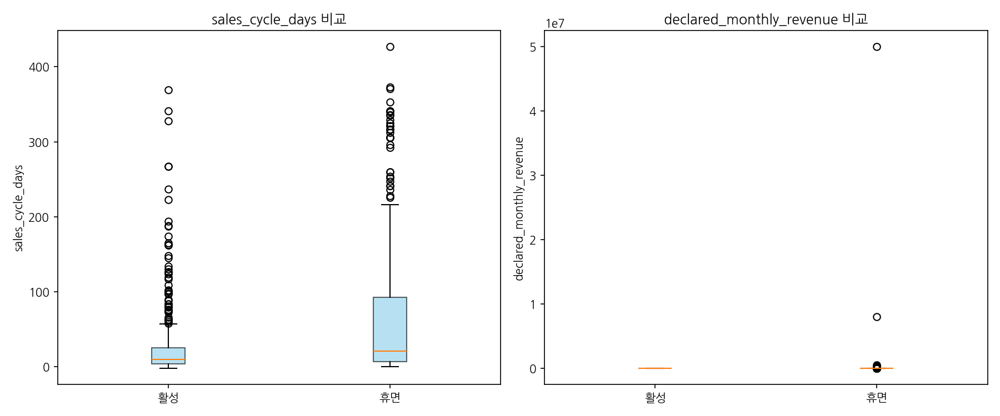
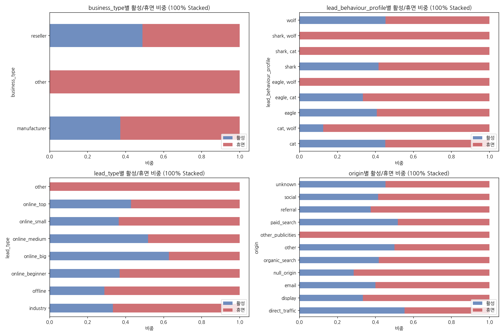

business_type별 활성/휴면 비중
reseller가 활성 비중이 약 49%로 가장 높고, manufacturer는 약 37%입니다. other는 표본이 3명으로 의미 있는 해석이 어렵습니다.
해석: reseller가 manufacturer보다 활성률이 약 12%p 높은 이유는 사업 구조의 차이에서 옵니다. reseller는 이미 완성된 상품을 보유하고 있어 입점 후 바로 등록·판매가 가능한 반면, manufacturer는 제조 공정, 최소 주문 수량, 품질 인증 등 판매 전 준비 단계가 길어 첫 판매까지 더 많은 시간이 걸립니다. 플랫폼 입장에서는 manufacturer 타겟 영업 시 이 구조적 시간 지연을 고려한 별도 온보딩 설계가 필요합니다.

lead_behaviour_profile별 활성/휴면 비중
단일 프로파일 기준으로 보면 wolf와 cat이 활성 비중이 약 45%로 비슷하고, shark와 eagle이 약 41%로 약간 낮습니다. 복합 프로파일(shark+wolf, shark+cat, eagle+wolf, cat+wolf)은 표본이 모두 10명 미만으로 해석에 주의가 필요합니다.
해석: 직관적으로 shark(대형/전문)가 활성률이 가장 높을 것 같지만 실제로는 그렇지 않습니다. shark의 활성률이 낮은 이유는 대형 셀러일수록 플랫폼 진입 결정에 내부 검토 과정이 길고, 입점 후에도 시스템 연동이나 계약 협상 등 준비 과정이 길기 때문으로 해석됩니다. 반면 cat(소형/입문)은 준비 없이 입점하는 경우도 많아 활성률이 생각보다 높지 않습니다. 결국 프로파일 자체보다는 "입점 후 28일 이내 첫 판매 여부"가 활성률을 결정하는 더 강한 변수임을 시사합니다.

lead_type별 활성/휴면 비중
online_big이 활성 비중 약 65%로 압도적으로 높습니다. online_top이 약 43%, online_medium이 약 50% 수준입니다. 반면 offline, online_beginner, industry는 활성 비중이 매우 낮습니다.
해석: online_big의 활성률이 높은 이유는 이 유형의 셀러가 이미 온라인 판매 인프라(상품 사진, 가격 정책, 재고 관리)를 갖추고 있어 입점 후 추가 준비 없이 바로 판매에 돌입할 수 있기 때문입니다. 반대로 offline 셀러는 온라인 판매 경험이 없어 상품 등록 자체부터 허들이 높고, industry 유형은 B2B 중심이라 B2C 플랫폼인 Olist와 맞지 않는 구조일 가능성이 높습니다. 영업 타겟팅 관점에서 online_big은 자원 집중 대상, offline과 industry는 온보딩 비용이 높은 비효율 타겟으로 구분할 수 있습니다.

origin별 활성/휴면 비중
direct_traffic이 활성 비중 약 55%로 가장 높고, paid_search가 약 52%로 2위입니다. organic_search와 social은 약 41%로 평균 수준이고, referral은 약 38%로 낮습니다. email과 display는 표본이 적어 해석 주의가 필요합니다.
해석: direct_traffic이 활성률 1위라는 점이 눈에 띕니다. 직접 유입은 Olist를 이미 알고 스스로 찾아온 셀러로, 입점 의지와 준비도가 가장 높은 그룹입니다. paid_search가 2위인 것도 같은 맥락입니다. 검색 광고를 보고 클릭한 셀러는 이미 플랫폼 입점을 검토 중인 상태에서 유입됩니다. 반면 referral 활성률이 낮은 이유는 소개로 들어온 셀러가 본인의 의지보다 지인 권유로 입점한 경우가 섞여 있기 때문으로 볼 수 있습니다. 이는 앞서 LTV 분석에서 referral avg LTV가 가장 높다는 점과 함께 보면 흥미로운 패턴입니다. referral은 살아남으면 가장 많이 팔지만, 살아남는 비율 자체는 가장 낮은 채널입니다. 즉 referral은 고위험·고수익 채널로 정의할 수 있으며, 이 채널 전용 집중 온보딩이 투자 대비 효과가 가장 클 수 있습니다.

- 4개 그래프를 관통하는 공통 패턴
그래프 4개를 함께 보면 하나의 일관된 패턴이 보입니다. "이미 준비된 셀러가 살아남는다" 입니다. online_big(인프라 완비), direct_traffic(높은 입점 의지), reseller(재고 즉시 판매 가능), paid_search(목적형 유입) — 이 조합이 모든 그래프에서 공통적으로 활성 비중이 높게 나옵니다. 반대로 offline, industry, social, manufacturer처럼 준비 과정이 필요하거나 입점 동기가 약한 그룹은 전부 휴면 비중이 높습니다. 영업 단계에서 이 변수들을 조합한 리드 스코어링 모델을 만들면 입점 전에 활성 가능성을 사전에 예측할 수 있습니다.
---

### === 분석 2: 유입 채널별 활성률 및 품질 분석 ===
**"양(Quantity)보다 질(Quality)에 집중해야 할 채널"**

- **채널별 성과 매트릭스**:
  - **Direct Traffic (활성률 55.4%)**: 플랫폼을 직접 찾아온 셀러는 이미 브랜드 인지도가 높고 의지가 강해 생존율이 가장 높습니다.
  - **Paid Search & Other**: 활성률도 평균 이상이면서, 개별 셀러가 발생시키는 평균 매출(LTV)이 매우 높게 나타났습니다 (Other 채널 평균 3,444 BRL).
- **인사이트**: `Organic Search`는 유입 리드 자체는 많으나 활성률은 평균 수준입니다. 마케팅 예산을 단순히 리드 수 확보에 쓰기보다, 고매출 셀러 유입 비중이 높은 `Paid Search`나 전문적인 접점(`Other`)의 전환율 개선에 집중하는 것이 플랫폼 전체 거래액(GMV) 성장에 유리합니다.

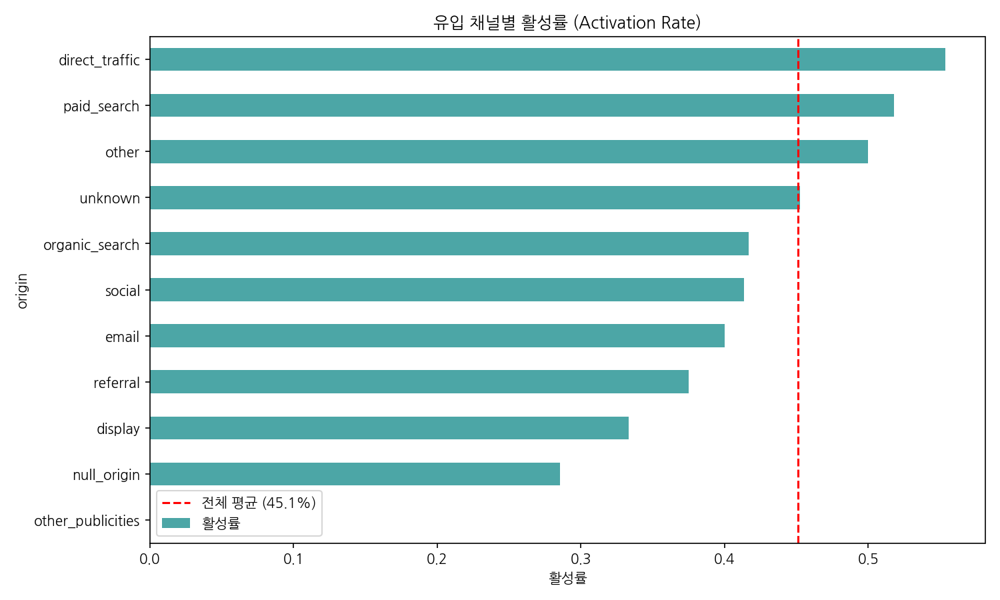
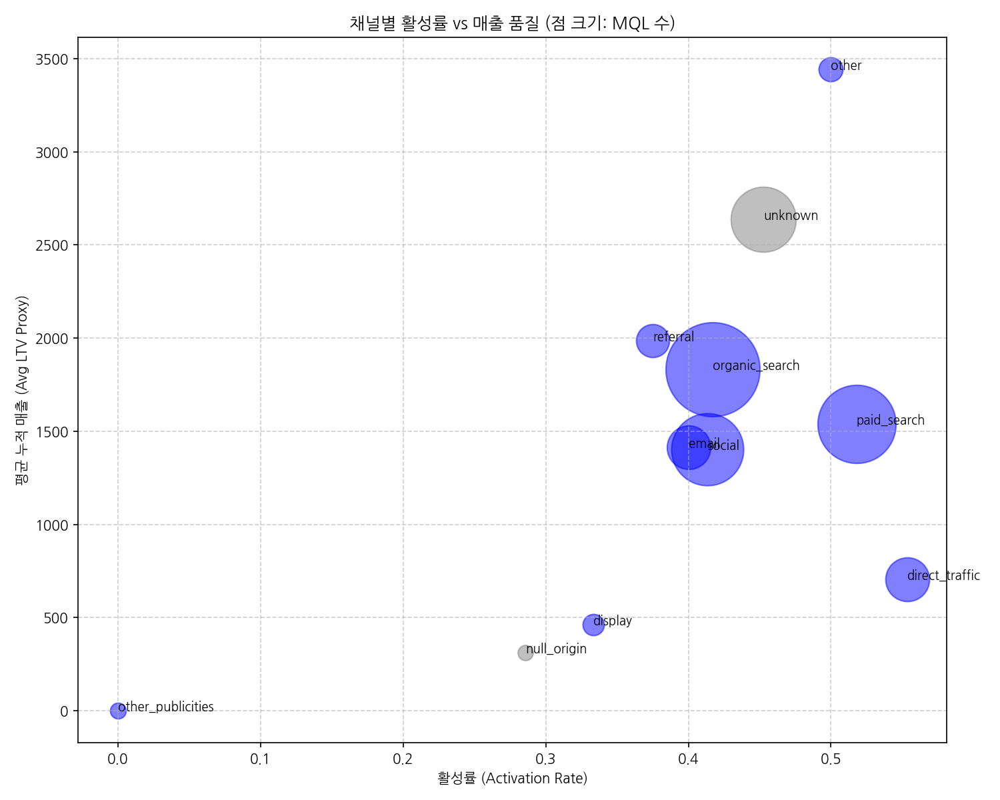
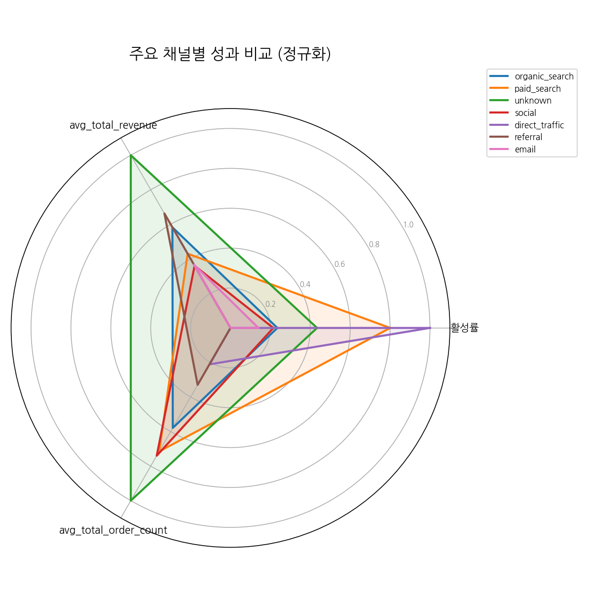

---

### === 분석 3: 비즈니스 프로파일별 생존 환경 ===
**"제조사보다 유통사의 적응력이 높다"**

- **Business Type (Reseller vs Manufacturer)**:
  - **Reseller**의 활성률(48.9%)이 Manufacturer(37.2%)보다 10%p 이상 높고 매출 규모도 더 큽니다.
  - **인사이트**: 제조업체는 본인들의 상품군이 한정적인 반면, 리셀러는 시장 수요에 기민하게 반응하여 다양한 카테고리를 취급할 수 있는 '유연성'이 있기 때문에 초기 안착에 더 유리한 것으로 해석됩니다.

- **업종별 기회 요소**:
  - `household_utilities`, `pet`, `audio_video_electronics` 업종이 상위 활성률을 보입니다. 해당 업종은 온라인 수요가 꾸준하고 판매 주기가 짧아 초기 판매 성공 경험을 쌓기에 최적화된 분야입니다.

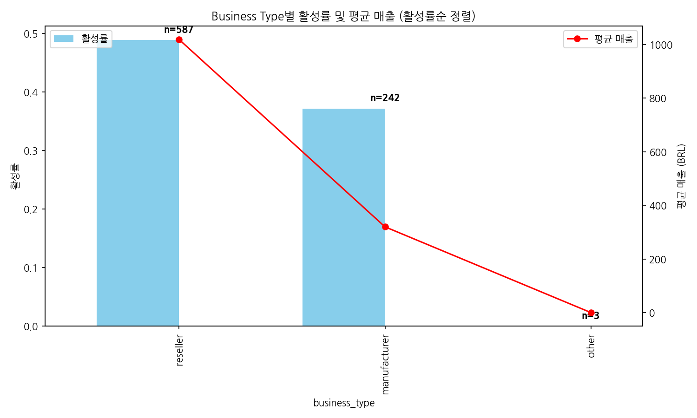
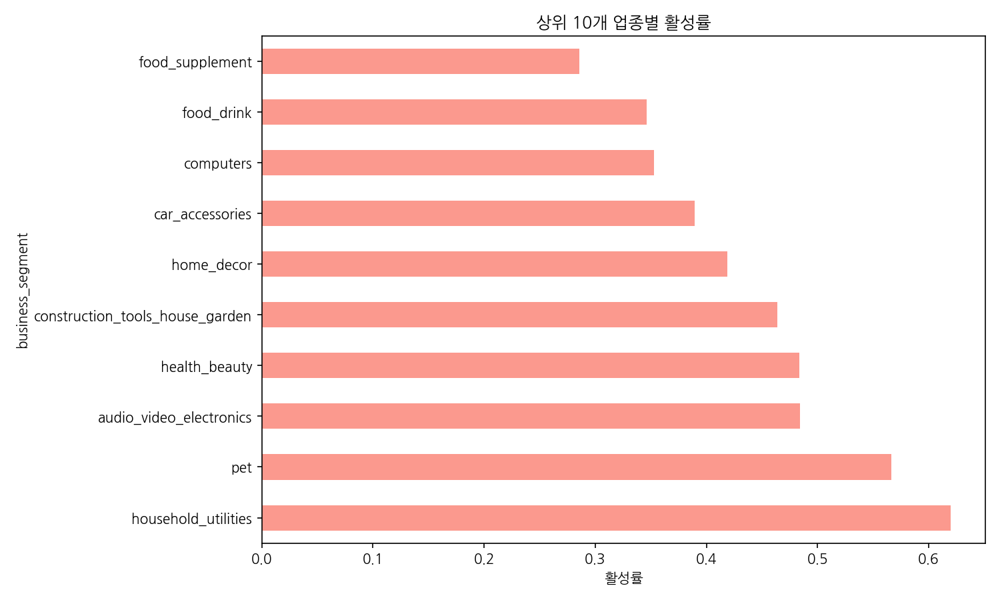

---

### === 분석 4: 초기 성공(Time-to-First-Sale)의 결정적 영향 ===
**"첫 4주(28일)가 셀러의 운명을 결정한다"**

> [!NOTE]
> **평균 누적 매출 (Average Cumulative Revenue)**
> - **정의**: 특정 그룹에 속한 활성 셀러들이 입점 후 첫 판매 시점부터 분석 기준일(2018-08-31)까지 발생시킨 총 매출의 평균값입니다. 이는 셀러가 플랫폼에 안착한 후 창출한 생애 가치(LTV)의 대리 지표로 활용됩니다.
> - **계산법**: $\text{평균 누적 매출} = \frac{\sum(\text{Active Seller의 총 매출})}{\text{활성 셀러 수}}$

- **매출과의 상관관계**: r = **-0.158** (약한 음의 상관관계)
- **구간별 분석**:
  - **빠름 (0-28일)**: 평균 매출 3,787 BRL (압도적 우위)
  - **매우 느림 (79일 이상)**: 평균 매출 630 BRL
- 첫 판매까지의 시간이 28일 이내인 셀러는 79일 이후에 낸 셀러보다 **약 6배 높은 누적 매출**을 기록했습니다.

#### [입점 후 경과 기간별 이탈률(미전환율) 분석]
입점 후 시간이 흐를수록 첫 판매에 성공하지 못하고 '휴면(이탈) 상태'로 남을 확률을 분석했습니다.

- **골든타임 28일**: 입점 후 28일이 지나는 시점에도 여전히 **88.4%**의 셀러가 첫 판매를 기록하지 못한 상태입니다. 이 시기를 넘기면 전환 속도가 급격히 둔화됩니다.
- **장기 휴면 고착화**: 입점 후 90일이 지나면 미전환율은 **62.9%** 수준에서 매우 천천히 감소하며, 최종적으로 약 **55%**의 셀러는 사실상 영구 휴면 상태로 고착화됩니다.
- **인사이트**: 입점 후 첫 1개월 이내에 셀러를 활성화시키지 못하면, 해당 셀러가 향후 플랫폼에 기여할 가능성은 기하급수적으로 낮아집니다.

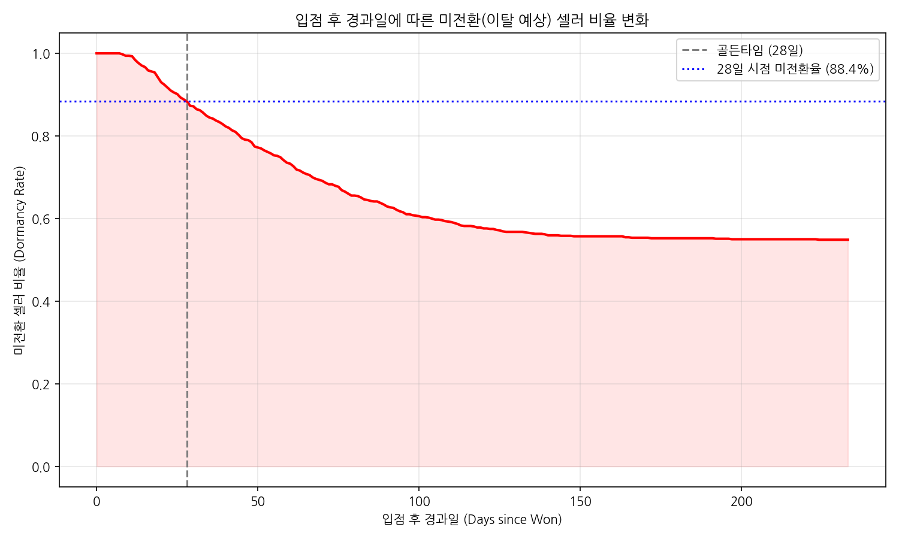
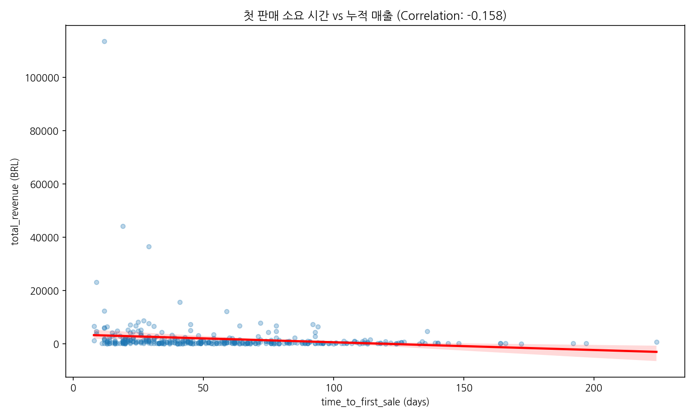
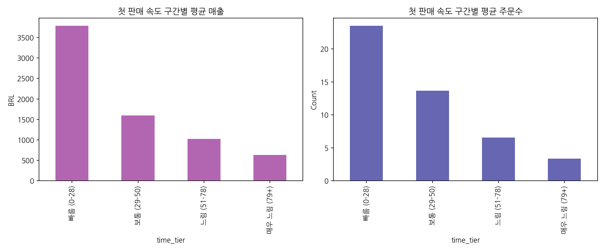

---

## 3. 종합 결론 및 비즈니스 제언

#### [살아남는 셀러의 조건 — 주요 발견]

1. **빠른 실행력**: 입점 결정이 빠르고 초기 온보딩 기간이 짧음 (Sales Cycle이 생존의 선행 지표).
2. **유연한 사업 모델**: 재고 관리와 품목 확장이 용이한 리셀러 형태 (Manufacturer 대비 높은 적응력).
3. **조기 성과 달성**: 입점 직후 28일 이내에 실제 판매를 일으킴 (Small Win의 가속 효과).
4. **목적형 유입 경로**: `direct_traffic`과 같이 브랜드 인지도가 이미 높거나, `paid_search`처럼 특정 비즈니스 목적을 가지고 유입된 채널일수록 생존율과 매출 기여도가 모두 높음.

### 3.2 비즈니스 제언: "Onboarding as a Service"
- **영업 타겟팅 고도화**: 입점 결정까지의 시간(Sales Cycle)과 기대 매출을 기준으로 잠재 활성 가능성이 높은 셀러를 우선순위화하십시오.
- **초기 28일 집중 케어**: 모든 신규 셀러가 입점 후 **4주 이내**에 첫 판매를 달성할 수 있도록 '웰컴 프로모션'이나 '첫 등록 지원 서비스'를 강화해야 합니다.
- **채널 최적화**: 단순히 리드 단가가 낮은 채널보다, 생존 셀러 매출 품질이 증명된 `paid_search` 및 유통사 비중이 높은 채널로 예산을 재분배하는 것이 효율적입니다.

### 3.3 데이터의 한계 및 향후 분석 제언
- 현재는 '생존 여부'에 집중하고 있으나, 매출의 지속성(Retention Curve)을 파악하기 위해 월별 활성 리텐션 데이터 보완이 필요합니다.
- 마지막 판매일(Recency) 데이터가 추가된다면 단순 휴면을 넘어선 **이탈(Churn)** 예측 모델로 고도화할 수 있습니다.

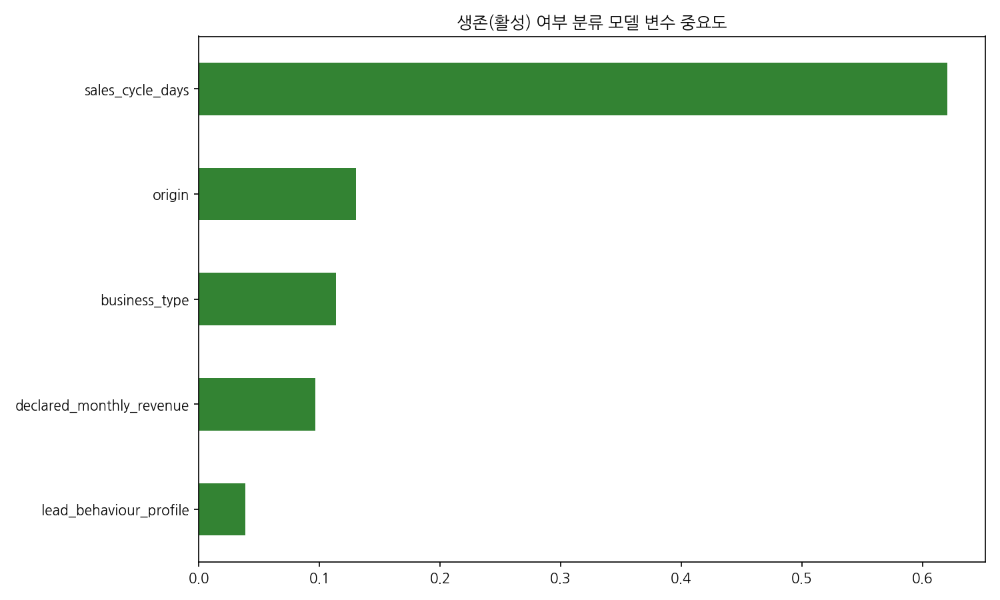
