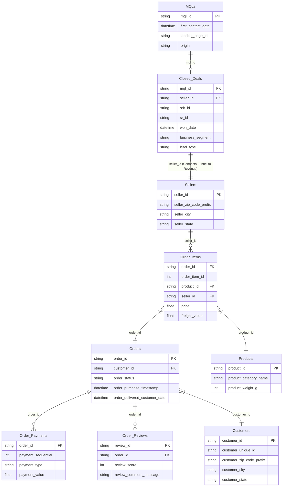

# 🗺️ 통합 ERD (Unified ERD: Funnel + E-Commerce)

이 다이어그램은 **Olist 마케팅 퍼널 데이터**와 **브라질 이커머스 매출 데이터**가 어떻게 연결되는지 보여줍니다. 핵심 연결 고리는 `mql_id`와 `seller_id`입니다.

### 🔗 핵심 분석 경로 (The Golden Path)
1. **유입(Acquisition)**: `MQLs.origin` 을 통해 리드가 어디서 왔는지 파악
2. **전환(Conversion)**: `Closed_Deals` 에서 어떤 리드가 실제 셀러가 되었는지 확인
3. **성과(Revenue)**: `Order_Items` 와 `Orders` 를 조인하여 해당 셀러가 발생시킨 실제 매출액 산출
4. **결론**: **MQL Origin별 평균 매출(LTV)과 ROI**를 계산하여 마케팅 예산 최적화
